# Beschreibung

FromThePage ist eine Plattform für kollaborative Transkriptionen, die 2005 ins Leben gerufen wurde, um die Arbeit an digitalen Editionen zu erleichtern. Die Software wurde 2009 unter einen Open-Source-Lizenz veröffentlicht und wird seit 2010 für die Transkription nach dem Crowdsourcing-Prinzip von Bibliotheken, Archiven und Museen genutzt. Durch die Anpassung an die besonderen Bedürfnisse der verschiedenen Institutionen wird die Software ständig weiterentwickelt. Seit 2014 liegt der Fokus vor allem auf wissenschaftlichen digitalen Editionen.

## Anwendungsbereiche

* Manuskript-Transkription
* OCR/HTR-Textkorrekturen
* Text-Mark-Up
* Indexierung
* Annotation

## Funktionsübersicht

* Transkription in Editoransicht mit Bild-Text-Synopse
* Multilinguales Interface (DE momentan in Arbeit)
* Versionskontrolle (Tracking bei jedem Abspeichern, Versionen öffentlich einsehbar)
* Textuelles Mark-Up (auf 3 Arten)
    * Silent Mark-Up → Zeilenumbrüche, Absatzmarkierungen bedürfen keiner zusätzlichen Auszeichnung, sondern werden direkt übernommen und in entsprechende Codes umgewandelt
    * Tags (inklusive farblicher Kennzeichnung) → hierfür gibt es eine Auswahl an unterstützten Mark-Up Tags (vorwiegend entsprechend TEI-Standard)
    * Buttons → die Auswahl der Buttons kann von den Projektinhaber:innen konfiguriert werden (es können jedoch keine eigenen Buttons kreiert werden)
* Editorkonfigurationen
    * projektspezifische Auswahl an unterstützten Tag-Buttons kann durch Projektinhaber:in zur Verfügung gestellt werden
    * projektspezifische Transkriptionsrichtlinien können festgelegt werden
* Indexierung und spätere Indexansicht kanonischer Namen mittels Mouseover
* Data Mining über Referenzierungen für Suchbegriffe/Stichworte
* Metadaten-Anreicherung zur Beschreibung des gesamten Projektmaterials und einzelner Werke
* Sprachenunterstützung → alle nach Unicode-Standard unterstützten Zeichensätze
* Eigene Übersetzungseditoransicht
* Unterstützung von Texttypen wie Formulare, Karteikarten und Bestandsbücher
* Übersicht über Projektfortschritt durch die Möglichkeit Bearbeitungsstati für einzelne Dokumente und Werke zu setzen (z.B. “Needs Review”)
* Diskussionsmöglichkeit für Mitarbeitende am Ende jeder Transkription
* Export: TEI, PDF, DOCX, Plain Text, etc.
* Integrative Workflows mit Transkribus, Omeka-S und FairCopy
* Direkte Verknüpfung zu Voyant, Verbatim, IIIF
* API für die automatisierte Veröffentlichung bei Fertigstellung einer Transkription

[Detaillierter Fact Sheet](../data/pipelines/pipeline_1/fromthepage/data/DigEdTnT_FactSheet_FromThePage.pdf)

## Tool-Kompatibilität

<table>
  <tr>
   <td>
   </td>
   <td>IIIF
   </td>
   <td>Transkribus
   </td>
   <td>ediarum
   </td>
   <td>OpenRefine
   </td>
   <td>ba[sic?]
   </td>
   <td>teiPublisher
   </td>
   <td>ediarum.WEB
   </td>
  </tr>
  <tr>
   <td>FTP
   </td>
   <td>✅
   </td>
   <td>✅
   </td>
   <td>🔑
   </td>
   <td>❌
   </td>
   <td>❌
   </td>
   <td>❌
   </td>
   <td>❌
   </td>
  </tr>
</table>

# Erforderliche Kenntnisse

* Keine
* Grundkenntnisse zu Markup-Sprachen (HTML, TEI, MediaWiki) von Vorteil

# Benötigte Software

* Webbrowser

# Einrichtung & Erste Schritte (Beispielprojekt)

1. **Registrierung**
    * Um in FTP ein Projekt anzulegen, muss man sich jedenfalls registrieren. Für unsere Testzwecke haben wir ein zweiwöchiges Probe-Benutzerkonto eingerichtet, in dem es uns möglich ist, bis zu 200 Seiten zur Transkription hochzuladen.
    * Erforderlich ist dafür lediglich eine E-Mail-Adresse \
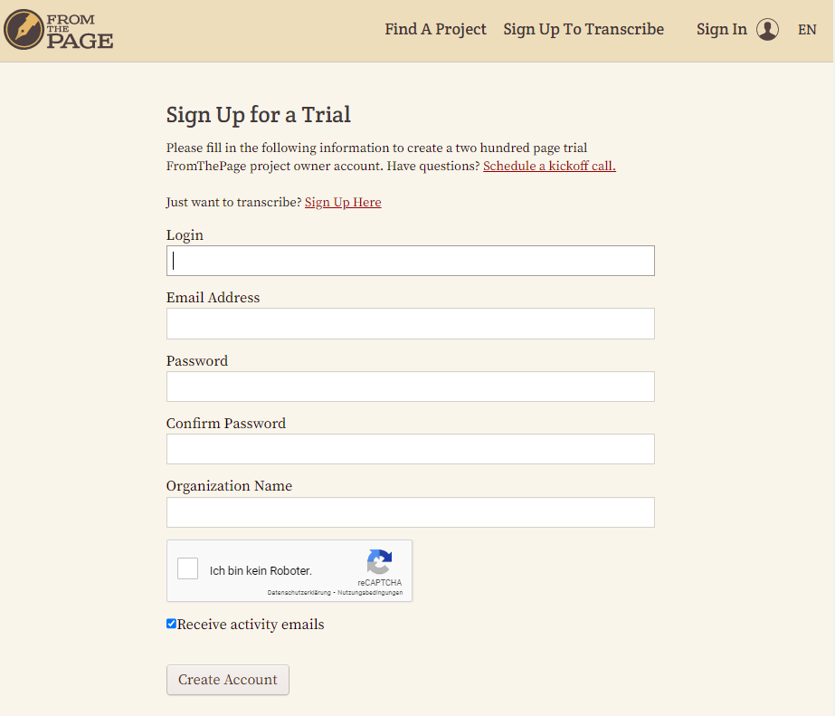 \

2. **Einrichtung eines Projekts**
    *  \
In der Dashboard-Ansicht ist es sinnvoll, zu Beginn eine Sammlung (“create a collection”) anzulegen, indem ein Titel sowie eine Beschreibung der Sammlung erstellt wird.  \
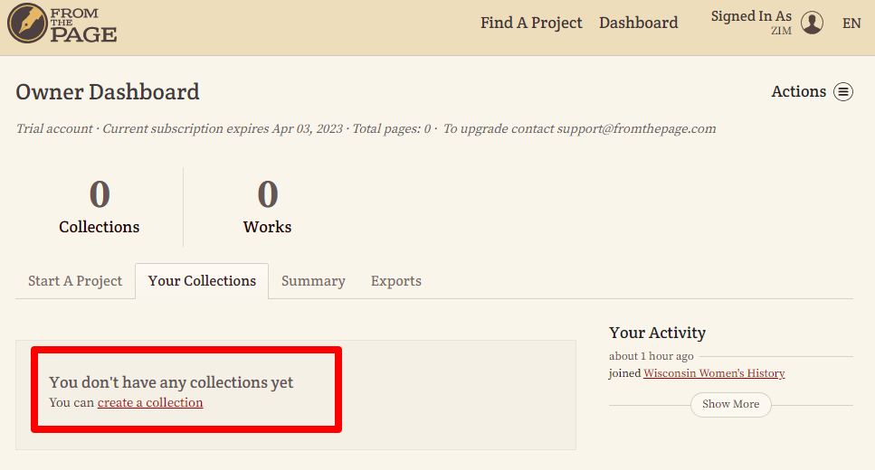
    * In unserem Fall legen wir eine Sammlung mit Kochrezepten aus dem Mittelalter an. \
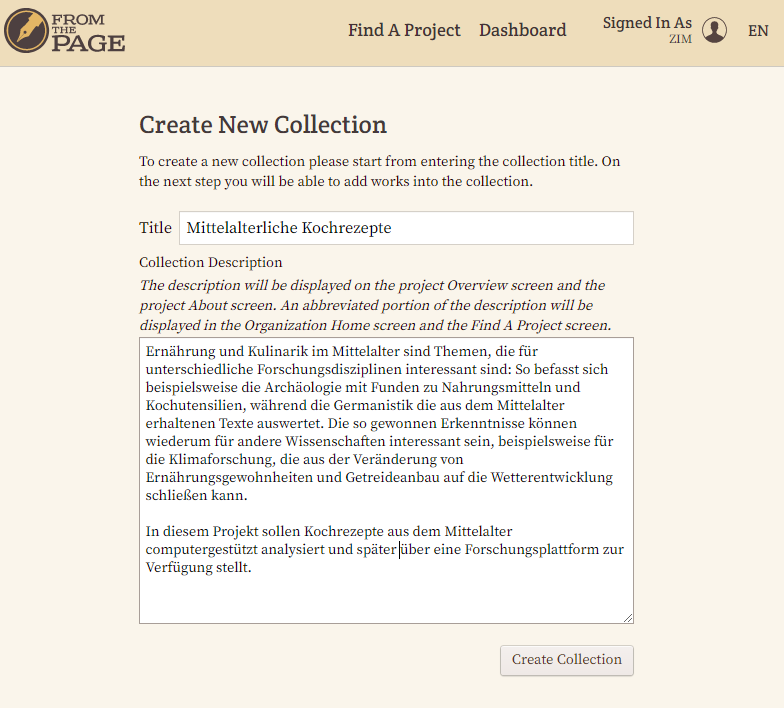
    * In unserem Beispielprojekt handelt es sich um verschiedene Manuskripte aus unterschiedlichen Regionen und mit unterschiedlichen Handschriften, die zu unterschiedlichen Zeiten erstellt wurden. Im nächsten Schritt legen wir also in unserer Sammlung für jedes Manuskript ein eigenes Werk an. \
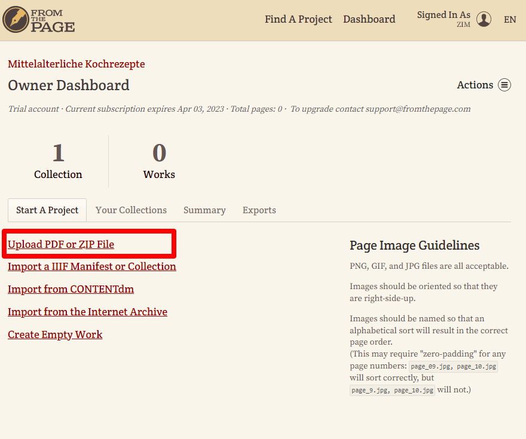
    * Für einen möglichst schnellen Upload mit wenigen Klicks wählen wir die Möglichkeit, eine ZIP-Datei mit den gesammelten Bilddateien von zwei Manuskripten hochzuladen. Wichtig dabei ist, die Manuskripte in separaten Ordnern abzuspeichern, damit diese direkt als eigenständige Werke erkannt werden.  \

    * Da uns von den Bibliotheken, in denen die Manuskripte gelagert sind, bereits ein paar Metadaten zur Verfügung stehen, legen wir in jedem unserer Manuskript-Ordner auch eine YML-Datei ab. Um zu vermeiden, dass es mit dem Upload Probleme gibt (wie es bei unserem ersten Versuch der Fall war), überprüft man am besten mit dem [YAML-Checker](https://yamlchecker.com/), ob die Syntax korrekt ist.  \

    * Eine Vorlage für den Aufbau der Metadaten-Datei steht unter der Upload-Möglichkeit zur Verfügung und kann einfach mit den entsprechenden Inhalten gefüllt werden. \

    * Der Upload kann außerdem einer Sammlung zugeordnet werden. \
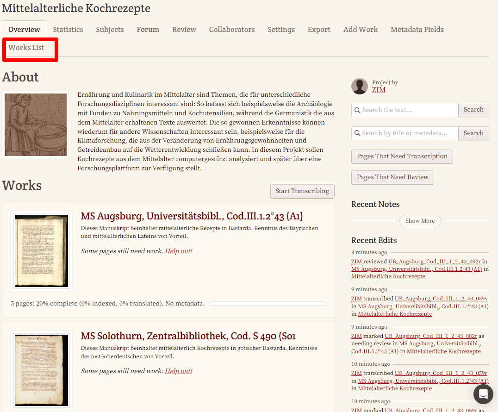
    * Nach erfolgreichem Upload kann man die Werke in der “Works List” einsehen und für die einzelnen Werke noch weitere Einstellungen vornehmen.  \
→ Es können übrigens jederzeit nachträglich noch Bilder zu einem Werk hinzugefügt werden.
3. **Vorbereitung und Konfiguration des Projektes**
    * **_Einstellungen im Projekt-Dashboard_**
        * **Allgemeine Einstellungen:** In den Einstellungen am Projekt-Dashboard konfigurieren wir schließlich die Ansicht, die den Transkriptoren zur Verfügung steht. Wir können unserer Projektseite zum Beispiel eine eigene URL zuweisen, einen eigenen Einladungslink zum Transkriptionsprojekt erstellen, ein Projektbild sowie einen eigenen Footer gestalten (um z. B. direkten Kontakt zur Projektleitung zu ermöglichen). Die Beschreibung, die wir beim Anlegen der Sammlung eingefügt haben, scheint hier bereits auf und kann noch weiter adaptiert werden.  \
 \
→ Mit dem Aktivieren von unterschiedlichen Funktionalitäten erweitert sich im Übrigen zunehmend auch das Menü im Dashboard.
        * **Einschränkung der Projektmitarbeitenden:** Da wir unser Projekt nur einem eingeschränkten Kreis an Mitarbeitenden zur Verfügung stellen wollen, nutzen wir außerdem die Möglichkeit, unsere Sammlung auf privat zu stellen sowie den Transkriptor:innenkreis einzuschränken und nur bestimmte registrierte Mitarbeitende über ihre Mailadresse hinzuzufügen.  \
→ Das Hinzufügen von neuen Personen erfolgt für gewöhnlich während eines allgemeinen System-Updates  über Nacht.
        * **Erweiterung der Projektleitung:** Nachdem wir in unserem Projekt zwei Projektleiter:innen haben, fügen wir außerdem noch einen zweiten Projektleiter hinzu. Hierzu muss die zweite Person ebenfalls registriert sein und die Mailadresse muss bekannt sein.
        * **Adaptierung der Hilfestellungen für das Projektteam:** FromThePage ermöglicht uns nun auch diverse Hilfestellungen für unsere Transkriptor:innen anzupassen. Es können hier also noch mal Transkriptionsrichtlinien festgelegt werden, die für alle Werke dieser Sammlung gelten. In unserem Fall haben wir mit der YML-Datei bereits Die englischen Vorlagen für den allgemeinen Hilfetext sowie für das Subject Linking ändern wir vorerst nichts.
        * **Einrichtung eines Forums:** Um auch eine aktive Diskussion zwischen den Mitarbeitenden in unserem Projekt zu ermöglichen, eröffnen wir zudem ein Forum.  \

        * **Anpassungen des Transkriptionseditors**: Damit unsere Transkriptior:innen sich nicht mit spitzen Klammern herumärgern müssen, nutzen wir die Möglichkeit, die vordefinierten(!) Editor-Buttons (derzeit sind 21[ Tags ](https://content.fromthepage.com/project-owner-documentation/advanced-editor/)verfügbar) zu aktivieren. \
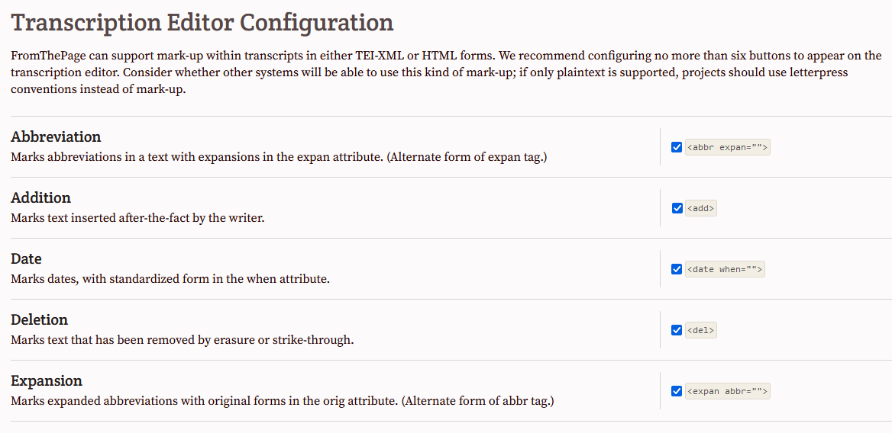
        * **Sprachauswahl:** In den Projekteinstellungen lässt sich außerdem die Sprache und für reguläre Sprachen auch eine Rechtschreibprüfung einstellen. Da wir es in unserem Projekt bei jedem Manuskript bzw. Werk mit diversen mittelalterlichen Varianten der deutschen Sprache zu tun haben, wählen wir hier Germanic languages. Auf eine Aktivierung der Speech-to-text-Funktion verzichten wir vorerst, da wir nicht davon ausgehen, dass unsere Mitarbeitenden fließend Frühneuhochdeutsch sprechen und auch die Rechtschreibprüfung wird nicht aktiviert, da diese für unsere Texte mit großer Wahrscheinlichkeit nicht funktionieren wird.  \

        * **Aktivierung der Indexierung (Subject Indexing):** Wir möchten unser Team außerdem motivieren, in den Rezepten Zutaten und Speisen zu annotieren und aktivieren daher die Möglichkeit der Indexierung von Entitäten. Die Kategorien und Entitäten können nur von Projektinhaber:innen angelegt werden. Die Transkriptor:innen können dann in ihrem Projekt-Dashboard die Entitäten einsehen und bearbeiten, nicht aber neue Entitäten anlegen.  \
 \
Es ist auch möglich, die Entitäten (in einem CSV) hochzuladen, wobei sich diese in unserem Projekt erst im Laufe der Transkription ergeben werden.  \
→ Durch das An- oder Abwählen von diversen Funktionen in den Projekteinstellungen erweitert sich übrigens das Navigationsmenü um entsprechende Tabs (z. B. “Enable subject indexing” führt dazu, dass im Projekt-Dashboard der Reiter “Subjects” zur Verfügung steht. \

        * **Einstellung des Revisionstyps**: Da wir in unserem Editionsprojekt nach dem 4-Augen-Prinzip arbeiten, stellen wir den Review type auf “restricted”, so dass alle fertiggestellten Transkriptionen unbedingt von einem autorisierten Reviewer noch einmal gelesen und gegebenenfalls korrigiert werden.
        * **Erstellung von Metadaten für einzelne Werke**: Damit unsere Transkriptor:innen uns auch mit den Metadaten helfen können, aktivieren wir die Metadaten-Beschreibung in den Einstellungen. Auch hierfür erscheint in der Navigation erscheint nun ein neuer Tab (Metadata Fields).  \

        * **API-Aktivierung:** Die Zugänglichkeit des Projekts über eine API lassen wir für unser Projekt vorerst deaktiviert.
    * **_Einstellungen für das jeweilige Werk_**
        * **Allgemeine Einstellungen**: Auch für jedes Werk - also in unserem Fall für jedes Manuskript selbst - können wir diverse Voreinstellungen vornehmen. Darunter fallen die Vergabe eines Titels, die Zuordnung zu einer Sammlung bzw. einem Projekt, die Anpassung der URL sowie die Vergabe eines Identifiers von einem externen System.  \
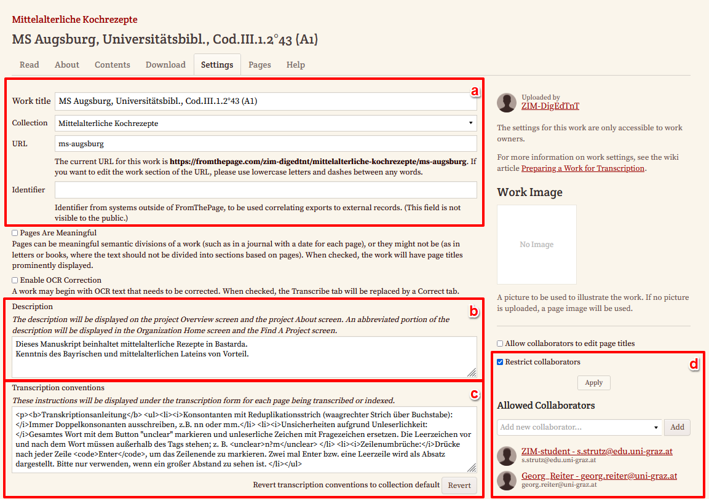 \
Zudem können wir diverse Häkchen für unterschiedliche Funktionen setzen, wobei in unserem Fall weder unsere Seiten als semantische Einheiten zu betrachten sind, noch eine OCR-Korrektur anwendbar ist.  \

        * **Beschreibung des Werkes:** Um unseren Transkriptor:innen einen Anhaltspunkt zu bieten, mit welcher Hand und welcher Sprache bzw. welchem Dialekt sie konfrontiert werden, schreiben wir dies bereits in die Werkbeschreibung.
        * **Transkriptionsrichtlinien:** Diese werden grundsätzlich von den Projekt-Einstellungen übernommen, können aber hier noch weiter angepasst werden. In unserem Fall ist dies nicht nötig.
        * **Aktivierung eines Übersetzungsbereichs:** Für unsere Transkriptor:innen eröffnen wir noch ein weiteres Tab für Übersetzungen. Die Translationsrichtlinien, die wir mit den Metadaten bereits hochgeladen haben, werden hier angezeigt und können erweitert werden.
        * **Einschränkung der Mitarbeitenden:** Auch für die einzelnen Werke ist es möglich, den Personenkreis (nur registrierte Nutzer:innen) einzuschränken. \
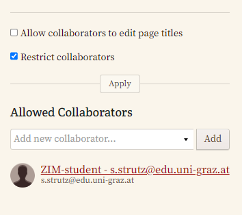 \
→ Dabei ist zu beachten, dass Personen, die als Mitarbeitende zu einem Werk hinzugefügt werden, zuvor auch in den übergeordneten Projekteinstellungen als Mitarbeitende hinzugefügt werden müssen. Während das Hinzufügen von Personen zum Projekt etwas dauert, erfolgt das Hinzufügen von Personen zu einzelnen Werken in Echtzeit.
        * **Metadaten-Anreicherung:** In diesem Bereich sollten unsere zuvor mit der YML-Datei hochgeladenen Metadaten ersichtlich sein. Diese können hier aber auch noch erweitert oder angepasst werden.  \
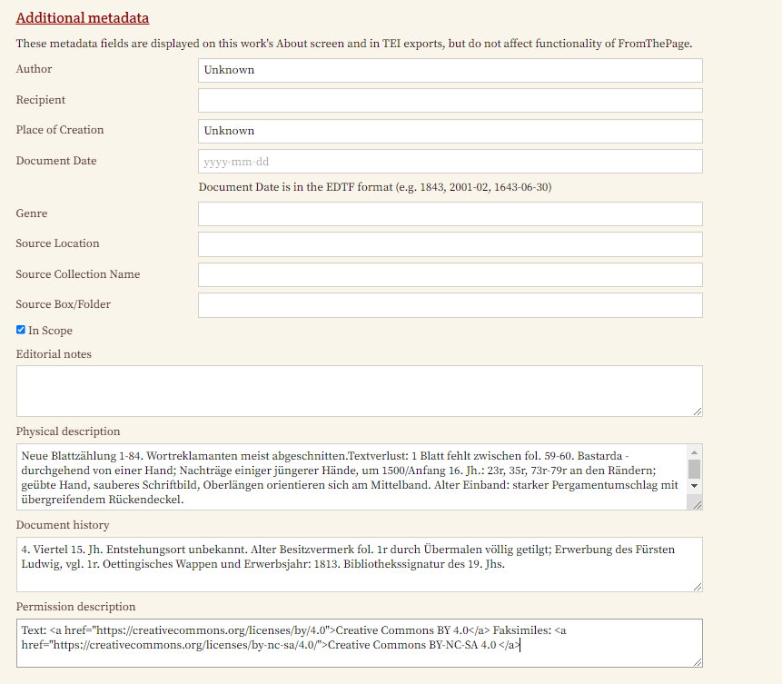
4. **Bearbeitung der Dokumente**
    * **Transkriptionsstatus**: Je nach Arbeitsfortschritt werden die einzelnen Dokumente in einem Werk als Not Started - Incomplete - Needs Review - Complete ausgewiesen.
    * **Transkriptionsansicht:** Im Transkriptionseditor wird uns eine synoptische Ansicht unseres Faksimiles und eines Bearbeitungsbereiches geboten. Wir können hier also mit der zeilenweisen Transkription beginnen.
        * **Auszeichnung unserer Transkription:** FTP ermöglicht es, ein Markdown entsprechend Wiki-Text-Konventionen anzuwenden sowie all jene Mark-Up-Buttons zu verwenden, deren Anzeige wir zuvor in den Projekt-Einstellungen aktiviert haben.  \
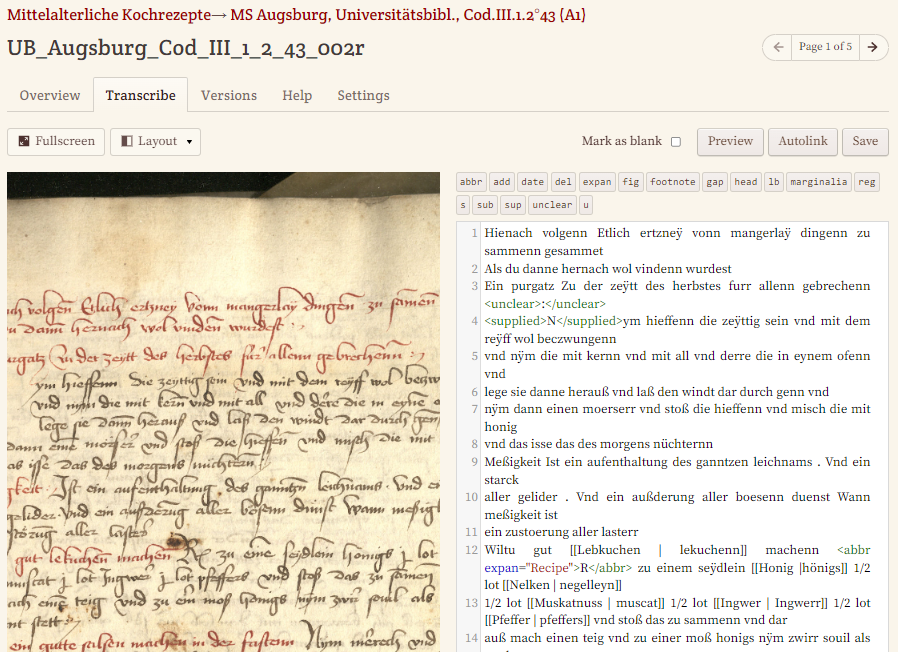 \
Sollten unsere Transkriptor:innen Tags lieber ausschreiben, statt Textbereiche zu markieren und auf Buttons zu klicken, ist dies ebenfalls möglich. Strukturierungen wie Zeilenumbrüche oder Absätze werden automatisch übernommen. Wenn wir die Möglichkeiten der TEI nutzen wollen, haben wir dafür zwar keine Buttons, wir können aber z. B. editorische Eingriffe - durch das Element &lt;supplied> realisiert - trotzdem mit dem entsprechenden Tag auszeichnen. Das Element wird zwar in der allgemeinen Darstellung auf FTP nicht unterstützt, es befindet sich aber am Ende in unserem TEI-Export.  \

        * **Subject Linking:** Während der Transkription eines Dokumentes können auch Entitäten wie Personen, Orte oder eigens angelegte Kategorien (inklusive Unterkategorien) - in unserem Beispiel Zutaten und Speisen - ausgezeichnet werden.  \
 \
Die Projektinhaber:innen können dafür im Projekt-Dashboard die Vorbereitungen treffen, indem sie die entsprechenden Kategorien erstellen.  \
 \
Die einzelnen Entitäten können schließlich diesen Kategorien zugeordnet und mit einer URI sowie einer Beschreibung angereichert werden.  \
 \
Diese Daten sowie die Verknüpfungen von Entitäten und ihr Auftreten bzw. ihre Häufigkeit in den Manuskripten kann schließlich eingesehen werden.  \
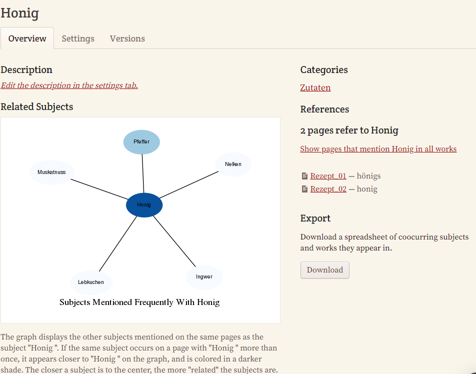 \
In den einzelnen Dokumenten ist es den Mitarbeitenden aber möglich, neue Entitäten händisch während der Transkription  (gemäß Anleitung) auszuzeichnen, oder über Autolink in einem bereits transkribierten Dokument gleichlautende Entitäten automatisch zu verlinken.  \
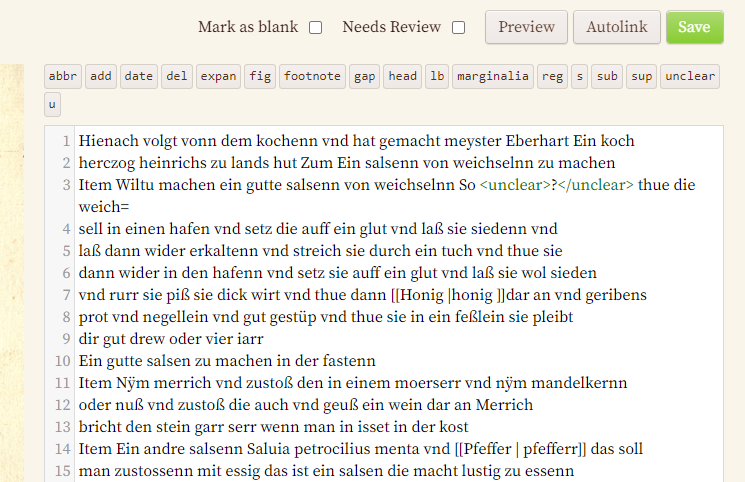 \
Beim Hinzufügen neuer Entitäten können diese danach direkt einer Kategorie zugeordnet werden.  \
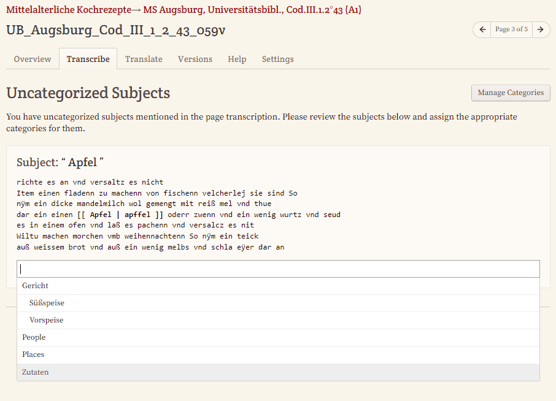 \
Die Transkriptor:innen können in ihrem Projekt-Dashboard die von der Projektleitung angelegten Entitäten einsehen und auch bearbeiten. Sie können jedoch nicht weitere Kategorien anlegen.
        * **Zwischenspeichern oder Abschließen:** Wenn wir mit einem Teil unserer Transkription fertig sind, klicken wir auf “Save” bzw. wenn die Transkription abgeschlossen ist, auf “Done”. Danach verändert sich der “Done”-Button in einen “Approve”-Button gemäß unserer zuvor festgelegten Einstellung, dass jedes Dokument einer Revision unterzogen werden muss.  \
→ Sobald man zwischen den Tab mit der Transkriptionsansicht verlässt, verliert man seinen Arbeitsfortschritt - daher nicht vergessen, regelmäßig abzuspeichern.
        * **Metadaten-Anreicherung:** Nachdem wir für unser Projekt festgelegt haben, dass zu jedem Werk auch Metadaten angelegt werden können, steht unseren Transkriptor:innen ein Button zur Erstellung von Metadaten zur Verfügung.  \
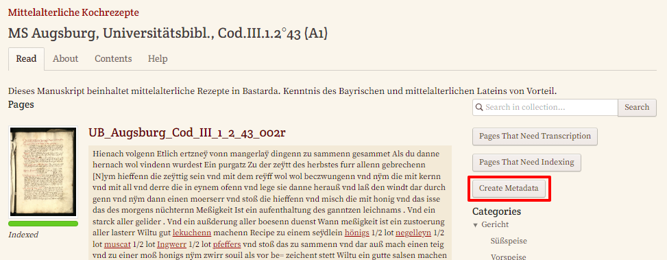 \
Über die damit aufgerufene Ansicht können schließlich die zuvor von der Projektleitung angelegten Felder (siehe Punkt Metadaten-Erstellung für einzelne Werke) befüllt werden.  \
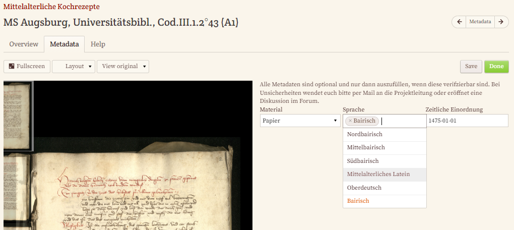 \
Auch bei den Metadaten gibt es wieder die Option zwischenzuspeichern (“Save”), die Daten als vollständig zu markieren (“Done”) und am Ende muss wieder ein Reviewer die eingegebenen Daten bestätigen (“Approve”).
    * **Versionsansicht:** Im Tab “Versions” können wir nachverfolgen, wer wann welche Änderungen vorgenommen hat. \

5. **Export der Dokumente (nur für Projektleitung)**
    * **_Downloadbereich im Projekt-Dashboard:_**
        * **Export aller Werke:** Über den Button “Export All Works” können wir nun verschiedene Formate und Feinheiten wählen und unsere gesamte Sammlung in einer ZIP-Datei exportieren. \
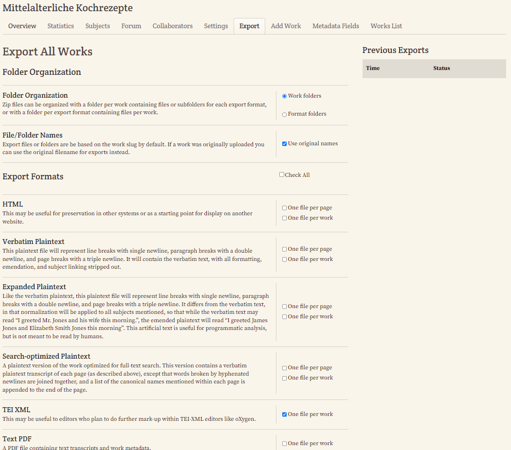 \
Wir wählen dabei einen Ordner pro Werk und stellen ein, dass unsere exportierten Dateien ihre Namen vom Import beibehalten sollen. Bei den Exportformaten wählen wir nur TEI XML aus.
        * **Export einzelner  Werke:** Da wir unsere Daten noch weiter annotieren und anreichern wollen, wählen wir den TEI-Export. \
 \
In der exportieren TEI-Datei (siehe [hier](https://github.com/DigEdTnT/digedtnt.github.io/blob/817c432fc69a959a8c596057c2daa7ac142b367d/data/pipelines/pipeline_1/export/ub-augsburg.xml) für vollständiges XML) finden unsere Bearbeitungsschritte nun folgende Form:
            * **Metadaten:** Unsere über die YML-Datei importierten Metadaten sowie diverse manuell hinzugefügte Metadaten, Informationen zu den Versionen sind im TEI Header wiederzufinden. \
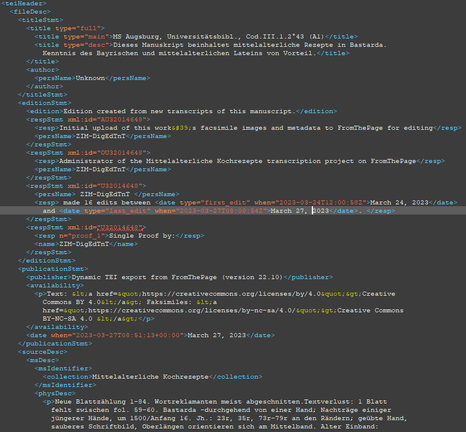 \
→ Die einzelnen Werk-Metadaten (Material, Sprache usw.), die wir für jedes Manuskript einzeln angelegt haben, sind hier aber leider nicht abgebildet (nur im CSV-Metadaten-Export).
            * **Entitäten & Kategorien:** Unsere Taxonomie für Zutaten und Gerichte wird in ein &lt;taxonomy>-Element verpackt, wo wir all unsere angelegten Daten und Kategoriezuordnungen wiederfinden. \
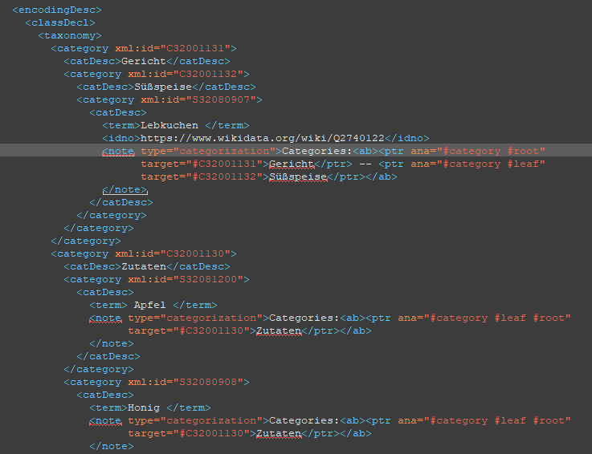
            * **Transkription:** Jede transkribierte Seite unseres Werkes wird schließlich in einem &lt;div>-Element wiedergegeben, wobei das vorangehende  &lt;pb>-Element einen Link zur Bilddatei im IIIF-Format beinhaltet.  \
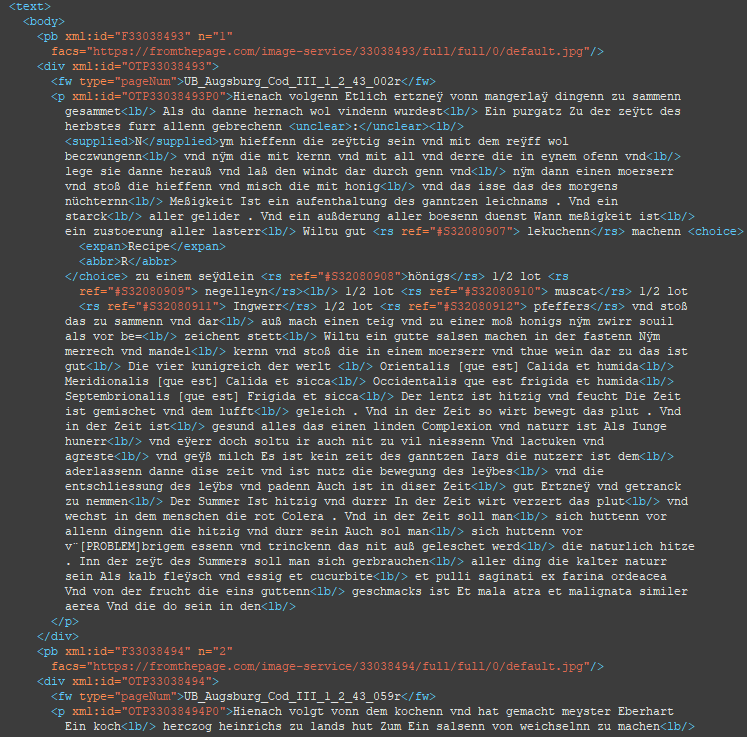 \
Außerdem können wir innerhalb des Textes die Auszeichnung von Zeilenumbrüchen, unklaren Stellen, Erweiterungen von Abkürzungen sowie Referenzen zu unserer Taxonomie wiederfinden.
        * **Export der Metadaten**: Viele der Metadaten, die wir auch im Header des XML/TEIs finden, können wir auch per CSV exportieren. Bei diesem Export sind nur sehr allgemeine Projekt-Metadaten und Statistiken wiederzufinden sowie die eigens angelegten Metadaten (Material, Sprache & zeitliche Einordnung), nicht aber die von uns per YML-Datei importierten Metadaten. \

# Möglichkeiten & Stärken

* Remote Kollaboration
* Subject-Tagging zur Erstellung von Registern
* Validierungen können auf bestimmte Reviewer eingeschränkt werden
* User- bzw. Projekt-Management: Überblick über Statistiken möglich (Dauer, Umfang, etc.)
* Unterstützung eines Mark-Ups von Merkmalen, die in historischen Dokumenten vorkommen
* Tabellenformatierung über [Markdown-Tabellensyntax](https://content.fromthepage.com/project-owner-documentation/table-encoding/) möglich
* [LaTex-Kodierung](https://content.fromthepage.com/project-owner-documentation/encoding-formula-with-latex/) für wissenschaftliche und mathematische Formeln möglich
* Unterschiedliche Darstellung des Mark-Ups je nach Umgebung:
    * _Single-Page-Darstellung: _1:1-Darstellung (Zeilenumbrüche werden beibehalten)
    * _Multi-Page-Darstellung: _nur Thumbnail-Bilder für die Faksimiles, zur Darstellung von Suchergebnissen (Absatzumbrüche werden beibehalten)
* Chat-Interface für direkten Support (Erreichbarkeit zu Arbeitszeiten in anderer Zeitzone - CST/CDT)
* Community für Transkription: Bewerbung des Projekts über den Newsletter von FromThePage oder über Social Media (z. B. Twitter)
* Qualitätssicherung:
    * Schutz vor Vandalismus durch Registrierungserfordernis
    * Einschränkung auf bestimmten Kreis an Mitarbeitende möglich
    * Fertiggestellte Unterprojekte können eingeschränkt und nur für bestimmte Mitarbeitende für die Revision bearbeitbar gemacht werden
    * Textpassagen können vor Webcrawlern oder Eingriffen von unregistrierten Nutzer:innen geschützt werden (nur Transkriptor:innen mit entsprechender Erlaubnis - über &lt;sensitive>-Tag - dürfen markierte Textpassage bearbeiten)

Mögliche Transitions/Integrationen:

* FromThePage → IIIF → TEI-XML → FairCopy
* Transkribus (HTR) → Plain Text → FromThePage
* FTP → Plain Text → Transkribus (Ground Truth/Training)
* FTP → TEI/XML → teiPublisher/EVT(Publikationstool)

# Herausforderungen & Grenzen

* Keine XSL-Transformationen möglich oder durchführbar innerhalb des Systems
* Tabellarische Darstellungen nur über Mark-Down (Pipes und Dashes) möglich
* Eingeschränkte Mark-Up-Möglichkeiten und keine Möglichkeit, individuelle Buttons für Mark-Up anzulegen (derzeit Unterstützung von 30 Tags)
* TEI-Export für jedes Dokument extra durchzuführen - keine Möglichkeit eines Exports des gesamten Projekts
* Werk-Metadaten sind nicht in TEI vorzufinden
* Exportiertes TEI ist nicht valide
* Keine Möglichkeit, farbliche Markierungen zu annotieren
* Keine Möglichkeit, Ergänzungen durch Transkriptor:innen als solche auszuzeichnen

# Kostenübersicht

* Kleinprojekte: 200 Seiten - kostenlos
* Betreuung von Institutionen: bis zu 50.000 Seiten - ca. 3600 Dollar/Jahr

# Kontakt

**Unternehmensgröße:** 3 Software-Developer (Stand 2023)

**Weblink:** [https://fromthepage.com/](https://fromthepage.com/)

**Mail:**

<table>
  <tr>
   <td>Allgemeiner Support
   </td>
   <td><a href="mailto:support@fromthepage.com">support@fromthepage.com</a>
   </td>
  </tr>
  <tr>
   <td>Ben Brumfield (Owner):
   </td>
   <td><a href="mailto:benwbrum@gmail.com">benwbrum@gmail.com</a>
   </td>
  </tr>
</table>

# Ressourcen

## Dokumentation

* [Dokumentation für Projektleitung](https://content.fromthepage.com/project-owner-documentation/)
* [Checkliste für das Anlegen eines neuen Projekts](https://content.fromthepage.com/project-owner-documentation/new-project-checklist/)
* [Integrationsanleitungen (CONTENTdm, Internet Archive, OmekaS)](https://content.fromthepage.com/project-owner-documentation/integrations/)

## Tutorials

[Youtube Channel](https://www.youtube.com/@fromthepage)

## Projekte, die dieses Tool genutzt haben

* [Wilford Woodruff Papers](https://wilfordwoodruffpapers.org/): Transkription durch Freiwillige, Revision und Annotation durch Projektmitarbeiter, Publikation der annotierten Dokumente via API
* [Civil War and Reconstruction Governors of Mississippi](https://cwrgm.org/): Bilder & Metadaten sind in Mississippi Digital Library gespeichert, Transkription und Annotation erfolgen ohne zusätzlichen Export/Import auf FromThePage; Publikation über Server des Projekts (CWRGM.org), wiederum ohne Import/Export-Aufwand(?)

## Literatur

Literaturliste von Zotero

## Fact Sheet zum Tool
<iframe src="../data/pipelines/pipeline_1/fromthepage/data/DigEdTnT_FactSheet_FromThePage.pdf" width="100%" height="480px"></iframe>
