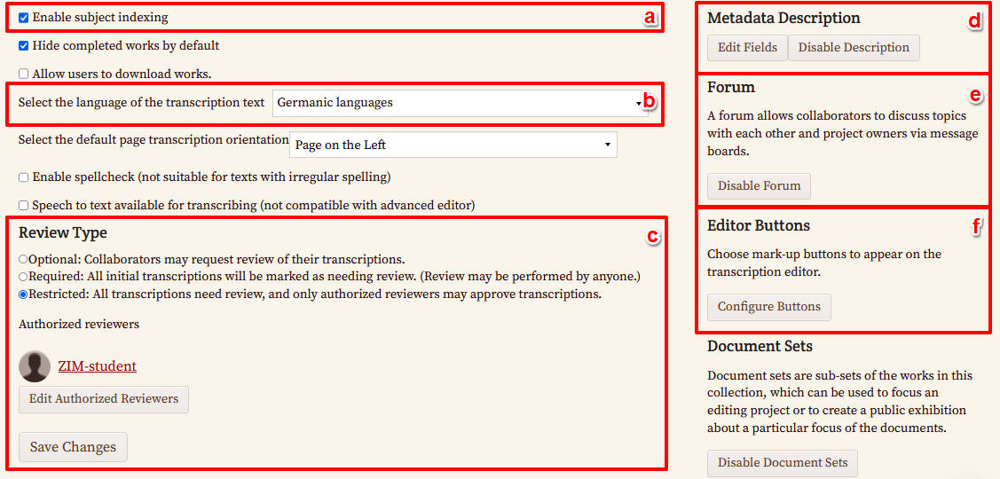
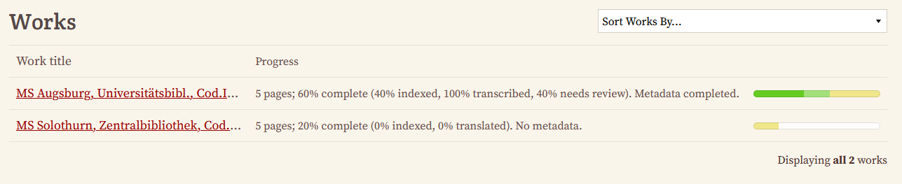
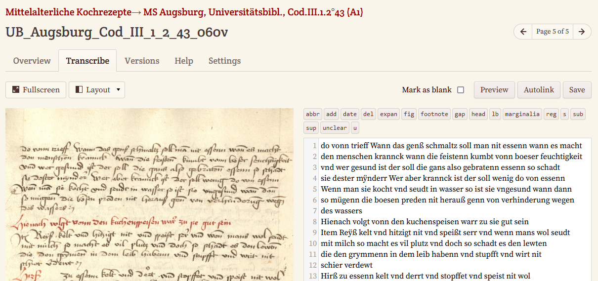
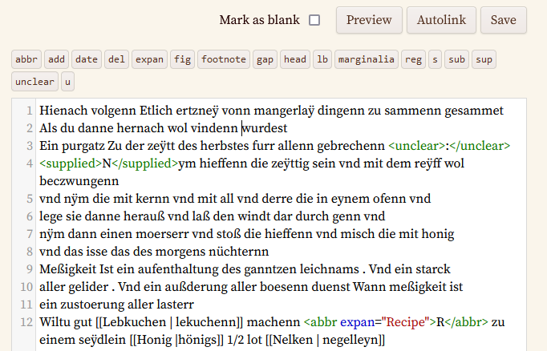
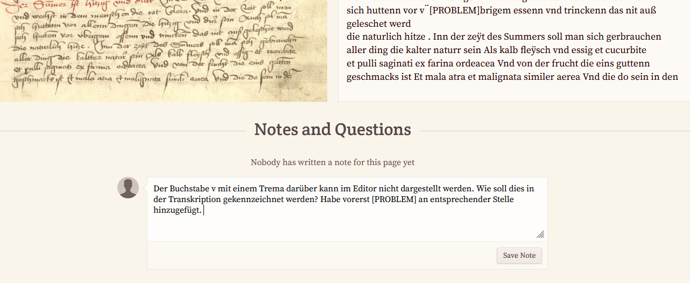
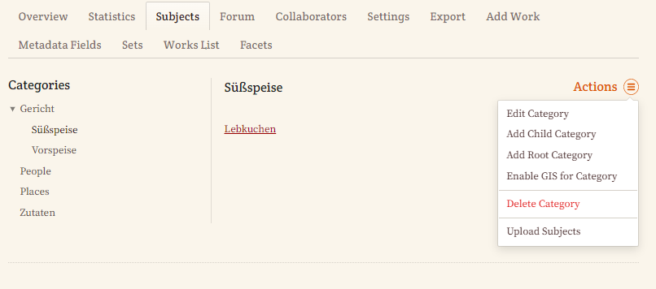
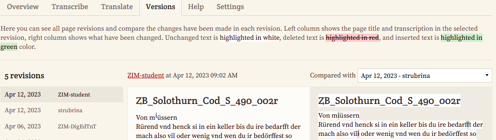
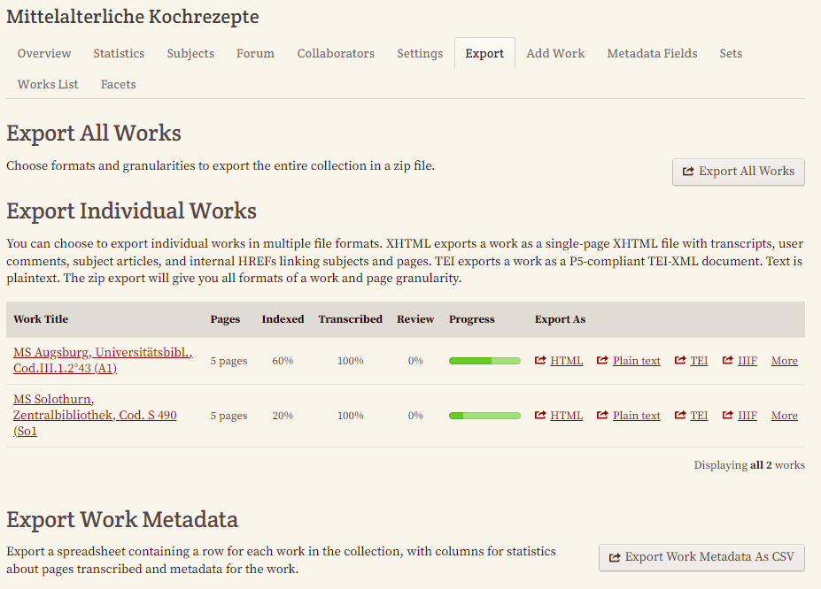

# Allgemeine Beschreibung

 _FromThePage_ ist eine Plattform für kollaborative Transkriptionen, die 2005 ins Leben gerufen wurde, um die Arbeit bei der Transkription von Textsammlungen zu erleichtern. Die Software wurde 2009 unter einen Open-Source-Lizenz veröffentlicht und wird seit 2010 für die Transkription nach dem Crowdsourcing-Prinzip von Bibliotheken, Archiven und Museen genutzt. Durch die Anpassung an die besonderen Bedürfnisse der verschiedenen Institutionen wird die Software ständig weiterentwickelt. Seit 2014 liegt der Fokus vor allem auf wissenschaftlichen digitalen Editionen.

<div class="essence">
<span style="font-style:italic;">FromThePage</span> zeichnet sich nicht nur darin aus, dass man bereits mit minimalen Computerkenntnissen bei der Transkription von Manuskripten mithelfen kann, sondern vor allem auch durch den Zugriff auf eine große transkriptionsfreudige Community sowie die Möglichkeit der Kollaboration bei umfangreichen Sammlungen. Für umfassende und tiefergehende Annotationen nach den in der DH gültigen Standards empfiehlt es sich jedoch aufgrund der eingeschränkten Annotations- und Validierungsmöglichkeiten auf andere Tools zurückzugreifen.
</div>


## Anwendungsbereiche

* Manuskript-Transkription
* [OCR](https://de.wikipedia.org/wiki/Texterkennung)/[HTR](https://de.wikipedia.org/wiki/Handschrifterkennung)-Textkorrekturen
* Simples Text-Mark-up
* Annotation (Fokus: historische Dokumente)
* Indexierung


## Funktionsübersicht

* Transkription in Editoransicht mit Bild-Text-Synopse
* Multilinguales Interface
* Versionskontrolle (Tracking bei jedem Abspeichern, Versionen öffentlich einsehbar)
* Textuelles Mark-up (auf 3 Arten)
    * Silent Mark-up → Zeilenumbrüche, Absatzmarkierungen bedürfen keiner zusätzlichen Auszeichnung, sondern werden direkt übernommen und in entsprechende Codes umgewandelt
    * Tags (inklusive farblicher Kennzeichnung) → hierfür gibt es eine Auswahl an unterstützten Mark-up-Tags (vorwiegend entsprechend TEI-Standard)
    * Buttons → die Auswahl der Buttons kann von den Projektinhaber:innen konfiguriert werden (es können jedoch keine eigenen Buttons kreiert werden)
* Editorkonfigurationen
    * Bereitsstellung projektspezifischer Auswahl an unterstützten Tag-Buttons durch Projektinhaber:innen
    * Erstellung projektspezifischer Transkriptionsrichtlinien
* Indexierung und spätere Indexansicht kanonischer Namen mittels Mouseover
* Data Mining über Referenzierungen für Suchbegriffe/Stichworte
* Metadaten-Anreicherung zur Beschreibung des gesamten Projektmaterials und einzelner Werke
* Sprachunterstützung → alle nach Unicode-Standard unterstützten Zeichensätze
* Eigene Übersetzungseditoransicht
* Unterstützung von Texttypen wie Formulare, Karteikarten und Bestandsbücher mit Tabellenformatierung über [Markdown-Tabellensyntax](https://content.fromthepage.com/project-owner-documentation/table-encoding/)
* [LaTex-Kodierung](https://content.fromthepage.com/project-owner-documentation/encoding-formula-with-latex/) für wissenschaftliche und mathematische Formeln möglich
* Unterschiedliche Darstellung des Mark-ups je nach Umgebung:
    * _Single-Page-Darstellung:_ 1:1-Darstellung (Zeilenumbrüche werden beibehalten)
    * _Multi-Page-Darstellung:_ nur Thumbnail-Bilder für die Faksimiles, zur Darstellung von Suchergebnissen (Absatzumbrüche werden beibehalten)
* Übersicht über Projektfortschritt durch die Möglichkeit Bearbeitungsstati für einzelne Dokumente und Werke zu setzen (z. B. "Needs Review")
* Diskussionsmöglichkeit für Mitarbeitende am Ende jeder Transkriptionsseite
* Diverse Exportformate: TEI, PDF, DOCX, Plain Text, HTML etc.
* Integrative Workflows mit Transkribus, Omeka-S und FairCopy
* Direkte Verknüpfung zu Voyant oder IIIF
* API für die automatisierte Veröffentlichung bei Fertigstellung einer Transkription


Weitere Details und technische Übersicht: siehe [Factsheet zum Tool](#factsheet-zum-tool)


## Voraussetzungen

Jedes Tool kann einerseits bestimmte Vorkenntnisse der Benutzer:innen voraussetzen und andererseits auch hinsichtlich der Software-Umgebung gewisse Anforderungen stellen.


### Erforderliche Kenntnisse

* [EDV-Grundkenntnisse](https://digedtnt.github.io/about/#grundvoraussetzungen)
* Grundkenntnisse von Markup-Sprachen (HTML, TEI, MediaWiki) von Vorteil


### Benötigte Software

* Stabile Internetverbindung
* Webbrowser


## Tool-Kompatibilität

<div class="table-responsive tool-table">
<table class="table">
  <tr>
   <td>
   </td>
   <td>IIIF
   </td>
   <td>Transkribus
   </td>
   <td>ediarum
   </td>
   <td>FairCopy
   </td>
   <td>OpenRefine
   </td>
   <td>ba[sic?]
   </td>
   <td>teiPublisher
   </td>
   <td>ediarum.WEB
   </td>
  </tr>
  <tr>
   <td>FromThePage
   </td>
   <td>✅
   </td>
   <td>✅
   </td>
   <td><a href="https://digedtnt.github.io/transition-fromthepage-ediarum/">🦄</a>
   </td>
   <td>❌
   </td>
   <td>❌
   </td>
   <td>❌
   </td>
   <td>❌
   </td>
   <td>❌
   </td>
  </tr>
</table>
</div>

<div style="font-size:0.8rem;">
<span style="font-weight:bold;">Legende</span><br/>
<p>✅ Integrationen vorhanden und Entwickler:innen bewerben Übergänge<br/>
❌ Kein Entwicklung einer Transition im DigEdTnT-Projekt, keine Entwicklerintegration beschrieben<br/>
🦄 Transition im DigEdTnT-Projekt erstellt
</div>


## Kostenübersicht

* Klein- oder Testprojekte: 200 Seiten - kostenlos
* Einzelforschende: bis zu 10.000 Seiten - 1200 Dollar/Jahr
* Betreuung von Institutionen: bis zu 50.000 Seiten - ca. 3600 Dollar/Jahr

[Detaillierte Preisübersicht](https://fromthepage.com/pricing)


# Möglichkeiten & Grenzen

Da jedes Projekt unterschiedliche Anforderungen mit sich bringt, sollen nachfolgend mögliche Vor- und Nachteile des
Tools aufgelistet werden, die während der Durchführung des jeweiligen [Beispielprojekts](https://digedtnt.github.io/about/#rezeptsammlung-pipeline-1) festgestellt wurden.


## Stärken

* Remote Kollaboration möglich
* Subject-Tagging zur Erstellung von Registern und nach einem gewissen Projektfortschritt auch automatische Verlinkungen
* User- bzw. Projekt-Management: Überblick über Statistiken (Dauer, Umfang etc.)
* Schneller und hilfreicher Support über Chat-Interface (Reaktion meist spätestens innerhalb von 24h)
* Vielzahl an qualitätssichernden Maßnahmen:
    * Schutz vor Vandalismus durch Registrierungserfordernis
    * Einschränkung auf bestimmten Kreis an Mitarbeitenden möglich
    * Einstellungen für eine strikte Qualitätskontrolle: Obligatorische Reviews können angefordert und Validierungen auf bestimmten Kreis an Reviewer:innen eingeschränkt werden
    * Fertiggestellte Unterprojekte können eingeschränkt und nur für bestimmte Mitarbeitende für die Revision bearbeitbar gemacht werden
    * Textpassagen können vor Webcrawlern oder Eingriffen von unregistrierten Nutzer:innen geschützt werden (nur Transkribierenden mit entsprechender Erlaubnis - mittels `<sensitive>`-Tag - dürfen markierte Textpassage bearbeiten)
* Community für Transkription: Bewerbung des Projekts über den Newsletter von  _FromThePage_ oder über Social Media (z. B. Twitter)


Mögliche (von den Entwickler:innen vorgeschlagene) Transitions bzw. Integrationen:
* FromThePage → IIIF → TEI-XML → FairCopy
* Transkribus (HTR) → Plain Text → FromThePage
* FromThePage → Plain Text → Transkribus (Ground Truth/Training)
* FromThePage → TEI-XML → teiPublisher/EVT (Publikationstool)


## Herausforderungen & Probleme

* Eingeschränkte Mark-up-Möglichkeiten durch Beschränkung auf unterstützte Tags (derzeit 30 Tags)
* Für detaillierte Annotationen entsprechend TEI-Konventionen eher weniger praktisch, da es keine Möglichkeit einer TEI-Validierung innerhalb des Transkriptionseditors gibt
* Farbliche Markierungen, Ergänzungen durch Transkribierende und einige andere Textmerkmale, die selbst von editionswissenschaftlich ungeschulten Transkribierenden einfach ausgezeichnet werden könnten, werden nicht mit eigenen Tag-Buttons unterstützt. Auch wenn ein Workaround möglich ist und Tags entsprechend den TEI-Standards verwendet werden könnten, werden diese aber in der Transkriptionsansicht nicht validiert. Dadurch besteht grundsätzlich immer das Risiko einer intensiven Nachbearbeitung im TEI/XML-Export (z. B. bei Tippfehlern in den Tags oder Positionierung der Tags an unzulässigen Stellen)
* Tabellarische Darstellungen nur über Mark-Down (Pipes und Dashes) möglich
* Metadaten-Beschreibung in den Projekt-Einstellungen teilweise unklar - aus den Bezeichnungen im Eingabeformular geht nicht klar hervor, welchen TEI-Header-Elementen diese im Output entsprechen könnten (siehe Export)
* Metadaten aus den Werk-Einstellungen werden nicht in den TEI-Export integriert
* Exportiertes TEI ist nicht valide (siehe unter [Export der Dokumente](#5--export-der-dokumente))
* Keine XSL-Transformationen  innerhalb des Systems möglich oder durchführbar


# Einrichtung & Erste Schritte

Anhand eines [Beispielprojekts](https://digedtnt.github.io/about/#rezeptsammlung-pipeline-1), das zum Ziel hat, Kochrezepte aus dem Mittelalter computergestützt zu analysieren und später über eine Forschungsplattform zur Verfügung zu stellen, soll nachfolgend ein möglicher Arbeitsablauf beschrieben werden.


## 1.  Registrierung
* Um in  _FromThePage_ ein Projekt anzulegen, muss man sich jedenfalls registrieren. Für unsere Testzwecke haben wir ein zweiwöchiges Probe-Benutzerkonto eingerichtet, das uns ermöglicht, bis zu 200 Seiten zur Transkription hochzuladen. Erforderlich ist dafür lediglich eine E-Mail-Adresse.
    
## 2.  Projekteinrichtung
* In der Dashboard-Ansicht ist es sinnvoll, zu Beginn eine Sammlung (“create a collection”) anzulegen, indem ein Titel sowie eine Beschreibung der Sammlung erstellt wird.
    
* Für unser Projekt legen wir eine Sammlung mit Kochrezepten aus dem Mittelalter an.
    
* In unserem Beispielprojekt handelt es sich um verschiedene Manuskripte aus unterschiedlichen Regionen und mit unterschiedlichen Handschriften, die zu unterschiedlichen Zeiten erstellt wurden. Im nächsten Schritt legen wir also in unserer Sammlung für jedes Manuskript ein eigenes Werk an.
    
* Für einen möglichst schnellen Upload mit wenigen Klicks wählen wir die Möglichkeit, eine ZIP-Datei mit den gesammelten Bilddateien von zwei Manuskripten hochzuladen. Wichtig dabei ist, die Manuskripte in separaten Ordnern abzuspeichern, damit diese direkt als eigenständige Werke erkannt werden.
    
    → Sollten später noch Faksimiles zu einem Werk hinzukommen, können diese übrigens jederzeit noch nachträglich zu einem Werk hinzugefügt werden.
* Da uns von den Bibliotheken, die über die Originale verfügen, bereits ein paar Metadaten bekannt sind, legen wir in jedem unserer Manuskript-Ordner auch eine [YAML-Datei](https://de.wikipedia.org/wiki/YAML) mit den bereits vorhandenen Metadaten ab. Um zu vermeiden, dass es mit dem Upload Probleme gibt, überprüft man am besten mit dem [YAML-Checker](https://yamlchecker.com/), ob die Syntax korrekt ist.
    
* Eine Vorlage für den Aufbau der Metadaten-Datei steht unter der Upload-Möglichkeit zur Verfügung und kann einfach mit den entsprechenden Inhalten gefüllt werden.
   ```yml
   # Title of a work -- this brief string is displayed prominently to end users
   title: 'MS Augsburg, Universitätsbibl., Cod.III.1.2°43 (A1)'
   # Description -- a block of HTML describing the work
   description: 'Dieses Manuskript beinhaltet mittelalterliche Rezepte in Bastarda. Kenntnis des Bayrischen und mittelalterlichen Lateins von Vorteil.'
   # Physical Description -- raw HTML is accepted
   physical_description: 'Neue Blattzählung 1-84. Wortreklamanten meist abgeschnitten.Textverlust: 1 Blatt fehlt zwischen fol. 59-60. Bastarda -durchgehend von einer Hand; Nachträge einiger jüngerer Hände, um 1500/Anfang 16. Jh.: 23r, 35r, 73r-79r an den Rändern; geübte Hand, sauberes Schriftbild, Oberlängen orientieren sich am Mittelband. Alter Einband: starker Pergamentumschlag mit übergreifendem Rückendeckel.'
   # Document History -- raw HTML is accepted
   document_history: '4. Viertel 15. Jh. Entstehungsort unbekannt. Alter Besitzvermerk fol. 1r durch Übermalen völlig getilgt; Erwerbung des Fürsten Ludwig, vgl. 1r. Oettingisches Wappen und Erwerbsjahr: 1813. Bibliothekssignatur des 19. Jhs.'
   # Permission Description -- raw HTML is accepted
   permission_description: 'Text: <a href="https://creativecommons.org/licenses/by/4.0">Creative Commons BY 4.0</a> Faksimiles: <a href="https://creativecommons.org/licenses/by-nc-sa/4.0/">Creative Commons BY-NC-SA 4.0 </a>'
   # location of composition (brief string)
   location_of_composition: 'Unknown'
   # author or creator (brief string)
   author: 'Unknown'
   # Recipient -- the recipient of the document, i.e. for a letter or other targeted document
   recipient: ''
   # HTML transcription conventions.  Only specified to override the transcription conventions for the collection
   transcription_conventions: '<p><b>Transkriptionsanleitung</b><ul><li><i>Konsontanten mit Reduplikationsstrich (waagrechter Strich über Buchstabe): </i>Immer Doppelkonsonanten ausschreiben, z.B. nn oder mm. <li><i>Unsicherheiten aufgrund Unleserlichkeit: </i>Gesamtes Wort mit dem Button "unclear" markieren und unleserliche Zeichen mit Fragezeichen ersetzen. Die Leerzeichen vor und nach dem Wort müssen außerhalb des Tags stehen; z. B. <unclear>n?m</unclear>  <li><i>Zeilenumbrüche:</i>Drücke nach jeder Zeile <code>Enter</code>, um das Zeilenende zu markieren. Zwei mal Enter bzw. eine Leerzeile wird als Absatz dargestellt. Bitte nur verwenden, wenn ein großer Abstand zu sehen ist. </ul>'
   # Boolean allowing collaborators to change page titles.  Set to true if you request users to catalog each page
   scribes_can_edit_titles: false
   # Boolean enabling translation as a step following transcription
   supports_translation: true
   # HTML block to be displayed to collaborators as they translate this work
   translation_instructions: '<p><b>Translationsrichtlinien für das Projekt Mittelalterlicher Kochrezepte:</b> Übersetzung ins Englische optional.</p>'
   # Boolean for how prominently to display a page.  Setting to false will suppress page title displays.
   pages_are_meaningful: true
   # Slug to be used for URL permalink
   slug: 'ms-augsburg'
   document_set: ''
   #you can also put multiple document sets in arrays like ['Diaries', 'Public']
   ```
    → Leider sind wir hier hinsichtlich unserer Metadaten etwas eingeschränkt und können den Werken nur jene Metadaten mitgeben, für die es in der Vorlage auch eine entsprechende Vorgabe gibt. Sollten die Metadaten erst im Zuge des Projekts erforscht werden, können diese auch zu einem späteren Zeitpunkt in den allgemeinen Einstellungen zur Sammlung sowie in den Einstellungen zum Werk ergänzt werden. Für Nutzer:innen, die lieber mit einer grafischen Oberfläche arbeiten, empfiehlt sich ebenfalls, die Metadaten in den allgemeinen Einstellungen einzutragen (siehe unter [Metadaten-Anreicherung](#32-einstellungen-für-das-jeweilige-werk)).
* Nach erfolgreichem Upload kann man die Werke in der “Works List” einsehen und für die einzelnen Werke noch weitere Einstellungen vornehmen. Auf unserem Dashboard können wir nun unsere Werke einsehen.
    
## 3.  Projektkonfigurationen
### 3.1. Einstellungen im Projekt-Dashboard
* **Allgemeine Einstellungen:** In den Einstellungen am Projekt-Dashboard konfigurieren wir schließlich die Ansicht, die den Transkribierenden zur Verfügung steht. Wir können unserer Projektseite zum Beispiel eine eigene URL zuweisen (Abb. 8: a), einen eigenen Einladungslink zum Transkriptionsprojekt erstellen (Abb. 8: f), ein Projektbild (Abb. 8: e) sowie einen eigenen Footer gestalten (Abb. 8: c), um z. B. direkten Kontakt zur Projektleitung zu ermöglichen. Die Beschreibung, die wir beim Anlegen der Sammlung eingefügt haben, scheint hier bereits auf und kann noch weiter adaptiert werden (Abb. 8: b).
    
* **Einschränkung der Projektmitarbeitenden:** Da wir unser Projekt nur einem eingeschränkten Kreis an Mitarbeitenden zur Verfügung stellen wollen, nutzen wir außerdem die Möglichkeit, unsere Sammlung auf privat zu stellen (Abb. 8: g) sowie den Transkribierendenkreis einzuschränken (Abb. 8: h) und nur bestimmte registrierte Mitarbeitende über ihre E-Mail-Adresse hinzuzufügen.
* **Adaptierung der Hilfestellungen für das Projektteam:**  _FromThePage_ ermöglicht uns, auch diverse Hilfestellungen für unsere Transkribierenden anzupassen. Es können hier also noch mal Transkriptionsrichtlinien festgelegt werden (Abb. 8: d), die für alle Werke dieser Sammlung gelten. In unserem Fall haben wir mit der YAML-Datei bereits unsere Richtlinien hochgeladen und finden diese nun in den entsprechenden Feldern. Die englischen Vorlagen für den allgemeinen Hilfetext sowie für das Subject Linking ändern wir vorerst nicht (Abb. 9: a).
* **API-Aktivierung:** Die Zugänglichkeit des Projekts über eine API lassen wir für unser Projekt vorerst deaktiviert (Abb. 9: b).
* **Erweiterung der Projektleitung:** Nachdem wir in unserem Projekt zwei Projektleiter:innen haben, fügen wir außerdem noch einen zweiten Projektleiter hinzu (Abb. 9: c). Hierzu muss die zweite Person ebenfalls registriert sein und die Mailadresse muss bekannt sein.
    
* **Aktivierung der Indexierung (Subject Indexing):** Wir möchten unser Team außerdem motivieren, in den Rezepten Zutaten und Speisen zu annotieren und aktivieren daher die Möglichkeit der Indexierung von Entitäten (Abb. 10: a). Die Kategorien und Entitäten können nur von Projektinhaber:innen angelegt werden. Die Transkribierenden können dann in ihrem Projekt-Dashboard die Entitäten einsehen und bearbeiten, nicht aber neue Entitäten anlegen.
    
→ Es ist auch möglich, die Entitäten (in einem CSV) hochzuladen, wobei sich diese in unserem Projekt erst im Laufe der Transkription ergeben werden.
* **Sprachauswahl:** In den Projekteinstellungen lässt sich außerdem die Sprache und für Transkriptionen in Standardsprache auch eine Rechtschreibprüfung einstellen. Da wir es in unserem Projekt bei jedem Manuskript bzw. Werk mit diversen mittelalterlichen Varianten der deutschen Sprache zu tun haben, wählen wir hier “Germanic languages” (Abb. 10: b). Auf eine Aktivierung der Speech-to-text-Funktion verzichten wir vorerst, da wir nicht davon ausgehen, dass unsere Mitarbeitenden fließend Frühneuhochdeutsch sprechen; und auch die Rechtschreibprüfung wird nicht aktiviert, da diese für unsere Texte mit großer Wahrscheinlichkeit wenig hilfreich ist.
    
* **Einstellung des Revisionstyps**: Da wir in unserem Editionsprojekt nach dem 4-Augen-Prinzip arbeiten, stellen wir den Review type auf “restricted”, so dass alle fertiggestellten Transkriptionen unbedingt von einem/einer autorisierten Reviewer:in noch einmal gelesen und gegebenenfalls korrigiert werden (Abb. 10: c).
* **Erstellung von Metadaten für einzelne Werke**: Damit unsere Transkribierenden uns auch bei der Anreicherung mit Metadaten helfen können, aktivieren wir die Metadaten-Beschreibung in den Einstellungen (Abb. 10: d). Auch hierfür erscheint in der Navigation nun ein neuer Reiter (Metadata Fields), in dem die entsprechenden Voreinstellungen getroffen werden können.
    
* **Einrichtung eines Forums:** Um auch eine aktive Diskussion zwischen den Mitarbeitenden in unserem Projekt zu ermöglichen, eröffnen wir zudem ein Forum (Abb. 10: e).
→ Durch das An- oder Abwählen von diversen Funktionalitäten in den Projekteinstellungen erweitert sich übrigens das Navigationsmenü um entsprechende Tabs. Das Aktivieren des Buttons “Enable Forum” führt also dazu, dass im Projekt-Dashboard der Reiter “Forum” zur Verfügung steht.
    
* **Anpassungen des Transkriptionseditors**: Um die Transkriptionsarbeit auch für Transkribierende, die bisher noch nie oder nur wenig mit spitzen Klammern gearbeitet haben, möglichst einfach zu gestalten, nutzen wir die Möglichkeit, die vordefinierten Editor-Buttons (derzeit sind 21[ Tags ](https://content.fromthepage.com/project-owner-documentation/advanced-editor/)verfügbar) zu aktivieren (Abb. 10: f).
    
### 3.2. Einstellungen für das jeweilige Werk
* **Allgemeine Einstellungen**: Auch für jedes Werk - also in unserem Fall für jedes Manuskript selbst - können wir diverse Voreinstellungen vornehmen. Darunter fallen die Vergabe eines Titels, die Zuordnung zu einer Sammlung bzw. einem Projekt, die Anpassung der URL sowie die Vergabe eines Identifiers von einem externen System (Abb. 15:a).
    
Zudem können wir diverse Häkchen für unterschiedliche Funktionen setzen, wobei in unserem Fall unsere Seiten weder als semantische Einheiten zu betrachten sind, noch eine [OCR](https://de.wikipedia.org/wiki/Texterkennung)-Korrektur anwendbar ist, und wir diese Optionen daher deaktiviert lassen.
* **Beschreibung des Werkes:** Um unseren Transkribierenden einen Anhaltspunkt zu bieten, mit welcher Hand und welcher Sprache bzw. welchem Dialekt sie konfrontiert werden, halten wir diese Informationen bereits in den jeweiligen Werkbeschreibungen bereit (Abb. 15:b).
* **Transkriptionsrichtlinien:** Diese werden grundsätzlich von den Projekt-Einstellungen übernommen, können aber hier noch weiter angepasst werden. In unserem Fall verzichten wir auf Änderungen, da für alle Manuskripte die gleichen Richtlinien gelten sollen (Abb. 15:c).
* **Einschränkung der Mitarbeitenden:** Auch für die einzelnen Werke ist es möglich, den Personenkreis (nur registrierte Nutzer:innen) einzuschränken (Abb. 15:d).
→ Dabei ist zu beachten, dass Personen, die als Mitarbeitende zu einem Werk hinzugefügt werden, zuvor auch in den übergeordneten Projekteinstellungen als Mitarbeitende hinzugefügt werden müssen.
* **Metadaten-Anreicherung:** In diesem Bereich sollten unsere zuvor mit der YAML-Datei hochgeladenen Metadaten ersichtlich sein. Diese können hier aber auch noch erweitert oder angepasst werden.
    
    → Leider sind wir hier hinsichtlich der Genauigkeit unserer Angaben etwas eingeschränkt, da wir beispielsweise in Bezug auf das Entstehungsdatum nur wissen, dass unsere Dokumente im letzten Viertel des 15. Jahrhunderts entstanden sind, die Eingabemaske aber ein genaues Datum erfordert und keinen Zeitrahmen zulässt. Sollte man bereits Erfahrungen mit Metadaten-Angaben im TEI-Header haben, kann man sich vorstellen, in welchen entsprechenden Elementen die hier getätigten Eingaben im Export wiederzufinden sein werden, aber ebenso wird hier auch ersichtlich, dass wir nicht für alle Metadaten, über die wir grundsätzlich verfügen, ein entsprechendes Feld haben.
## 4.  Bearbeitung der Dokumente
* **Transkriptionsstatus**: Je nach Arbeitsfortschritt werden die einzelnen Dokumente in einem Werk als "Not Started", "Incomplete", "Needs Review" oder "Complete" ausgewiesen. Diese Einstellung ermöglicht eine Statusübersicht über einzelne Werke bzw. den Projektfortschritt.
    
* **Transkriptionsansicht:** Im Transkriptionseditor wird uns eine synoptische Ansicht unseres Faksimiles und des Bearbeitungsbereiches geboten.
    
    Wir können hier also direkt mit der zeilenweisen Transkription beginnen und die verschiedenen Funktionen von FromThePage nutzen:
    * **Auszeichnung unserer Transkription**:  _FromThePage_ ermöglicht es, unsere Auszeichnungen mittels Markdown entsprechend [Wiki-Text-Konventionen](https://www.mediawiki.org/wiki/Wikitext/de) zu gestalten sowie außerdem all jene Mark-up-Buttons zu verwenden, deren Anzeige wir zuvor in den Projekt-Einstellungen aktiviert haben.
        
        Sollte es unter unseren Transkribierenden Personen geben, die Tags lieber ausschreiben statt Textbereiche mittels Klick auf Button zu markieren, ist dies ebenfalls möglich. Strukturierungen wie Zeilenumbrüche oder Absätze werden automatisch übernommen. Wenn wir die Möglichkeiten der TEI nutzen wollen, haben wir dafür zwar keine Buttons, wir können aber z. B. editorische Eingriffe - in der Abbildung durch das Element `<supplied>` realisiert - trotzdem mit dem entsprechenden Tag auszeichnen.
        
        Das Element wird zwar in der allgemeinen Darstellung auf  _FromThePage_ nicht unterstützt, es befindet sich aber am Ende in unserem TEI-Export. Ein Nachteil dieses Workarounds ist jedoch, dass auf diese Weise angelegte Tags nicht validiert werden und wir bei einer falschen Schreibweise oder unzulässigen Positionierung des Elements keinen Hinweis darauf bekommen. Da wir  _FromThePage_ aber ohnehin nur für unsere Transkription und nicht für die Annotation verwenden wollen, setzen wir uns mit dieser Form der Auszeichnung nicht weiter auseinander.
        
        → An dieser Stelle hervorzuheben ist auch, dass es im Rahmen unseres Beispielsprojekts leider nicht auf sichere und einfache Weise möglich war, farbliche Hervorhebungen, Hinzufügungen durch den/die Editor:in (und nicht den/die Schreiber:in) oder die Gründe für eine unleserliche Stelle zu annotieren.
    * **Anmerkungen und Fragen:** Sollten Mitarbeitende auf Probleme stoßen, zu denen es in den Transkriptionsrichtlinien keine Anhaltspunkte gibt, so haben sie die Möglichkeit, für jedes Faksimile und die dazugehörige Transkription eine Anmerkung zu hinterlassen oder Fragen zu stellen. Diese Notizen werden auch in den TEI-Export übernommen und können somit nützlich sein, um damit Problemstellen zu kennzeichnen oder Kommentare für die spätere Annotation einzufügen. In unserem Beispiel wurde diese Funktion genutzt, um jene Transkriptionen zu markieren, in denen es Probleme mit der Darstellung von diakritischen Zeichen gab.
        
    * **Kleiner Exkurs - Subject Linking:** Während der Transkription eines Dokumentes können auch Entitäten wie Personen, Orte oder eigens angelegte Kategorien (inklusive Unterkategorien) - in unserem Beispiel Zutaten und Speisen - ausgezeichnet werden.
        
        Projektinhaber:innen können dafür im Projekt-Dashboard die nötigen Vorbereitungen treffen, indem sie die entsprechenden Kategorien erstellen.
        
        Die einzelnen Entitäten können schließlich diesen Kategorien zugeordnet und mit einer URI sowie einer Beschreibung angereichert werden.
        
        Diese Daten sowie die Verknüpfungen von Entitäten und ihr Auftreten bzw. ihre Häufigkeit in den Manuskripten kann schließlich eingesehen werden.
        
        In den einzelnen Dokumenten ist es den Mitarbeitenden möglich, neue Entitäten händisch während der Transkription (gemäß Anleitung) auszuzeichnen, oder über Autolink in einem bereits transkribierten Dokument gleichlautende Entitäten automatisch zu verlinken.
        
        Beim Hinzufügen neuer Entitäten können diese danach direkt einer Kategorie zugeordnet werden.
        
        Die Transkribierenden können in ihrem Projekt-Dashboard die von der Projektleitung angelegten Entitäten einsehen und auch bearbeiten. Sie können jedoch keine weiteren Kategorien anlegen. Auch hier gilt wieder, dass  _FromThePage_ für unser Projekt nur als Transkriptionstool genutzt wird, weshalb wir versuchsweise nur auf der ersten Seite ein paar Entitäten verlinkt und innerhalb aller weiteren Transkriptionen die Auto-Link-Funktion ausprobiert, die auch tatsächlich zu ein paar Treffern führte.
    * **Zwischenspeichern oder Abschließen**: Wenn wir ein paar Zeilen transkribiert haben und zwischenspeichern wollen, klicken wir auf “Save”. Wenn die Transkription vollständig abgeschlossen ist, klicken wir auf “Done”. Danach wird aus dem “Done”-Button ein “Approve”-Button gemäß unserer zuvor festgelegten Einstellung, dass jedes Dokument einer Revision unterzogen werden muss.
    → Achtung: Sobald man den Tab mit der Transkriptionsansicht verlässt, verliert man ohne Vorwarnung seinen Arbeitsfortschritt - daher sollte man nicht vergessen, regelmäßig abzuspeichern.
    * **Metadaten-Anreicherung:** Nachdem wir für unser Projekt festgelegt haben, dass zu jedem Werk auch Metadaten angelegt werden können, steht unseren Transkribierenden ein Button zur Erstellung von Metadaten zur Verfügung.
        
        Über die damit aufgerufene Ansicht können schließlich die zuvor von der Projektleitung angelegten Felder (siehe [Metadaten-Erstellung für einzelne Werke](#32-einstellungen-für-das-jeweilige-werk)) befüllt werden.
        
        Auch bei den Metadaten gibt es wieder die Option zwischenzuspeichern (“Save”), die Daten als vollständig zu markieren (“Done”) bzw. sie am Ende durch eine:n Reviewer:in zu bestätigen (“Approve”).
* **Versionsansicht:** Im Tab “Versions” können wir nachverfolgen, wer wann welche Änderungen vorgenommen hat.
    
## 5.  Export der Dokumente
Die nachfolgenden Ausführungen beziehen sich auf die Möglichkeiten, die auf  _FromThePage_ im Downloadbereich des Projekt-Dashboards (und nicht in den Werkübersichten) zu finden sind: Da wir unsere Daten in anderen Tools weiter annotieren und mit Normalisierungen anreichern wollen, soll der Output in einer TEI-XML-Datei exportiert werden. Dafür bietet uns  _FromThePage_ die Möglichkeit, entweder jedes Projekt einzeln oder die einzelnen Werke als Sammelexport in einer gewissen Ordnerstruktur herunterzuladen.
    
    → Wir sehen hier für all unsere Werke den Bearbeitungsfortschritt und haben direkt die Möglichkeit, unsere Arbeit als TEI zu exportieren. Für etwas speziellere Einstellungen nutzen wir jedoch die erste Option für einen Sammelexport ("Export All Works").
* **Export der Werke:** Über den Button “Export All Works” können wir nun verschiedene Formate und Einstellungen wählen und unsere gesamte Sammlung als ZIP-Datei exportieren.
    
    Wir wählen dabei einen Ordner pro Werk und stellen ein, dass unsere Export-Ordner den Namen der Import-Ordner übernehmen bzw. beibehalten sollen. Bei den Exportformaten wählen wir nur TEI-XML aus. In den exportierten TEI-Dateien ([Link zum vollständigen Export](https://github.com/DigEdTnT/digedtnt.github.io/tree/master/data/pipelines/pipeline_1/fromthepage/export)) finden wir für jedes Werk einen Ordner mit je einer Readme-Datei, in der die verschiedenen Exportformate beschrieben sind, und für jedes Werk einen weiteren Ordner, in dem unsere TEI-Dateien enthalten sind, in denen unsere Bearbeitungsschritte des vorangegangenen Abschnittes nun folgende Form angenommen haben:
    * **Metadaten:** Unsere über die YML-Datei importierten Metadaten sowie diverse manuell hinzugefügte Metadaten, und Informationen zu den Versionen sind - wie hier auszugsweise dargestellt - im `<teiHeader>` wiederzufinden.
        ```xml
        <teiHeader>
            <fileDesc>
            <titleStmt>
                <title type="full">
                    <title type="main">MS Augsburg, Universitätsbibl., Cod.III.1.2°43 (A1)</title>
                    <title type="desc">Dieses Manuskript beinhaltet mittelalterliche Rezepte in Bastarda.
                        Kenntnis des Bayrischen und mittelalterlichen Lateins von Vorteil.</title>
                </title>
                <author>
                    <persName>Unknown</persName>
                </author>
            </titleStmt>
            <editionStmt>
                <edition>Edition created from new transcripts of this manuscript.</edition>
                <respStmt xml:id="AU32014648">
                    <resp>Initial upload of this work&#39;s facsimile images and metadata to FromThePage for
                        editing</resp>
                    <persName>ZIM-DigEdTnT</persName>
                </respStmt>
                <respStmt xml:id="OU32014648">
                    <resp>Administrator of the Mittelalterliche Kochrezepte transcription project on
                        FromThePage</resp>
                    <persName>ZIM-DigEdTnT</persName>
                </respStmt>
                <respStmt xml:id="U32014648">
                    <persName> ZIM-DigEdTnT </persName>
                    <resp> made 40 edits between <date type="first_edit" when="2023-03-24T12:00:58Z">March 24,
                        2023</date> and <date type="last_edit" when="2023-04-13T11:10:05Z">April 13,
                        2023</date>. </resp>
                </respStmt>
                <respStmt xml:id="U32014447">
                    <persName> ZIM-student </persName>
                    <resp> made 5 edits between <date type="first_edit" when="2023-03-28T06:46:46Z">March 28,
                        2023</date> and <date type="last_edit" when="2023-03-28T06:49:26Z">March 28,
                        2023</date>. </resp>
                </respStmt>
                <respStmt xml:id="U32014648">
                    <resp n="proof_1">Single Proof by:</resp>
                    <name>ZIM-DigEdTnT</name>
                </respStmt>
                <respStmt xml:id="U32014447">
                    <resp n="proof_1">Single Proof by:</resp>
                    <name>ZIM-student</name>
                </respStmt>
            </editionStmt>
            <publicationStmt>
                <publisher>Dynamic TEI export from FromThePage (version 22.10)</publisher>
                <availability>
                    <p>Text: &lt;a href=&quot;https://creativecommons.org/licenses/by/4.0&quot;&gt;Creative
                        Commons BY 4.0&lt;/a&gt; Faksimiles: &lt;a
                        href=&quot;https://creativecommons.org/licenses/by-nc-sa/4.0/&quot;&gt;Creative Commons
                        BY-NC-SA 4.0 &lt;/a&gt;</p>
                </availability>
                <date when="2023-04-13T11:27:04+00:00">April 13, 2023</date>
            </publicationStmt>
            <sourceDesc>
                <msDesc>
                    <msIdentifier>
                        <repository>Universitätsbibliothek Augsburg</repository>
                        <collection>Mittelalterliche Kochrezepte</collection>
                        <idno>Cod.III.1.2°43</idno>
                    </msIdentifier>
                    <physDesc>
                        <p>Neue Blattzählung 1-84. Wortreklamanten meist abgeschnitten.Textverlust: 1 Blatt fehlt zwischen fol. 59-60. Bastarda -durchgehend von einer Hand; Nachträge einiger jüngerer Hände, um 1500/Anfang 16. Jh.: 23r, 35r, 73r-79r an den Rändern; geübte Hand, sauberes Schriftbild, Oberlängen orientieren sich am Mittelband. Alter Einband: starker Pergamentumschlag mit übergreifendem Rückendeckel.</p>
                    </physDesc>
                    <history>
                        <origin>
                        <placeName>Unknown</placeName>
                        </origin>
                        <provenance>4. Viertel 15. Jh. Entstehungsort unbekannt. Alter Besitzvermerk fol. 1r durch Übermalen völlig getilgt; Erwerbung des Fürsten Ludwig, vgl. 1r. Oettingisches Wappen und Erwerbsjahr: 1813. Bibliothekssignatur des 19. Jhs.</provenance>
                    </history>
                </msDesc>
            </sourceDesc>
            </fileDesc>
            ...
            <profileDesc>
            <creation>
                <placeName>Unknown</placeName>
                <date when="1475-01-01">1475-01-01</date>
            </creation>
            <textClass>
                <keywords>
                    <term type="genre">Rezepte</term>
                </keywords>
            </textClass>
            <langUsage>
                <language ident="gem">Germanic languages</language>
            </langUsage>
            </profileDesc>
            ...
        </teiHeader>
        ```
        → Die individuellen Werk-Metadaten (Material, Sprache usw.), die wir für jedes Manuskript einzeln angelegt haben, sind hier leider nicht abgebildet - diese befinden sich aber später im CSV-Metadaten-Export. Leider müssen wir an dieser Stelle außerdem feststellen, dass unser TEI nicht valide ist, da in den Metadaten eine xml:id an zwei Stellen vergeben wurde.
    * **Transkription:** Jede transkribierte Seite unseres Werkes wird schließlich in einem `<div>`-Element wiedergegeben, wobei das vorangehende `<pb>`-Element einen Link zur Bilddatei im IIIF-Format beinhaltet.
        ```xml
        <text>
            <body>
            <pb xml:id="F33038493" n="1"
                facs="http://fromthepage.com/image-service/33038493/full/full/0/default.jpg"/>
            <div xml:id="OTP33038493">
                <fw type="pageNum">UB_Augsburg_Cod_III_1_2_43_002r</fw>
                <p xml:id="OTP33038493P0">Hienach volgenn Etlich ertzneÿ vonn mangerlaÿ dingenn zu sammenn
                gesammet<lb/> Als du danne hernach wol vindenn wurdest<lb/> Ein purgatz Zu der zeÿtt des
                herbstes furr allenn gebrechenn <unclear>:</unclear><lb/>
                <supplied>N</supplied>ym hieffenn die zeÿttig sein vnd mit dem reÿff wol
                beczwungenn<lb/> vnd nÿm die mit kernn vnd mit all vnd derre die in eynem ofenn vnd<lb/>
                lege sie danne herauß vnd laß den windt dar durch genn vnd<lb/> nÿm dann einen moerserr
                vnd stoß die hieffenn vnd misch die mit honig<lb/> vnd das isse das des morgens
                nüchternn<lb/> Meßigkeit Ist ein aufenthaltung des ganntzen leichnams . Vnd ein
                starck<lb/> aller gelider . Vnd ein außderung aller boesenn duenst Wann meßigkeit ist<lb/>
                ein zustoerung aller lasterr<lb/> Wiltu gut <rs ref="#S32080907"> lekuchenn</rs> machenn <choice>
                    <expan>Recipe</expan>
                    <abbr>R</abbr>
                </choice> zu einem seÿdlein <rs ref="#S32080908">hönigs</rs> 1/2 lot <rs
                    ref="#S32080909"> negelleyn</rs><lb/> 1/2 lot <rs ref="#S32080910"> muscat</rs> 1/2 lot
                    <rs ref="#S32080911"> Ingwerr</rs> 1/2 lot <rs ref="#S32080912"> pfeffers</rs> vnd stoß
                das zu sammenn vnd dar<lb/> auß mach einen teig vnd zu <choice>
                    <expan>einer</expan>
                    <abbr>ein</abbr>
                </choice> moß honigs nÿm zwirr souil als vor be=<lb/> zeichent stett<lb/> Wiltu ein gutte
                salsen machen in der fastenn Nÿm merrech vnd mandel<lb/> kernn vnd stoß die in einem
                moerserr vnd thue wein dar zu das ist gut<lb/> Die vier kunigreich der werlt <lb/>
                Orientalis [que est] Calida et humida<lb/> Meridionalis [que est] Calida et sicca<lb/>
                Occidentalis que est frigida et humida<lb/> Septembrionalis [que est] Frigida et
                sicca<lb/> Der lentz ist hitzig vnd feucht Die Zeit ist gemischet vnd dem lufft<lb/>
                geleich . Vnd in der Zeit so wirt bewegt das plut . Vnd in der Zeit ist<lb/> gesund alles
                das einen linden Complexion vnd naturr ist Als Iunge hunerr<lb/> vnd eÿerr doch soltu ir
                auch nit zu vil niessenn Vnd lactuken vnd agreste<lb/> vnd geÿß milch Es ist kein zeit
                des ganntzen Iars die nutzerr ist dem<lb/> aderlassenn danne dise zeit vnd ist nutz die
                bewegung des leÿbes<lb/> vnd die entschliessung des leÿbs vnd padenn Auch ist in diser
                Zeit<lb/> gut Ertzneÿ vnd getranck zu nemmen<lb/> Der Summer Ist hitzig vnd durrr In der
                Zeit wirt verzert das plut<lb/> vnd wechst in dem menschen die rot Colera . Vnd in der
                Zeit soll man<lb/> sich huttenn vor allenn dingenn die hitzig vnd durr sein Auch sol
                man<lb/> sich huttenn vor v̈brigem essenn vnd trinckenn das nit auß geleschet werd<lb/>
                die naturlich hitze . Inn der zeÿt des Summers soll man sich gerbrauchen<lb/> aller ding
                die kalter naturr sein Als kalb fleÿsch vnd essig et cucurbite<lb/> et pulli saginati ex
                farina ordeacea Vnd von der frucht die eins guttenn<lb/> geschmacks ist Et mala atra et
                malignata similer aerea Vnd die do sein in den<lb/>
                </p>
                <note resp="#U32014648">Darstellungsproblem bei v mit Trema darüber!</note>
            </div>
            <pb xml:id="F33038494" n="2"
                facs="http://fromthepage.com/image-service/33038494/full/full/0/default.jpg"/>
            <div xml:id="OTP33038494">
                <fw type="pageNum">UB_Augsburg_Cod_III_1_2_43_059r</fw>
                <p xml:id="OTP33038494P0">Hienach volgt vonn dem kochenn vnd hat gemacht meyster Eberhart
                Ein koch<lb/> herczog heinrichs zu lands hut Zum Ein salsenn von weichselnn zu machen<lb/>
                Item Wiltu machen ein gutte salsenn von weichselnn So <unclear>?</unclear> thue die
                weich=<lb/> sell in einen hafen vnd setz die auff ein glut vnd laß sie siedenn vnd<lb/>
                laß dann wider erkaltenn vnd streich sie durch ein tuch vnd thue sie<lb/> dann wider in
                den hafenn vnd setz sie auff ein glut vnd laß sie wol sieden<lb/> vnd rurr sie piß sie
                dick wirt vnd thue dann <rs ref="#S32080908">honig </rs>dar an vnd geribens<lb/> prot vnd
                negellein vnd gut gestüp vnd thue sie in ein feßlein sie pleibt<lb/> dir gut drew oder
                vier iarr<lb/> Ein gutte salsen zu machen in der fastenn<lb/>
                <choice>
                    <expan>Item</expan>
                    <abbr>It</abbr>
                </choice> Nÿm merrich vnd zustoß den in einem moerserr vnd nÿm mandelkernn<lb/> oder nuß
                vnd zustoß die auch vnd geuß ein wein dar an Merrich<lb/> bricht den stein garr serr wenn
                man in isset in der kost<lb/>
                <choice>
                    <expan>Item</expan>
                    <abbr>It</abbr>
                </choice> Ein andre salsenn Saluia petrocilius menta vnd <rs ref="#S32080912">
                    pfefferr</rs> das soll<lb/> man zustossenn mit essig das ist ein salsen die macht lustig
                zu essenn<lb/> Item Ein essenn von gebratenn arbeissenn Nÿm gesotenn arbeÿß vnd<lb/>
                slach sie durch ein tuch oder durch ein sib vnd slach vil eÿerr<lb/> darzu als vil der
                arbeiß sein vnd seud es in putternn vnd steck es<lb/> an einen spiß vnd brot sie wol vnd
                beslach sie mit eÿernn vnd mit<lb/> kraut vnd gib es hin <choice>
                    <expan>versaltz</expan>
                    <abbr>vsaltz</abbr>
                </choice> es nit<lb/> Ein holder muß zu machenn Nÿm holderplut vnd zureib die in
                kuee<lb/> milch vnd nÿm mel vnd mach ein mus dar auß das ist gut zu<lb/> dem haubt vnd
                den sÿnnenn<lb/> Ein gut mus zu machenn So nÿm nuß kernn vnd stoß die clein vnd<lb/>
                streich die durch mit einerr sussenn milch vnd mit susser semell<lb/> brosem die wol
                gesotenn sein vnd thue schmaltz dar an genug vnd<lb/> rurr es ab mit eÿer totternn vnd
                wurtz es wol vnd <choice>
                    <expan>versaltz</expan>
                    <abbr>vsaltz</abbr>
                </choice> es nit<lb/> Wiltu machen ein gebraten muß vonn vischennn So nÿm per visch<lb/>
                die peÿß in essig vnd wurff die in ein mandel milch die mit reÿß<lb/> sein wol gemengt
                vnd ein wenig schmaltz dar an das wellig sej<lb/> versaltz es nit<lb/>
                <choice>
                    <expan>Item</expan>
                    <abbr>It</abbr>
                </choice> Ein essenn vonn einer lebernn eins kalbs Nÿm ein lebernn von einem<lb/> kalb
                vnd hack sie clein vnd würtz sie wol vnd nÿm dann einen<lb/> hewrigenn speck vnd
                weinperr vnd leg das netz furr dich vnd be=<lb/> streich es wol mit totternn vnd nÿm dann
                die lebernn vnd slach<lb/> ein netz dar veberr vnd <choice>
                    <expan>verspeil</expan>
                    <abbr>vspeil</abbr>
                </choice> das wol vnd leg sie auff ein rost<lb/> vnd laß sie pratenn vnd beslach sie halb
                mit totternn die rot sein dar </p>
            </div>
            <pb xml:id="F33038495" n="3"
                facs="http://fromthepage.com/image-service/33038495/full/full/0/default.jpg"/>
            <div xml:id="OTP33038495">
                <fw type="pageNum">UB_Augsburg_Cod_III_1_2_43_059v</fw>
                <p xml:id="OTP33038495P0">nach an der andernn seittenn mit grunen totternn vnd peterlein vnd <choice>
                    <expan>versaltz</expan>
                    <abbr>vsaltz</abbr>
                </choice> es nit<lb/> Wiltu machen ein meyschen kuchenn So nÿm auff zehen eÿer vnd
                zuslach<lb/> sie wol vnd nÿm darzu peterlein vnd rurr es <choice>
                    <expan>vndereinander</expan>
                    <abbr>vndeinand</abbr>
                </choice> vnd nÿm einen<lb/> morserr vnd setz auff ein kolenn vnd thue dar ein einen
                loeffel vol schmaltz<lb/> vnd laß es heÿß werdenn vnd geuß die eÿerr darein vnd laß es
                kul pachen<lb/> vnd thu es also gantz auff ein schussel <choice>
                    <expan>versaltz</expan>
                    <abbr>vsaltz</abbr>
                </choice> es nit<lb/> Item Wiltu machen ein essen in dem meÿen das heÿßt ein gespoet So
                nym<lb/> einen fliessendenn keß vnd schneid den in vil schnittenn die duenn sein<lb/> vnd
                nÿm darzu sechs eÿer vnd slach die auff den keß vnd nÿm<lb/> meichßige putternn in ein
                pfannen vnd thue den keß mit den eÿernn<lb/> vber das fewrr vnd zeuch es eÿ dar mit auff
                das es slecht werr vnd<lb/> richte es an vnd <choice>
                    <expan>versaltz</expan>
                    <abbr>vsaltz</abbr>
                </choice> es nicht<lb/> Item einen fladenn zu machenn von fischenn velcherlej sie sind
                So<lb/> nÿm ein dicke mandelmilch wol gemengt mit reiß mel vnd thue<lb/> dar ein einen
                apffel oderr zwenn vnd ein wenig wurtz vnd seud<lb/> es in einem ofen vnd laß es pachenn
                vnd <choice>
                    <expan>versalcz</expan>
                    <abbr>vsalcz</abbr>
                </choice> es nit<lb/> Wiltu machen morchen vmb weihennachtenn So nÿm ein teick<lb/> auß
                weissem brot vnd auß ein wenig melbs vnd schla eÿer dar an<lb/> vnd mach zwen knebel vnd
                wurff die in den teick vnd zeuch<lb/> sie darInnen vmb vnd leg sie in ein schmaltz das nit
                zu heÿß<lb/> sej vnd wenn es ein wenig gepack So nÿm es her wider auß<lb/> vnd schneÿd
                es dann mitten auff dem knebel auff von <choice>
                    <expan>einander</expan>
                    <abbr>einand</abbr>
                </choice><lb/> vnd full es danne mit ein geruntenn eÿernn vnd zeuch es durch<lb/> einen
                lindenn straubenn teick leg es in ein schmaltz vnd laß es<lb/> pachenn vnd setz die
                morchen dar ein vnd laß sie pachenn<lb/> Wiltu machen ein gestrocztes gepachens So mach
                ein teÿck von<lb/> eÿtell eÿernn vnd wurtz in wol vnd mach in gel vnd warmm
                    <unclear>du</unclear><note n="*" type="footnote">Lesart nach Feyl: dutzend</note><lb/>
                <choice>
                    <expan>gutter</expan>
                    <abbr>gutt</abbr>
                </choice> holmm in den teick das sie naß werdenn vnd nÿm sie dann<lb/> her auß vnd pack
                es in einem schmaltz vnd <choice>
                    <expan>versaltz</expan>
                    <abbr>vsaltz</abbr>
                </choice> nit<lb/> Wiltu machen gut kuchenn vonn eÿernn So nÿm eÿer wie vil<lb/> du
                wilt vnd zu slach die wol vnd schneid semel funf lot dar<lb/>
                <choice>
                    <expan>vnter</expan>
                    <abbr>vnt</abbr>
                </choice> vnd thue dar ein weinperr vnd schmaltz in ein pfannen des<lb/> genug sej vnd
                geuß die eÿer dar ein vnd laß es packenn ÿnnenn<lb/> vnd aussenn do mit slach es auff
                ein panck vnd hack dar <choice>
                    <expan>vnter</expan>
                    <abbr>vnt</abbr>
                </choice><lb/> gut wurtz vnd schneid es zu scheubenn vnd richt es an<lb/> Item Ein essenn
                von milch kuchenn So soltu sie clein <choice>
                    <expan>schnëyden</expan>
                    <abbr>schnëy</abbr>
                </choice><note n="*" type="footnote">Rezept endet hier</note>
                </p>
            </div>
            <pb xml:id="F33038496" n="4"
                facs="http://fromthepage.com/image-service/33038496/full/full/0/default.jpg"/>
            <div xml:id="OTP33038496">
                <fw type="pageNum">UB_Augsburg_Cod_III_1_2_43_060r</fw>
                <p xml:id="OTP33038496P0"><note n="*" type="footnote">Rezept beginnt inmitten des
                    Textes</note>hafen vnd geuß ein wasserr dar an vnd deck es zu vnd laß siedenn so
                wirt<lb/> es sich strecken in dem glaß das man sicht sein fuß vnd flügel vnd<lb/> den
                ganntzen pöttich so ist es gerecht<lb/> Wiltu machenn dreÿerlej essens an einem visch So
                nÿm ein hecht vnd<lb/> slach vmb das mittel teÿl ein naß tuch vnd leg in auff ein rost
                vnd<lb/> saltz in vnd laß in pratenn vnd das foderr teil bespreng mit melb<lb/> vnd begeuß
                mit schmaltz das heÿß sej vnd das tuch begeuß mit<lb/> heissem wein vnd das hinder teÿl
                prett sich selbs auff dem rost<lb/> Item vt scito coquantur carnes Recipe aliquas pecias
                de <note n="*Laut Feyl hier: vino" type="footnote"><unclear>vitro</unclear></note> Et pone
                in ollam<lb/> ad carnes crudas et sic coquantur<lb/> Item ad extrahendum sal de cibo nimis
                salsato Recipe de farina frumenti in vna<lb/> pecia lini panni et dimitte bulire
                intus<lb/> Item Ad appetitum comedendi valet illa salsa facta cum aleo Et appone
                piper<lb/> ad triginta grana et hoc simul tunde Et Ieiunus per duos dies comede<lb/> etiam
                appone de saluia tria folia cum sale modico Vel accipe aleum cum<lb/> bibenella et fac succum<lb/>
                <choice>
                    <expan>Item</expan>
                    <abbr>It </abbr>
                </choice> Wiltu swartz fisch machenn So laß die visch siedenn an die<lb/> stat vnd nÿm
                dann gestossenn negellein vnd thue die dar an <unclear>?</unclear><lb/> vnd laß sie dann
                noch ein guttenn wal thun<lb/>
                <choice>
                    <expan>Item</expan>
                    <abbr>It </abbr>
                </choice> Vonn hechtenn wirt garr schoenns vnd lawters gestanndenn<lb/> also das es
                durchsichtig wirt<lb/> Wiltu einen gutten stockfisch machenn So laß in siedenn als ein
                kalb<lb/> fleisch vnd laß in ein siedenn auff halben <choice>
                    <reg>wegk</reg>
                    <orig>wogk</orig>
                </choice> vnd seig dann die<lb/> brue dar vonn vnd schuet den stockvisch herauß vnd
                erclaub in<lb/> wol vnd nÿm dann ein pfannen vnd thue smaltz dar ein vnd laß<lb/> es
                warmm werdenn vnd leg dann den stockvisch in die putternn<lb/> vnd laß sie dar ÿnnen
                erhitzenn vnd nÿm dann Ingwerr vnd saffran<lb/> mit des visch brue vnd ferb das do mit
                ein vnd geuß es <choice>
                    <expan>veber</expan>
                    <abbr>veb</abbr>
                </choice><lb/> den stock <del>in die</del> visch in die pfannen vnd laß es ein wal
                oder<lb/> drej thun so ist er gerecht<lb/> Item Hienach volgt wie man ein ganß pratenn
                soll So laß sie<lb/> vor zwenn oder drej tag wol hungernn das die bösen predenn<lb/> die
                in ir sein her auß genn vnd soll sie dann nernn mit kornn vnd dar<lb/> nach tötte sie vnd
                prate sie pej dem fewerr vnd du solt dar ein<lb/> stossen saluia vnd ander gut wuertz das
                der safft dardurch gee<lb/> vnd man soll sie besprengenn mit wein oder mit essigk das <choice>
                    <expan>daz</expan>
                    <abbr>dz</abbr>
                </choice> schmaltz </p>
            </div>
            <pb xml:id="F33038497" n="5"
                facs="http://fromthepage.com/image-service/33038497/full/full/0/default.jpg"/>
            <div xml:id="OTP33038497">
                <fw type="pageNum">UB_Augsburg_Cod_III_1_2_43_060v</fw>
                <p xml:id="OTP33038497P0">do vonn trieff Wann das genß schmaltz soll man nit essenn wann es
                macht<lb/> den menschen krannck wann die feistenn kumbt vonn boeser feuchtigkeit<lb/> vnd
                wer gesund ist der soll die gans also gebratenn essenn so schadt<lb/> sie dester mÿnderr
                Wer aber krannck ist der soll wenig do von essenn<lb/> Wenn man sie kocht vnd seudt in
                wasser so ist sie vngesund wann dann<lb/> so mügenn die boesen preden nit herauß genn von
                verhinderung wegen<lb/> des wassers<lb/> Hienach volgt vonn den kuchenspeisen warr zu sie
                gut sein<lb/>
                <choice>
                    <expan>Item</expan>
                    <abbr>It </abbr>
                </choice> Reÿß kelt vnd hitzigt nit vnd speißt serr vnd wenn mans wol seudt<lb/> mit
                milch so macht es vil plutz vnd doch so schadt es den lewten<lb/> die den grymmenn in dem
                leib habenn vnd stupfft vnd wirt nit<lb/> schier<choice>
                    <expan>verdewt</expan>
                    <abbr> vdewt</abbr>
                </choice><lb/> Hirß zu essenn kelt vnd derrt vnd stopffet vnd speist nit wol<lb/> vnd das
                selb thut auch der habernn vnd spelt<lb/> Gerstenn Blewet vnd keltet vnd speist nit wol
                vnd schadt allen<lb/> den lewtenn die geprestenn habenn vnd von kalter natur kumbt
                oder<lb/> das grymmenn in dem leib hat Aber hitzigenn lewtenn vnd die do <choice>
                    <expan>gern</expan>
                    <abbr>gn</abbr>
                </choice><lb/> cleiner wurdenn den ist sie gut vnd wenn man sie isset oderr trincket<lb/>
                mit venchel samenn so ist sie gut furr etlichenn gebresten an der<lb/> brust vnd spricht
                Auicenna das gerstenn wasserr schadet dem magen<lb/> der do kalt ist Es ist auch Rittigenn
                lewtenn garr nuetz<lb/> Linßenn Sein bescheidenlich heÿß vnd derren vnd machenn vil
                plutz<lb/> vnd so man sie seudt mit essig so erleschenn sie die enzuendung des<lb/> plutz
                Vnd wer sie dick isset dem machen sie vinsterr awgenn do<lb/> vonn sie vast derrent
                Auicenna spricht das sie schadenn dem magenn<lb/> vnd blewend vnd stopffend<lb/> Die
                kichernn Hitzenn vnd plewend vnd machenn pruntzen vnd machenn<lb/> den frawenn ire Recht
                zu vier wochenn einß komenn als es sein soll<lb/> vnd spricht <choice>
                    <expan>Auerrois</expan>
                    <abbr>Aurois</abbr>
                </choice> das sie prechenn den stein der do leÿt in den<lb/> lendenn oder der do leit in
                der blosenn vnd auch die brüe mit<lb/> der sie gesotenn werdenn vnd darczu sein die
                swartzen kichernn pesserr<lb/> dann die weissenn Vnd <choice>
                    <expan>Galienus</expan>
                    <abbr>Galien </abbr>
                </choice>spricht das bru von kichernn so<lb/> man sie seudt die ist der lebernn gut wann
                es reinigt sie vnd die<lb/> nÿren do der stein wechst den schleim vnd treibt vil
                vnflatz<lb/> vonn dem menschenn<lb/> Arbeißenn Brüe hat die selben krafft aber nit als
                krefftigklichenn<lb/> do vonn so man kichernn nit hat so seudt man arbeiß kichernn<lb/>
                oder arbeiß die grun sein so soll man <add>nit</add> essenn wann sie machenn<lb/> em
                menschenn boese feuchtigkeit </p>
            </div>
            </body>
        </text>
        ```
    Wie erwartet können wir innerhalb des Textes die Auszeichnung von Zeilenumbrüchen, unklaren Stellen, Erweiterungen von Abkürzungen sowie Referenzen zu unserer Taxonomie wiederfinden. Außerdem finden wir auch die Anmerkungen der Transkribierenden in einem `<note>`-Element am Ende des `<div>`-Elements.
     * **Entitäten & Kategorien:** Unsere Taxonomie für Zutaten und Gerichte wird in ein `<taxonomy>`-Element verpackt, wo wir all unsere angelegten Daten und Kategoriezuordnungen wiederfinden.
        ```xml
        <encodingDesc>
            <classDecl>
            <taxonomy>
                <category xml:id="C32001131">
                    <catDesc>Gericht</catDesc>
                    <category xml:id="C32001132">
                    <catDesc>Süßspeise</catDesc>
                    <category xml:id="S32080907">
                        <catDesc>
                        <term>Lebkuchen </term>
                        <idno>https://www.wikidata.org/wiki/Q2740122</idno>
                        <note type="categorization">Categories:<ab><ptr ana="#category #root"
                                target="#C32001131">Gericht</ptr> -- <ptr ana="#category #leaf"
                                target="#C32001132">Süßspeise</ptr></ab>
                        </note>
                        </catDesc>
                    </category>
                    </category>
                </category>
                <category xml:id="C32001130">
                    <catDesc>Zutaten</catDesc>
                    <category xml:id="S32080908">
                    <catDesc>
                        <term>Honig </term>
                        <note type="categorization">Categories:<ab><ptr ana="#category #leaf #root"
                            target="#C32001130">Zutaten</ptr></ab>
                        </note>
                    </catDesc>
                    </category>
                    <category xml:id="S32080911">
                    <catDesc>
                        <term>Ingwer </term>
                        <note type="categorization">Categories:<ab><ptr ana="#category #leaf #root"
                            target="#C32001130">Zutaten</ptr></ab>
                        </note>
                    </catDesc>
                    </category>
                    <category xml:id="S32080910">
                    <catDesc>
                        <term>Muskatnuss </term>
                        <note type="categorization">Categories:<ab><ptr ana="#category #leaf #root"
                            target="#C32001130">Zutaten</ptr></ab>
                        </note>
                    </catDesc>
                    </category>
                    <category xml:id="S32080909">
                    <catDesc>
                        <term>Nelken </term>
                        <note type="categorization">Categories:<ab><ptr ana="#category #leaf #root"
                            target="#C32001130">Zutaten</ptr></ab>
                        </note>
                    </catDesc>
                    </category>
                    <category xml:id="S32080912">
                    <catDesc>
                        <term>Pfeffer </term>
                        <note type="categorization">Categories:<ab><ptr ana="#category #leaf #root"
                            target="#C32001130">Zutaten</ptr></ab>
                        </note>
                    </catDesc>
                    </category>
                </category>
            </taxonomy>
            </classDecl>
        </encodingDesc>
        ```
    → Auch hier treffen wir auf ein Problem hinsichtlich der Validität unseres TEI-Dokuments, da in der Taxonomie innerhalb der `<catDesc>`-Elemente `<note>`-Elemente erzeugt wurden, die dort nicht zugelassen sind.
* **Export der Metadaten**: Viele der Metadaten, die wir im Header des TEI-XMLs finden, sowie zusätzlich die eigens für jedes Projekt angelegten Metadaten (Material, Sprache & zeitliche Einordnung) können wir auch per CSV exportieren ([Link zum CSV-Export](https://github.com/DigEdTnT/digedtnt.github.io/blob/95d465f768eff02fdcd74f8e5248d8eea9e94586/data/pipelines/pipeline_1/fromthepage/export/fromthepage_work_metadata_export_32000501_2023-04-13T11_28_04Z.csv)).
→ Man beachte jedoch, dass bei diesem Export nur die allgemeinen Projekt-Metadaten und Statistiken wiederzufinden sind, nicht aber die von uns per YAML-Datei importierten Metadaten wie beispielsweise die physische Beschreibung oder historische Dokumentation der Manuskripte.

<span style="font-size:0.8rem;">→ <u>Hinweis:</u> Beim Öffnen des exportierten TEI-XML im Oxygen Editor könnte es zu Problemen mit der Zeichenkodierung kommen. Buchstaben mit Diakritika werden in der Standard-Schriftart (Monospaced) des Editors im TEI nicht korrekt dargestellt. Für ein korrektes Rendering müsste daher die Schriftart (z. B. auf Corbel) umgestellt werden.</span>

# Kontakt

**Unternehmensgröße:** 3 Software-Developer (Stand März 2023)

**Weblink:** [https://fromthepage.com/](https://fromthepage.com/)

<table>
  <tr>
   <td>Allgemeiner Support
   </td>
   <td><a href="mailto:support@fromthepage.com">support@fromthepage.com</a>
   </td>
  </tr>
  <tr>
   <td>Ben Brumfield (Owner):
   </td>
   <td><a href="mailto:benwbrum@gmail.com">benwbrum@gmail.com</a>
   </td>
  </tr>
</table>


# Ressourcen


## Dokumentation


* [Dokumentation für Projektleitung](https://content.fromthepage.com/project-owner-documentation/)
* [Checkliste für das Anlegen eines neuen Projekts](https://content.fromthepage.com/project-owner-documentation/new-project-checklist/)
* [Integrationsanleitungen (CONTENTdm, Internet Archive, OmekaS)](https://content.fromthepage.com/project-owner-documentation/integrations/)


## Tutorials

* [FromThePage Youtube Channel](https://www.youtube.com/@fromthepage)


## Projekte, die dieses Tool genutzt haben


* [Wilford Woodruff Papers](https://wilfordwoodruffpapers.org/): In diesem Projekt wurde die Transkription durch Freiwillige vorgenommen, die Revision und Annotation durch Projektmitarbeiter:innen, und die Publikation der annotierten Dokumente letztlich via API.
* [Civil War and Reconstruction Governors of Mississippi](https://cwrgm.org/): Die Bilder & Metadaten bei diesem Projekt sind im Mississippi Digital Library gespeichert, während Transkription und Annotation ohne zusätzlichen Export/Import auf  _FromThePage_ erfolgen und die  Publikation schließlich - ohne zusätzlichen Import/Export-Aufwand - über Server des Projekts (CWRGM.org) erfolgt.


## Literatur


* Blickhan, S., Krawczyk, C., Hanson, D., Boyer, A., Simenstad, A., & Hyning, V. van. (2019). Individual vs. Collaborative Methods of Crowdsourced Transcription. _Journal of Data Mining and Digital Humanities_, _Special Issue on Collecting, Preserving, and Disseminating Endangered Cultural Heritage for New Understandings through Multilingual Approaches_. [https://doi.org/10.46298/jdmdh.5759](https://doi.org/10.46298/jdmdh.5759)
* Brumfield, B. (o. J.). _Collaborative Manuscript Transcription_ [Blog]. Collaborative Manuscript Transcription. Abgerufen 3. Mai 2023, von [http://manuscripttranscription.blogspot.com/](http://manuscripttranscription.blogspot.com/)
* Brumfield, B. (2012, Jänner 7). _FromThePage: A Web-Based Tool for Transcribing, Indexing, and Annotating Handwritten Material_. 126th Annual Meeting American Historical Association, Chicago.
* Brumfield, B. (2020, September 1). The Decade in Crowdsourcing Transcription. FromThePage Blog. _From the Page_. [https://content.fromthepage.com/decade-in-crowdsourcing/](https://content.fromthepage.com/decade-in-crowdsourcing/)
* Causer, T., Tonra, J., & Wallace, V. (2012). Transcription maximized; expense minimized? Crowdsourcing and editing The Collected Works of Jeremy Bentham. _Literary and Linguistic Computing_, _27_(2), 119–137. [https://doi.org/10.1093/llc/fqs004](https://doi.org/10.1093/llc/fqs004)
* Christina Manzo et al. (o. J.). _By the People, For the People: Assessing the Value of Crowdsourced, User-Generated Metadata_ [DHQ: Digital Humanities Quarterly:]. Abgerufen 24. September 2015, von [http://www.digitalhumanities.org/dhq/vol/9/1/000204/000204.html](http://www.digitalhumanities.org/dhq/vol/9/1/000204/000204.html)
* del Rio Riande, G., Hernández, N., & De León, R. (2018, November). _Manos en la masa (textual): introducción al editatón colaborativo con FromThePage_. III Congreso Internacional de la Asociación de Humanidades Digitales (AAHD). La cultura de los datos, Rosario, Santa Fe. [http://hdl.handle.net/2133/13460](http://hdl.handle.net/2133/13460)
* Finke, P., & Laszlo, E. (2014). _Citizen Science: Das unterschätzte Wissen der Laien_. oekom verlag.
* Guzman, A. (2019, September 27). _Challenges in Multilingual Transcription: An Overview of FromThePage and This Panel_. Digital Frontiers Anual Conference, Austin, Texas. [https://digital.library.txstate.edu/handle/10877/9479](https://digital.library.txstate.edu/handle/10877/9479)
* Jarnecke, M. (2020). Crowdsource Indexing: Virtual Volunteering Means Big Index Projects Keep on Moving at the Indiana State Archives. _The Hoosier Genealogist: Connections_, _60_(2), 62–68. [https://go.gale.com/ps/i.do?p=AONE&sw=w&issn=10542175&v=2.1&it=r&id=GALE%7CA681543475&sid=googleScholar&linkaccess=abs](https://go.gale.com/ps/i.do?p=AONE&sw=w&issn=10542175&v=2.1&it=r&id=GALE%7CA681543475&sid=googleScholar&linkaccess=abs)
* Okinina, N., Nicolas, L., & Lyding, V. (2018). _Transc&Anno: A Graphical Tool for the Transcription and On-the-Fly Annotation of Handwritten Documents_. 701–705.
* Terras, M. (2016). Crowdsourcing in the Digital Humanities. In S. Schreibman, R. Siemens, & J. Unsworth (Hrsg.), _A New Companion to Digital Humanities, 2nd Edition_ (S. 420–439). Wiley-Blackwell. [https://doi.org/10.1002/9781118680605.ch29](https://doi.org/10.1002/9781118680605.ch29)
* Vrije Universiteit Amsterdam. (o. J.). _Transcription of text_. Digital Humanities Workbench. Abgerufen 9. Mai 2023, von [https://www2.fgw.vu.nl/werkbanken/dighum/source_data/transcription/transcription_text.php](https://www2.fgw.vu.nl/werkbanken/dighum/source_data/transcription/transcription_text.php)


# Factsheet zum Tool

<table>
    <tr>
        <td colspan="2" style="text-align: center;font-size: 1.2em"><strong>System</strong>
        </td>
    </tr>
    <tr>
        <td><strong>Scope des Tools</strong>
        </td>
        <td>Transkription
        </td>
    </tr>
    <tr>
        <td><strong>Softwareumgebung/Softwaretyp <br />
            </strong>(Remotesystem im Browser / Lokaler Client)
        </td>
        <td>Browser-Anwendung/
            <br/>
                web-basiert
        </td>
    </tr>
    <tr>
        <td><strong>Unterstützte Plattformen</strong>
        </td>
        <td>Linux, Windows & Mac
        </td>
    </tr>
    <tr>
        <td><strong>Geräte</strong>
        </td>
        <td>Desktop & mobil
        </td>
    </tr>
    <tr>
        <td><strong>Einbindung anderer Systeme (Interoperabilität)</strong>
        </td>
        <td>✅ (IIIF)
        </td>
    </tr>
    <tr>
        <td><strong>Accountsystem</strong>
        </td>
        <td>✅
        </td>
    </tr>
    <tr>
        <td><strong>Kostenmodell <br />
            </strong>(Kostenübersicht/Open Source)
        </td>
        <td>Kleinprojekte: <br />
            bis zu 200 Seiten - kostenlos
            <br/>
                Betreuung von Institutionen: bis zu 50.000 Seiten - ca. 3600 Dollar/Jahr
        </td>
    </tr>
    <tr>
        <td colspan="2" style="text-align: center;font-size: 1.2em"><strong>Anforderungen & Methoden</strong>
        </td>
    </tr>
    <tr>
        <td><strong>Erforderte Code Literacy</strong>
        </td>
        <td>sehr gering
        </td>
    </tr>
    <tr>
        <td><strong>Interface-Sprachen (ISO 639-1)</strong>
        </td>
        <td>en, es, fr, pt, de (in Arbeit)
        </td>
    </tr>
    <tr>
        <td><strong>Unterstützte Zeichenkodierung</strong>
        </td>
        <td>UTF-8
        </td>
    </tr>
    <tr>
        <td><strong>Inkludierte Datenkonvertierung</strong>
            <br/>
                (Im Preprocessing mögliche Anpassung der Daten an für die Software erforderliches Format)
        </td>
        <td>❌
        </td>
    </tr>
    <tr>
        <td><strong>Abhängigkeit von anderer Software <br />
            </strong>(Falls ja, wird diese Software automatisch mitinstalliert?)
        </td>
        <td>❌
        </td>
    </tr>
    <tr>
        <td><strong>Erforderliche Plug-Ins </strong>(bei web-basierten Anwendungen)
        </td>
        <td>❌
        </td>
    </tr>
    <tr>
        <td colspan="2" style="text-align: center;font-size: 1.2em"><strong>Dokumentation & Support</strong>
        </td>
    </tr>
    <tr>
        <td><strong>Wartung und ständige Erweiterung</strong>
        </td>
        <td>✅ (solange Institutionen Projekte über FTP abwickeln)
        </td>
    </tr>
    <tr>
        <td><strong>Einbindung der Community</strong>
        </td>
        <td>✅ via Github
        </td>
    </tr>
    <tr>
        <td><strong>Dokumentation</strong>
        </td>
        <td>✅ Dokumentation (für Projektleitung)
        </td>
    </tr>
    <tr>
        <td><strong>Dokumentationssprache</strong>
        </td>
        <td>Englisch
        </td>
    </tr>
    <tr>
        <td><strong>Dokumentationsformat</strong>
        </td>
        <td>HTML
        </td>
    </tr>
    <tr>
        <td><strong>Dokumentationsabschnitte</strong>
        </td>
        <td>Project Owner Documentation, FAQ, Descriptions of functionalities (Upload, Transcription, User Management,
            Project Configuration, Subject Linking, Export), verschiedene How-Tos (inkl. Videomaterial),
            Installationsanleitung
        </td>
    </tr>
    <tr>
        <td><strong>Verfügbarkeit von Tutorials</strong>
        </td>
        <td>✅ Keine Schritt-für-Schritt-Anleitungen, aber Videomaterial zu Features und Projekten
        </td>
    </tr>
    <tr>
        <td><strong>Aktiver Support/Community <br />
            </strong>(Forum, Slack, Issue Tracker etc.)
        </td>
        <td>✅ E-Mail- & Chat-Support, Telefonische Beratung (für Institutionen), Slack Channel, Chat Option, Google
            Group (für Bug Fixes und Releases), Github-Issue-Mechanismus
        </td>
    </tr>
    <tr>
        <td colspan="2" style="text-align: center;font-size: 1.2em"><strong>Nutzbarkeit & Nachhaltigkeit</strong>
        </td>
    </tr>
    <tr>
        <td><strong>Installationsablauf </strong>
        </td>
        <td>sehr einfach
        </td>
    </tr>
    <tr>
        <td><strong>Test</strong>
            <br/>
                (Gibt es ein Test Suite, um zu überprüfen, ob die Installation erfolgreich war?)
        </td>
        <td>✅
        </td>
    </tr>
    <tr>
        <td><strong>Lizenz, unter der das Tool veröffentlicht wurde</strong>
        </td>
        <td><a href="https://www.gnu.org/licenses/agpl-3.0.de.html">Affero GPL</a>
        </td>
    </tr>
    <tr>
        <td><strong>Registrierung in einem Repository</strong>
        </td>
        <td>✅ Github
        </td>
    </tr>
    <tr>
        <td><strong>Möglichkeit zur Software-Entwicklung beizutragen</strong>
        </td>
        <td>✅
        </td>
    </tr>
    <tr>
        <td colspan="2" style="text-align: center;font-size: 1.2em"><strong>Benutzerinteraktion &
                Benutzeroberfläche</strong>
        </td>
    </tr>
    <tr>
        <td><strong>Benutzerprofil <br />
            </strong>(erwartete Nutzer:innen)
        </td>
        <td>GeWi-Forschungsinstitutionen und Forschende sowie an Transkription interessierte Personen als Tool-Nutzende
        </td>
    </tr>
    <tr>
        <td><strong>Benutzerinteraktion <br />
            </strong>(erwartete Nutzung)
        </td>
        <td>Hochladen von Dateien, Projektmanagement, Metadatenbeschreibung,
                Transkription sowie Bearbeitung und Korrektur von Transkriptionen, schriftlicher Austausch über
                Transkriptionsarbeit, Export
        </td>
    </tr>
    <tr>
        <td><strong>Benutzeroberfläche</strong>
        </td>
        <td>webbasiertes GUI
        </td>
    </tr>
    <tr>
        <td><strong>Visualisierungen </strong>
            <br/>
                (Analyse-, Input-, Outputkonfigurationen)
        </td>
        <td>✅ Projektstatistik, Vorschau-Ansichten
        </td>
    </tr>
    <tr>
        <td colspan="2" style="text-align: center;font-size: 1.2em"><strong>Benutzerverwaltung</strong>
        </td>
    </tr>
    <tr>
        <td><strong>Personenverwaltung</strong>
        </td>
        <td>✅Hinzufügen/Einschränkung von Mitarbeitenden möglich
        </td>
    </tr>
    <tr>
        <td><strong>Interne Kommunikationsmöglichkeiten <br />
            </strong>(z. B. Annotationsrichtlinien, Kommentarfunktionen, …)
        </td>
        <td>✅ Anlegen von eigenen Hilfstexten, Transkriptionsrichtlinien, Anleitung zum Subject Linking, Forum für
            Projektdiskussionen, Kommentarfunktion für jede Transkription
        </td>
    </tr>
    <tr>
        <td colspan="2" style="text-align: center;font-size: 1.2em"><strong>Daten- und Toolverwaltung</strong>
        </td>
    </tr>
    <tr>
        <td><strong>Zentrale/dezentrale Verwaltungsmöglichkeit</strong>
        </td>
        <td>✅ mehrere Project Owner möglich
        </td>
    </tr>
    <tr>
        <td><strong>Versionskontrolle</strong>
        </td>
        <td>✅ im Interface integriert
        </td>
    </tr>
    <tr>
        <td><strong>Projektspezifische Einstellungen</strong>
        </td>
        <td>✅
        </td>
    </tr>
    <tr>
        <td><strong>API</strong>
        </td>
        <td>✅
        </td>
    </tr>
    <tr>
        <td><strong>Möglichkeit auf simultanes Arbeiten </strong>
        </td>
        <td>❌ Während Bearbeitung der Transkription einer Bilddatei, ist diese gesperrt
        </td>
    </tr>
    <tr>
        <td colspan="2" style="text-align: center;font-size: 1.2em"><strong>Datenupload</strong>
        </td>
    </tr>
    <tr>
        <td><strong>Unterstützte Dateiformate</strong>
        </td>
        <td>JPG, PNG, GIF, PDF, ZIP, IIIF (Manifest + Collection)
            <br/>
                Zusätzlich: Import von CONTENTdm, Internet Archive
        </td>
    </tr>
    <tr>
        <td><strong>Informationen zur Datensicherheit</strong>
        </td>
        <td>FromThePage erhebt keinen Anspruch auf geistiges Eigentum an Bildern, Transkripten, Annotationen oder
            Kommentaren, die auf FromThePage gepostet werden; Transkriptionen und Übersetzungen, die auf FromThePage
            gepostet werden, unterliegen dem Urheberrecht der Originale. FromThePage behält sich das Recht vor,
            jeglichen Inhalt, der von Nutzer:innen veröffentlicht wird, aus beliebigen Gründen zu entfernen..
            FromThePage bewahrt Sicherungskopien von gelöschten Beiträgen oder Konten bis zu 14 Tage nach der Löschung
            auf den Servern auf.
        </td>
    </tr>
    <tr>
        <td><strong>Zugänglichkeit von verschiedenen Standorten/Geräten</strong>
        </td>
        <td> ✅
        </td>
    </tr>
    <tr>
        <td><strong>Einschränkungen hinsichtlich der Datenmenge</strong>
        </td>
        <td>❌
        </td>
    </tr>
    <tr>
        <td><strong>Verlustfreier Upload von bereits bearbeiteten Dokumenten </strong>
        </td>
        <td>[nicht anwendbar, da noch keine Annotation stattgefunden hat]
        </td>
    </tr>
    <tr>
        <td><strong>Unterstützung von IIIF-Import</strong>
        </td>
        <td>✅
        </td>
    </tr>
    <tr>
        <td colspan="2" style="text-align: center;font-size: 1.2em"><strong>Datenbearbeitung
                (Transkriptionstool)</strong>
        </td>
    </tr>
    <tr>
        <td><strong>Komplexitätsgrad beim Mark-up <br />
            </strong>(z. B. Verfügbarkeit von Buttons, Drag&Drop-Funktion, …)
        </td>
        <td>Silent Mark-Up
            <br/>Tags & Buttons
        </td>
    </tr>
    <tr>
        <td><strong>Standardeinstellungen entsprechend bestimmten Standards für Digitale Editionen </strong>
        </td>
        <td>✅ HTML, TEI
        </td>
    </tr>
    <tr>
        <td><strong>Anpassungsmöglichkeit und Validierung entsprechend projektspezifischen
                Konventionen/Schemata</strong>
        </td>
        <td>Subject Linking - Erweiterung um eigene Kategorien
        </td>
    </tr>
    <tr>
        <td><strong>Definition eigener/projektspezifischer Tags</strong>
        </td>
        <td>❌
        </td>
    </tr>
    <tr>
        <td><strong>Metadaten-Anreicherung</strong>
        </td>
        <td>✅ Allgemeine Projektmetadaten sowie Metadaten zu einzelnen Werken
        </td>
    </tr>
    <tr>
        <td><strong>Layoutmöglichkeiten <br />
            </strong>(z.B. Tabellendarstellung, Spalten wie in Zeitschriften, …)
        </td>
        <td>Tabellendarstellung über Markdown, Formularlayout für Werk konfigurierbar
        </td>
    </tr>
    <tr>
        <td><strong>Eigene Indexierung </strong>
        </td>
        <td>✅ Taxonomie über Subject Index
        </td>
    </tr>
    <tr>
        <td><strong>Möglichkeit von Textvergleich bzw. Arbeit an Variantenapparat</strong>
        </td>
        <td>❌
        </td>
    </tr>
    <tr>
        <td><strong>Ansichtsmöglichkeiten <br />
            </strong>(z. B. Bearbeitungsansicht, Synopsen-Ansicht, Vorschauansicht …)
        </td>
        <td>Bearbeitungsansicht, Bild-Text-Editor-Synopse, Vorschauansicht
            <br/>
                <em>Single-Page-Darstellung: </em>1:1-Darstellung (Zeilenumbrüche werden beibehalten)
                <br/>
                    <em>Multi-Page-Darstellung: </em>nur Thumbnail-Bilder für die Faksimiles, zur Darstellung von
                    Suchergebnissen (Absatzumbrüche werden beibehalten)
        </td>
    </tr>
    <tr>
        <td><strong>Verlinkung von Entitäten, NER</strong>
        </td>
        <td>✅ Subject Linking (Personen, Orte und eigene Kategorien)
        </td>
    </tr>
    <tr>
        <td colspan="2" style="text-align: center;font-size: 1.2em"><strong>Datenexport</strong>
        </td>
    </tr>
    <tr>
        <td><strong>Unterstützte Dateiformate</strong>
        </td>
        <td>HTML, Plain Text (Verbatim, Searchable, Expanded), TEI, IIIF, PDF, DOCX, CSV, ZIP (nur für Projektleitung)
        </td>
    </tr>
    <tr>
        <td><strong>Datenverlust <br />
            </strong>(nicht vollständiger Erhalt von Annotationen, die bereits vor Verwendung des Tools gemacht wurden)
        </td>
        <td>[nicht anwendbar]
        </td>
    </tr>
    <tr>
        <td><strong>Validierungsmöglichkeit für TEI-XML vor Export</strong>
        </td>
        <td>❌
        </td>
    </tr>
    <tr>
        <td><strong>Datenaufbewahrung nach Export</strong>
        </td>
        <td>Solange das Konto bestehen bleibt, und nach Löschung des Projekts oder des Kontos noch weitere 14 Tage.
        </td>
    </tr>
</table>
