# Allgemeine Beschreibung

Der _TEI Publisher_ wurde mit dem Ziel entwickelt, Forschenden und Webredakteur:innen ein leistungsstarkes Werkzeug zur Verfügung zu stellen, das ohne umfangreiche Programmierkenntnisse die Veröffentlichung von Materialien ermöglicht. Nutzer:innen werden bei der Arbeit mit dem _TEI Publisher_ nicht in ein starres Framework gezwängt, sondern können flexibel agieren. Auch erfahrene Entwickler:innen profitieren von diesem Tool, da sich ihr Programmieraufwand durch das Tool reduzieren lässt.

Der _TEI Publisher_ bietet ein Framework bzw. eine Bibliothek für die Gestaltung einer digitalen Edition mit vorgefertigten Komponenten und verfügt über eine eigene interne Arbeits- und Verwaltungsumgebung, die die Bearbeitung von ODD-Dateien, die Verwaltung und Annotation der projektspezifischen Daten sowie eine Anbindung an externe Dienste über klar definierte APIs ermöglicht. Die Kernfunktionalität des _TEI Publisher_ liegt in der Veröffentlichung von TEI-XML-Dokumenten in verschiedenen Ausgabeformaten wie HTML oder PDF. Die beiden grundlegenden TEI-Publisher-Komponenten dafür sind erstens die _TEI Publisher_ Lib, die das [TEI Processing Model](https://tei-c.org/release/doc/tei-p5-doc/en/html/TD.html#TDPM) implementiert und die Transformation der XML-Dateien zu HTML-Output ermöglicht, und zweitens der Baukasten für die Benutzeroberfläche - HTML5-Webkomponenten für Buttons, Navigation, Suchfelder etc. -, die es ermöglichen, Vorlagen für die Webseiten der digitalen Edition zu erstellen. Ein zusätzliches Feature ist der Annotationseditor, der sich derzeit noch im Ausbau befindet.

Im Fokus steht nicht nur die Einhaltung von Standards, sondern auch die Nutzung von Modulbauweisen, die einerseits die Wiederverwendbarkeit fördert und andererseits zur Sicherstellung von langfristiger Nachhaltigkeit beiträgt.

Schematischer Ablauf der Datenaufbereitung im TEI Publisher:
Daten(-stand) → <span style="text-decoration:underline;">Datenbank → Abfrage → Prozessierung → Aufbereitung </span>→ Darstellung


## Anwendungsbereiche

* Transformation von Importformaten wie TEI, DocBook, MS Word (DOCX) oder JATS zu Exportformaten wie HTML, eBook-Formaten, PDF oder LaTeX
* Publikation in Web und Druck
* TEI-konforme Annotation


## Funktionsübersicht


* Benutzer- und Datenverwaltungssystem
* Kollaborationsmöglichkeit (über eXist)
* Erstellung von einfachen digitalen Editionen mit:
    * synoptischer Text-Faksimile-Ansicht
    * benutzerdefiniertem Rendering des Textes
    * Anzeige von Informationen zu verschiedenen Szenarien
* Formularbasierte Arbeitsumgebung für die [ODD](https://www.digitale-edition.at/o:konde.150)-Erstellung und -Anpassung
* Annotationsmodul - Möglichkeit zur rudimentären Auszeichnung von XML-TEI-Daten in graphischer Oberfläche (Voraussetzung ist, dass das XML-TEI bereits minimalen Anforderungen entspricht)
* Webkomponenten (Navigation, Paginierung, Suchfeld, Faksimile-Anzeige, Sprachauswahl usw.)
* Anbindung an externe Dienste (über APIs)
* Diverse Ansichtsmöglichkeiten: Web-Ansicht und PDF-Vorschau


## Voraussetzungen

Jedes Tool kann einerseits bestimmte Vorkenntnisse der Benutzer:innen voraussetzen und andererseits auch hinsichtlich der Software-Umgebung gewisse Anforderungen stellen.


### Erforderliche Kenntnisse


* TEI-XML
* XPath/XQuery
* HTML/CSS Grundkenntnisse


### Benötigte Software


* eXist-db
* Docker Desktop (für eine einfachere Installation von eXist-db)


## Tool-Kompatibilität

<div class="table-responsive tool-table">
<table>
  <tr>
   <td>   </td>
   <td>IIIF</td>
   <td>Transkribus</td>
   <td>FromThePage</td>
   <td>FairCopy</td>
   <td>ediarum</td>
   <td>OpenRefine</td>
   <td>ba[sic?]</td>
   <td>ediarum.WEB</td>
  </tr>
  <tr>
   <td>TEI Publisher</td>
   <td>✅</td>
   <td>❌</td>
   <td>❌</td>
   <td>❌</td>
   <td>🦄</td>
   <td>❌</td>
   <td>❌</td>
   <td>❌</td>
  </tr>
</table>
</div>

<div style="font-size:0.8rem;">
<span style="font-weight:bold;">Legende</span><br/>
✅ Integrationen vorhanden und Entwickler:innen bewerben Übergänge<br/>
❌ Kein Entwicklung einer Transition im DigEdTnT-Projekt, keine Entwicklerintegration beschrieben<br/>
🦄 Transition im DigEdTnT-Projekt erstellt
</div>


## Kostenübersicht

* **TEI Publisher & eXist-db:**
    * kostenlos


# Möglichkeiten & Grenzen

Da jedes Projekt unterschiedliche Anforderungen mit sich bringt, sollen nachfolgend mögliche Vor- und Nachteile des getesteten Tools dargestellt werden.


## Stärken

* Kollaborationsmöglichkeit
* Nachhaltigkeit und Austauschbarkeit (durch die Möglichkeit der Weiterverwendung und Anpassung von Daten aus Beispielprojekten, die mit der Installation mitgeliefert werden)
* Bereitstellung von Bausteinen einer digitalen Edition (Webkomponenten) zur Navigation, Paginierung, Suche, Faksimile-Anzeige
* Formularbasierter Editor zur Bearbeitung des ODD
* Eignung für jede Art von XML, nicht nur TEI
* Erstellung von hoch-qualitativem und kameratauglichem Material für Buchveröffentlichungen
* Sehr hilfsbereite und reaktionsschnelle Slack-Community

## Herausforderungen & Probleme

* Implementierung und Konfiguration von Projekten mit komplexeren Publikationsansichten (z. B. verschiedene ODDs für verschiedene XML-Dateien oder bei erwünschter Verknüpfung von XML-Dateien, wie bspw. Manuskript und Register) erfordert DH-Entwickler:in, da mitunter viel technische Anpassungsarbeit notwendig ist
* Abhängigkeit von eXist-db
* Cache-Probleme im Browser, sodass Änderungen teilweise erst nach Leeren des Cache angezeigt werden
* Informationsarme Fehlermeldungen im ODD-Editor (Fehlermeldung bei erfolglosem Speichern gibt nur "Error" an, nicht jedoch die Ursache)


# Einrichtung & Erste Schritte

Anhand eines [Beispielprojekts](https://digedtnt.github.io/about/#rezeptsammlung-pipeline-1), das zum Ziel hat, Kochrezepte aus dem Mittelalter computergestützt zu analysieren und anschließend über eine Forschungsplattform zur Verfügung zu stellen, soll nachfolgend ein möglicher Arbeitsablauf beschrieben werden. Die dafür verwendeten Daten wurden bereits mit dem Tool [FromThePage](https://digedtnt.github.io/fromthepage/) transkribiert, in [ediarum](https://digedtnt.github.io/ediarum/) annotiert und mit Normdaten, die in [OpenRefine](https://digedtnt.github.io/openrefine/) bearbeitet wurden, angereichert. Der letzte Abschnitt des Beispielprojekts soll sich nun mit den Möglichkeiten einer Publikation der digitalen Edition mittels _TEI Publisher_ beschäftigen.


## 1. Installation einzelner Komponenten

Da die Grundlage des _TEI Publisher_ - ebenso wie bei [ediarum](https://digedtnt.github.io/ediarum/) - eine eXist-Datenbank ist, nutzen wir unsere bereits vorhandene Struktur mit Docker Desktop. Hier geht es zur detaillierten [Installationsanleitung für Docker Desktop sowie eines Containers für den TEI Publisher.](https://digedtnt.github.io/docker-exist/)


## 2. Einrichtung des Projekts

* Wir beginnen mit der Einrichtung unseres Projekts, indem wir uns im _TEI Publisher_ anmelden. Dafür müssen wir nur sicherstellen, dass wir die eXist-db über den Docker Container gestartet haben. Mit einem Klick auf den Port öffnet sich im Browser die eXist-db (- mitunter kann es 1-2 Minuten dauern, bis sich die eXist-db tatsächlich öffnet).
    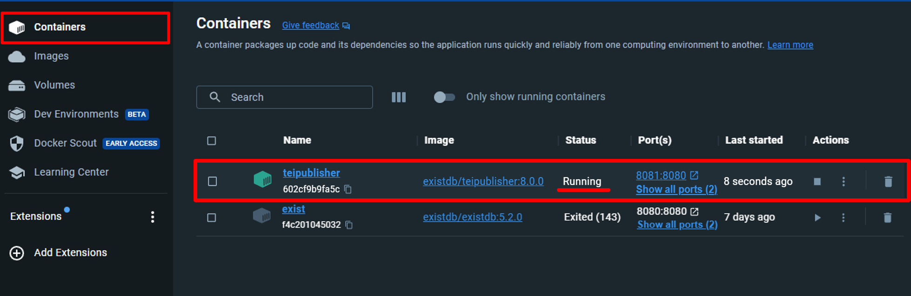
    Anschließend wählen wir in der eXist-db die TEI-Publisher-Applikation.
    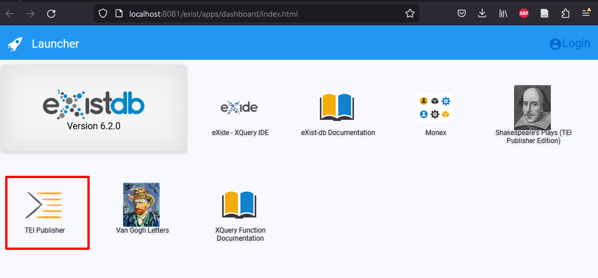

* Im _TEI Publisher_ gibt es bereits zwei vorangelegte Standard-User (tei-demo und tei), für die es auf der Startseite des _TEI Publisher_ auch eine kleine Infobox mit Angaben zum Passwort gibt.
    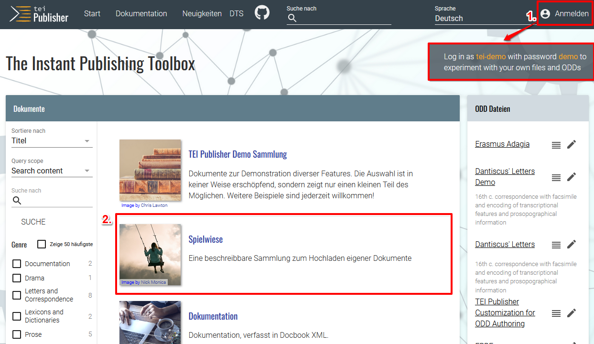
    → Wir loggen uns als "tei-demo" mit dem Passwort "demo" ein, um anschließend die **Spielwiese** zu öffnen.
* In der Spielwiese können wir nun unsere XML-Dokumente - in unserem Fall die bereits [in ediarum annotierten Manuskripte](https://github.com/DigEdTnT/digedtnt.github.io/tree/master/data/pipelines/pipeline_1/teipublisher/data/import) - hochladen.
    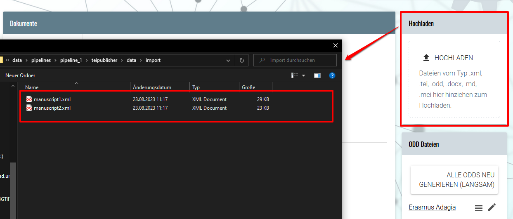
    → Unsere beiden Manuskripte scheinen im Anschluss im Dokumentenverzeichnis des _TEI Publisher_ auf.
    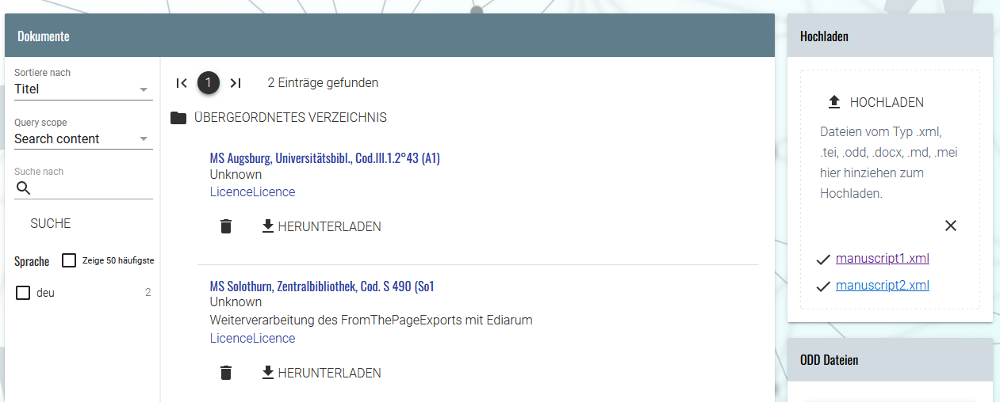
* Um ein projektspezifisches ODD zu erstellen, scrollen wir im rechten Seitenbereich unter **ODD Dateien** bis zum Seitenende, wo wir schließlich einen Dateinamen für unsere ODD sowie einen Titel für die Anzeige eingeben, und mittels "ERZEUGEN" ein eigenes ODD anlegen.
    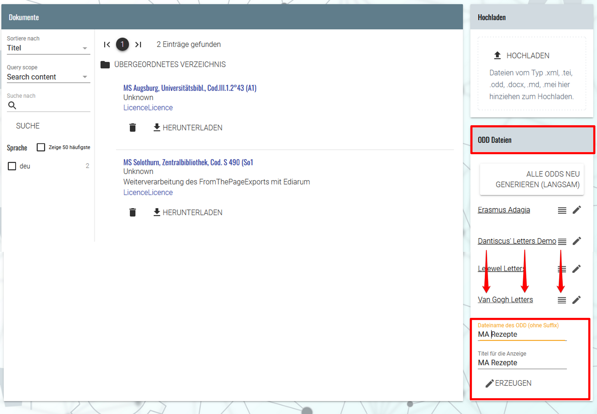
    → Das neue ODD erscheint anschließend als eigenständige Instanz in der Liste.
* Wir wählen nun eines unserer Dokumente in der Spielwiese und öffnen dieses. Wie wir an der Kursiv-Schreibung der ersten Zeilen erkennen können, wurde unser Dokument bereits mit einem Standard-ODD verknüpft. Mit einem Klick auf das Hamburger-Symbol in der Navigationsleiste lassen sich die Einstellungen zu unserem Dokument öffnen.
    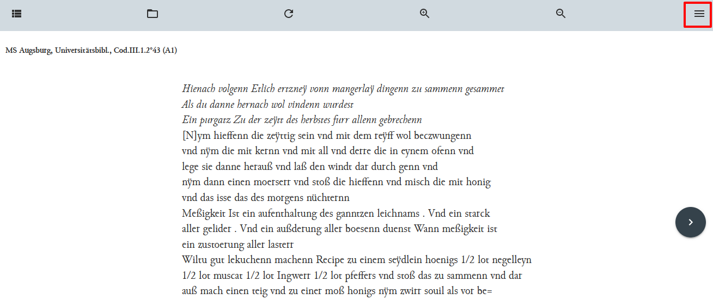
    Bei der Auswahl der ODD-Datei wählen wir nun anstelle des voreingestellten "TEI Publisher Base" unser soeben erstelltes, eigenes ODD-Dokument ("MA Rezepte").
    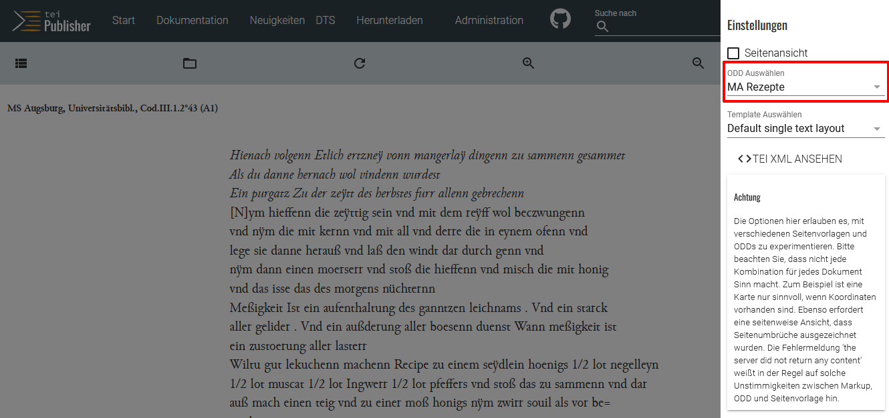
    → Da das ODD vorerst noch leer ist bzw. auf dem Standard-ODD im _TEI Publisher_ basiert, ergeben sich vorerst keine Änderungen.


## 3. Bearbeitung der Dokumente

Für eine vollständige Publikationsansicht benötigt man die TEI-XML-Ressource, die über den _TEI Publisher_ in die eXist-db hochgeladen werden, sowie zumindest ein ODD mit Processing Instructions und ein Page Template in HTML. Das ODD wird dabei auf Grundlage eines Basis-ODD im _TEI Publisher_ erstellt und kann nachfolgend für das eigene Projekt angepasst werden. Für das Page Template ist es am sinnvollsten, sich in der Demo-Sammlung des _TEI Publisher_ Beispielprojekte genauer anzusehen, und sich von dort ein passendes Template für das eigene Projekt zu kopieren und anzupassen.


### a. Bearbeitung des ODD der Manuskripte
* Bei jedem Start unserer Arbeitsroutine müssen wir zuerst Docker Desktop aktivieren und anschließend den teipublisher-Container starten, indem wir auf die Play-Schaltfläche klicken.
    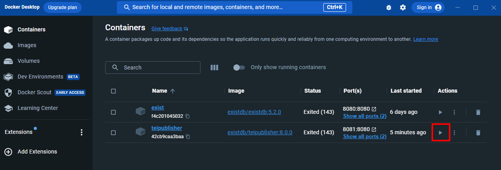
    → Mit einem Klick auf den Port (8081:8080) öffnet sich schließlich im Browser das eXist-db-Dashboard, über das wir zum _TEI Publisher_ gelangen, in dem wir uns einloggen müssen, um unsere Arbeit fortsetzen zu können.
* Um das eigens angelegte ODD anzupassen und damit unsere annotierten XML-Dateien für die Publikation aufzubereiten, gehen wir in der Navigation auf **Administration** und wählen dort "ODD editieren". (Der Administration-Button steht im Übrigen nur zur Verfügung, wenn man eingeloggt ist.)
    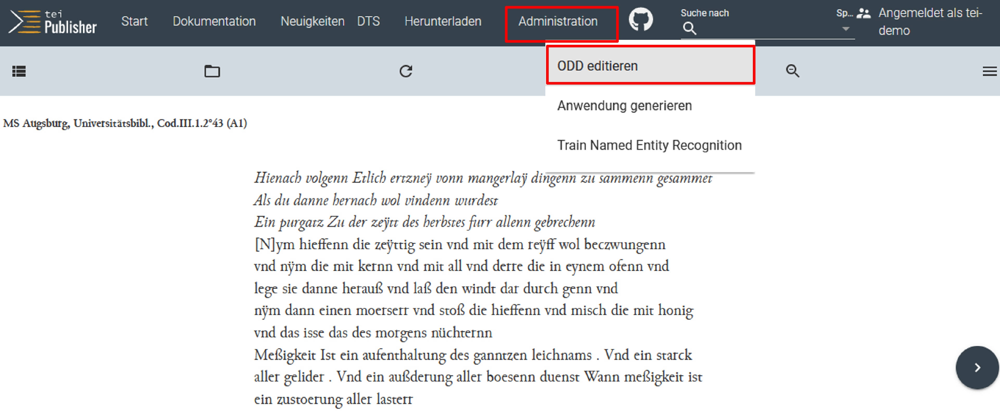
* In der ersten Ansicht des bisher noch leeren ODD können wir nun die Metadaten ausklappen und für unser Projekt anpassen.
    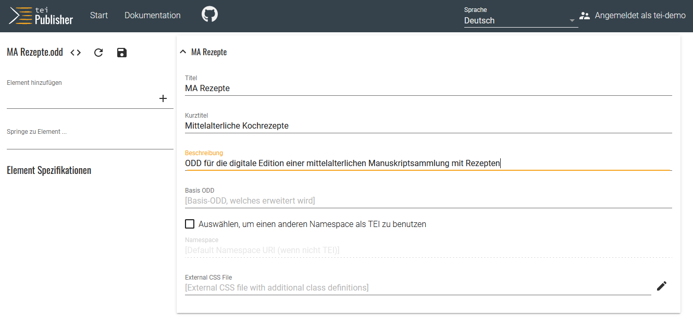
* Um die einzelnen TEI-Elemente, mit denen wir unsere Manuskripttexte annotiert haben, für die Publikation aufzubereiten, müssen wir als Erstes im ODD das Element angeben, das wir bearbeiten möchten. Sollten wir nicht (mehr) wissen, welche TEI-Elemente wir bei der Annotation verwendet haben, können wir in der Navigationsleiste des _TEI Publisher_ auf **Herunterladen** klicken und im Drop-Down-Menü "XML" auswählen.
    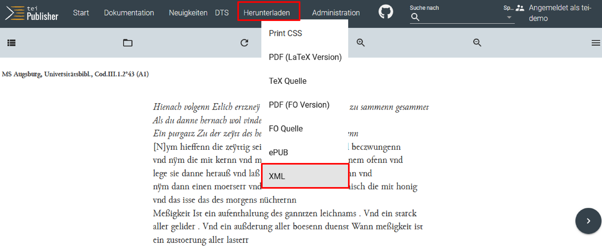
    Das XML unseres Manuskriptes öffnet sich daraufhin in einem neuen Browserfenster in eXide.
    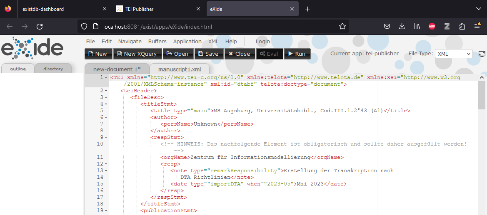
    → Bei der Arbeit im _TEI Publisher_ empfiehlt es sich, stets mehrere Tabs geöffnet zu haben: die Manuskriptansicht, auf der man die Änderungen direkt nachverfolgen kann; die XML-Ansicht in eXide, um einen Überblick über die Annotationen zu haben; sowie den ODD-Editor, wo die einzelnen Elemente bearbeitet werden können.
* Zurück zum ODD-Editor: In der Formularansicht können wir nun das Layout der einzelnen Annotationen bzw. der entsprechenden TEI-Elemente gestalten. Als erstes möchten wir, dass in der Publikationsansicht die mit roter Farbe geschriebenen Textstellen ebenfalls in rot dargestellt werden. Wir geben also in das Feld mit der Überschrift **Element hinzufügen** "hi" ein und klicken auf das Plus-Symbol (+).
    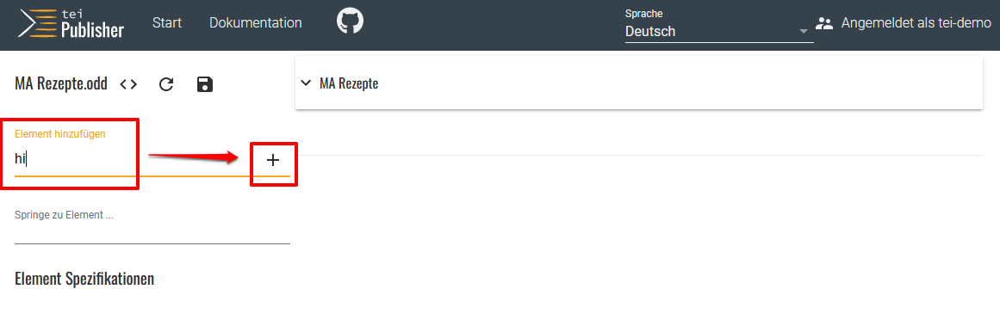
* Wenn wir das `<hi>`-Element aufklappen, öffnet sich ein Formular zur Bearbeitung.
    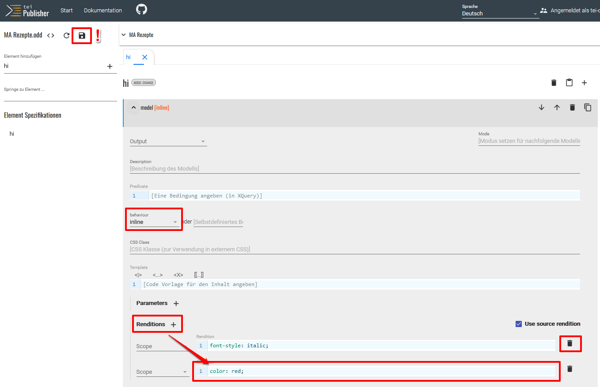
    Standardmäßig ist als behaviour "inline" eingestellt, was wir in diesem Fall auch so belassen, da sich die roten Textstellen innerhalb des Fließtextes befinden. Etwas weiter unten im Formular klicken wir bei Rendition auf das Plus-Zeichen, um hier das Rendering festzulegen. Da wir möchten, dass die `<hi>`-Elemente, die für die Annotation roter Textstellen angelegt wurden, auch im Publikationsmedium eine rote Farbe erhalten, müssen wir in dem Feld die entsprechende [CSS-Syntax](https://www.w3schools.com/css/css_syntax.asp) für die Rotfärbung angeben.
    Die vom Standard-ODD übernommene Kursivschreibung für das `<hi>`-Element, die im oberen Rendition-Feld gespeichert ist, löschen wir. Zuletzt müssen wir zum Speichern unserer Modellspezifikation auf das Diskettensymbol klicken.
    Wenn wir anschließend in einem anderen Browser-Tab die Manuskript-Ansicht öffnen (oder das Tab aktualisieren), können wir unsere Änderungen bereits sehen.
    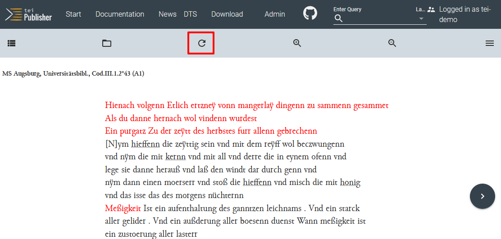
    → Sollten die Änderungen nicht sichtbar sein, muss möglicherweise überprüft werden, ob das Dokument nach wie vor mit dem eigenen ODD verknüpft ist, da sich dies mitunter automatisch auf die Standardeinstellung zurücksetzt, oder ob man nach wie vor eingeloggt ist, da man teilweise bereits nach kürzeren Bearbeitungspausen automatisch ausgeloggt wird. Es kann auch nötig sein, mit der F5-Taste zu aktualisieren oder den Cache zu leeren, um die Änderungen zu sehen.
* Wenn wir nun ein Element anlegen, das im Standard-ODD-Template noch keine Modellspezifikationen besitzt, wie in diesem Fall das `<term>`-Element, dann müssen wir nach dem Hinzufügen des Elements außerdem das Plus-Zeichen in der Elementansicht anklicken und aus dem Drop-Down auswählen, ob wir ein Modell, eine Modellsequenz oder eine Modellgruppe erstellen möchten.
    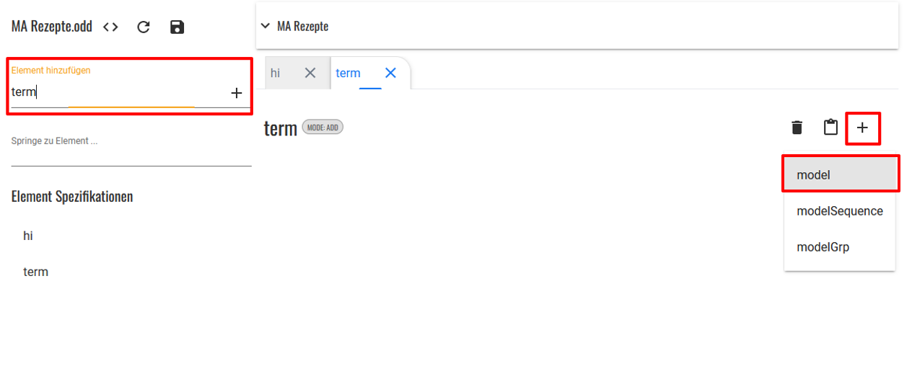
    Wir möchten unsere Zutaten mit einer punktierten Unterstreichung hervorheben und geben daher in dem Eingabefeld für die Rendition den entsprechenden CSS-Code an:
    ```css
    text-decoration-line: underline; text-decoration-style: dotted;
    ```
    Außerdem möchten wir in der Webansicht ein Popover über das `<term>`-Element legen, in dem einerseits der Wikidata-Link zu der in [OpenRefine erstellten normalisierten Entität](https://digedtnt.github.io/openrefine/) und andererseits eine Information mit Link zum Register erscheint. Zuerst stellen wir dafür das behaviour auf "alternate" und geben zwei Parameter an. Einmal den "default"-Parameter, wo wir nur einen Punkt setzen, da wir standardmäßig den Inhalt des `<term>`-Elements angezeigt bekommen wollen, und als "alternate"-Parameter geben wir an, was im Popover angezeigt werden soll. Wir möchten hier gerne die Informationen aus dem Register anzeigen und wählen daher den entsprechenden XPath, der uns genau zu diesem Registereintrag führt:
    ```xml
    id(substring-after(@key, '#'), doc("/db/apps/tei-publisher/data/playground/Sachbegriffe.xml"))
    ```
    Die gesamte Modellspezifikation sieht schließlich folgendermaßen aus:
    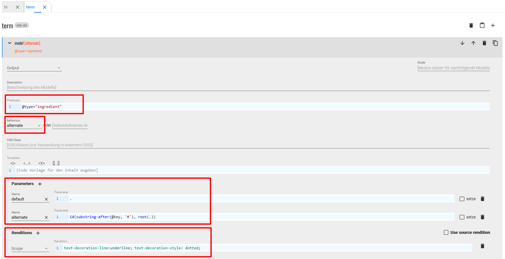
    Wenn wir nun wieder zur Ansicht unseres Dokuments wechseln, sehen wir, dass die Zutaten unterstrichen sind und beim Bewegen des Mauszeigers über die Zutat ein Popover mit allen Informationen aus dem Register, die es für das `<item>`-Element, auf welches das `<term>`-Element referenziert, erscheint. Da wir für die Kindelemente des `<item>`-Elements noch keine Modelle erstellt haben, werden vorerst nur die Inhalte dieser Elemente in direkter Aneinanderreihung ausgegeben.
    
* Als nächstes passen wir die Modellspezifikationen der Kindelemente der Registereinträge an. Die `<item>`-Elemente in unserem Register (Sachbegriffe.xml), auf das wir verlinken, beinhalten ein `<idno>`-Element mit der Wikidata-Referenz, ein `<label>`-Element mit dem Attribut `@type="reg"` für die reguläre Schreibweise sowie ein `<label>`-Element mit dem Attribut `@type="alt"` für diverse frühneuhochdeutsche Varianten.
    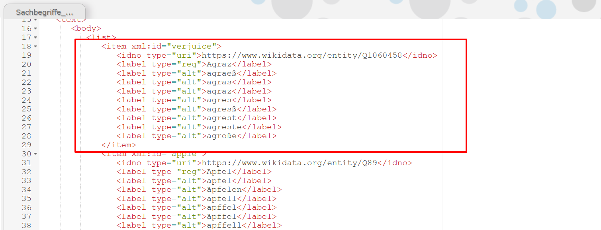
    Da wir einerseits den Inhalt des `<idno>`-Elements als Link im Popover haben möchten, zusätzlich aber noch eine Zeile mit einem Verweis auf das Register, müssen wir für diese zwei Aktionen zum gleichen Element zuerst eine Modellsequenz anlegen. Das Arbeiten mit `<modelSequence>` ermöglicht es, mehrere Modelle für ein spezifisches Element anzulegen, ohne dass diese sich gegenseitig überschreiben. Alle in einer Modellsequenz befindlichen Modelle für ein Element werden nacheinander abgearbeitet. Wir beschränken diese Sequenz auf `<idno>`-Elemente mit dem Attribut `@type="uri"` und legen darin über das Plus-Symbol zwei weitere Modelle an.
    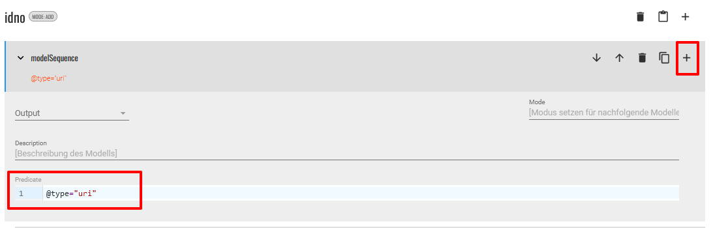
    * In der ersten neu angelegten Modellspezifikation wählen wir anschließend als behaviour "link" aus. Bei den Parametern wählen wir nun "uri" und verweisen dabei mit einem Punkt auf den Inhalt des `<idno>`-Elementes.
        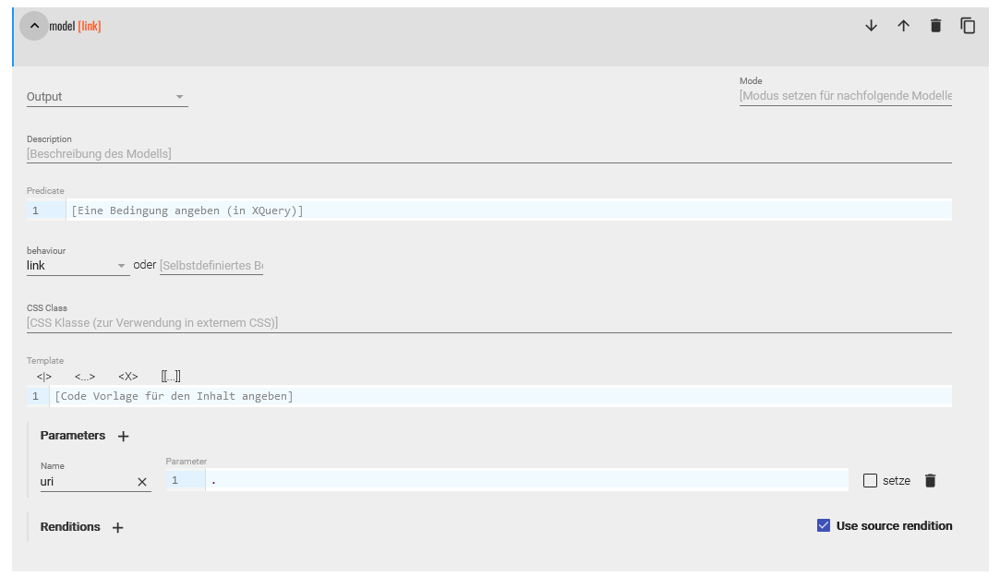
    * In der zweiten Modellspezifikation möchten wir nun einen kleinen Informationstext mit Link zum Zutatenregister erstellen. Dafür wählen wir als behaviour "block" und erstellen ein Template in HTML-Syntax für diesen Text, der in einem `<div>`-Element angezeigt werden soll:
        ```html
        <div>Siehe weitere Schreibweisen dieser Zutat im <a href="[[register]]" traget="_blank">Register</a></div>
        ```
        Da wir das Wort "Register" gleich mit unserem Zutatenregister verlinken wollen, setzen wir um dieses Wort einen Anker, und geben als Referenz den Parameter `[[register]]` an, den wir unter den Parametern dann mit dem entsprechenden XPath-Ausdruck näher spezifizieren. Damit sich das Register in einem neuen Tab im Browser öffnet, ergänzen wir das `<a>`-Element noch mit dem Attribut `@target="_blank"`. Der Link zum Register wir schließlich im Parameter weiter ausgeführt:
        ```xml
        concat('Sachbegriffe.xml?view=div&#38;odd=ma-zutaten', '#’, parent::item/@xml:id')
        ```
        Um in unserem Zutatenregister direkt zu der Zutat zu springen, dessen Popover gerade betrachtet wird, müssen wir einerseits die entsprechende XML-Datei (Sachbegriffe.xml) angeben, die aufgerufen werden soll, und andererseits das ODD-Template (ma-zutaten ohne Dateiendung), das für die Darstellung gewählt werden soll. Wir geben zudem an, dass nach dem Aufrufen des Registers, jenes Element ausgewählt werden soll, das wir gerade angewählt haben (- Näheres zum ma-zutaten.odd siehe unter Abschnitt [b. Bearbeitung des ODD des Zutatenregisters](https://digedtnt.github.io/teipublisher/#b-bearbeitung-des-odd-des-zutatenregisters)). Dafür müssen wir von dem `<idno>`-Element ausgehend zum übergeordneten `<item>`-Element, dessen `@xml:id` auf die Zutat im Sachregister verweist.
        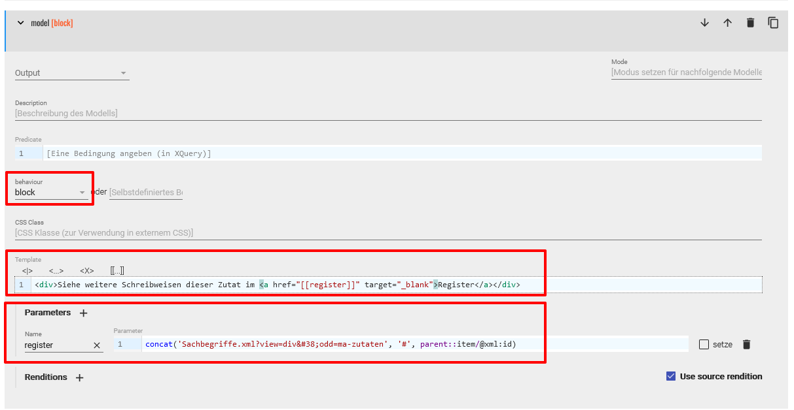
* Nun muss abschließend noch die Darstellung der `<label>`-Elemente modifiziert werden. Damit diese nicht alle im Popover erscheinen, legen wir eine Modellspezifikation für alle `<label>`-Elemente, unabhängig von ihrem Attributwert an. Da wir alle Elementinhalte ausblenden wollen, wählen wir als behaviour "omit" aus.
    
    Wenn wir uns jetzt erneut unser aktualisiertes Dokument ansehen und die Maus über eine Zutat bewegen, sieht der Inhalt des Popovers bereits anders aus.
    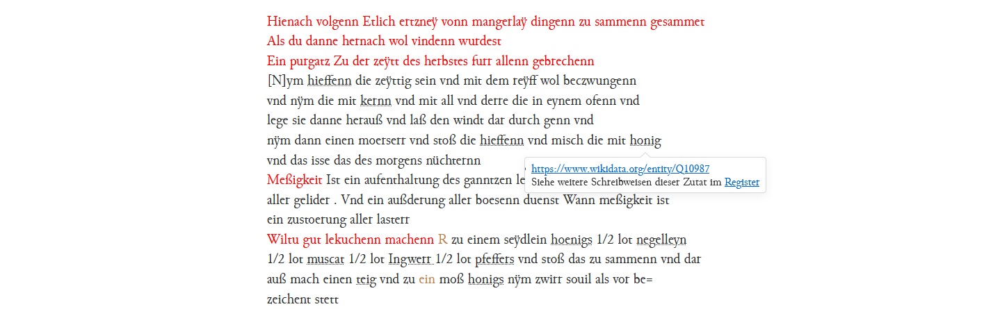
    Während uns der obere Link direkt zur entsprechenden Wikidata-Entität führt, kommen wir über den Link zum Register direkt an die entsprechende Stelle im Zutatenregister, wo die ausgewählte Zutat in die Mitte der Registeransicht rückt.
    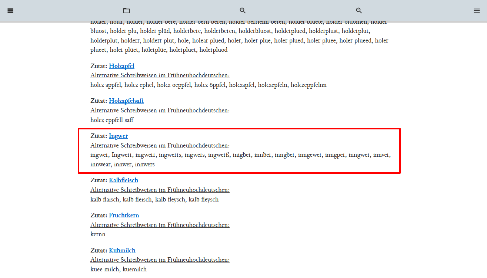
* In der XML-Datei unseres Projektes haben wir nun außerdem noch Auszeichnungen für Streichungen und Hinzufügungen durch die/den ursprüngliche:n Schreiber:in in Form von `<del>` und `<add>`, Abkürzungen und deren Langform im `<choice>`-Element, Hinzufügungen durch Editor:innen oder Transkribierende als `<supplied>` und Fußnoten als `<note>`. Wie bereits erwähnt, wurden beim Erstellen des projekteigenen ODD bereits einige grundlegende Modellspezifikationen des TEI-Publisher-Base-ODD übernommen, die häufig in digitalen Editionen vorkommen. Dementsprechend gibt es auch für alle genannten Elemente bereits Modelle. Während einige dieser Standard-Darstellungen ganz gut für unser Projekt passen, möchten wir andere jedoch noch weiter anpassen.
* Starten wir also der Reihe nach zuerst mit der Modellspezifikation für Streichungen bzw. das `<del>`-Element. Diese sieht standardmäßig als Rendition einen durchgestrichenen Text vor. Da dieses Element laut [Auszeichnungsrichtlinien für Manuskripte im DTA-Basisformat](https://www.deutschestextarchiv.de/doku/basisformat/msAddDel.html) (dessen Schema wir im Zuge der [Annotation in ediarum](https://digedtnt.github.io/ediarum/) verwendet haben) jedoch verschiedene Werte im `@rendition`-Attribut haben kann, wollen wir im Modell für das `<del>`-Element etwas spezifischer sein und fügen dort hinzu, dass das Rendering als durchgestrichener Text nur für `<del>`-Elemente mit `@rendition="#s"` gelten soll.
    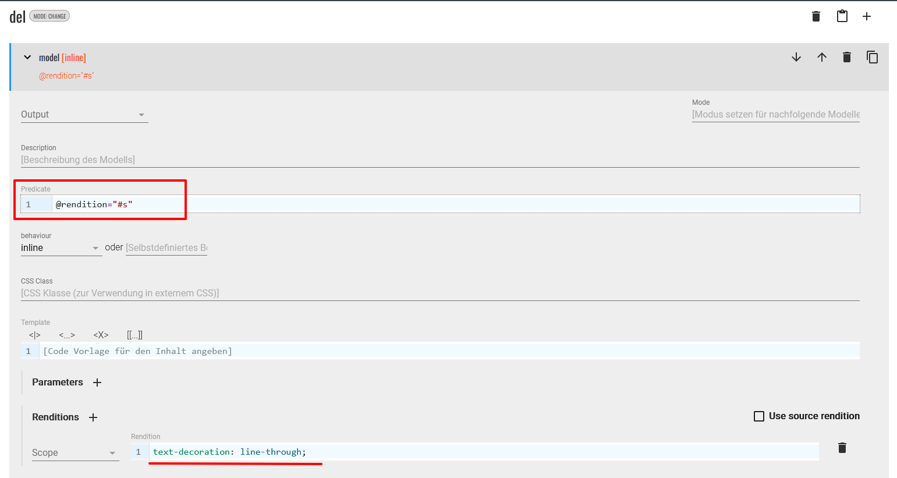
    In der Publikationsansicht des _TEI Publisher_ sehen `<del>`-Elemente entsprechend so aus:
    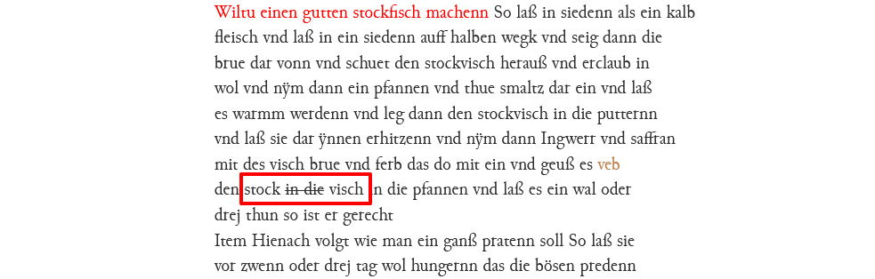
* Als nächstes widmen wir uns im ODD-Editor der Spezifikationen des `<add>`-Elements. Auch dort nehmen wir mittels Änderung im Predicate-Feld eine Limitation vor, indem wir das bestehende Modell auf das Attribut `@place="superlinear"`-Element beschränken. Außerdem adaptieren wir die Darstellung mit dem entsprechenden CSS Code, sodass diese nachträglich eingefügten Textstellen hochgestellt und in einem Braunton erscheinen.
    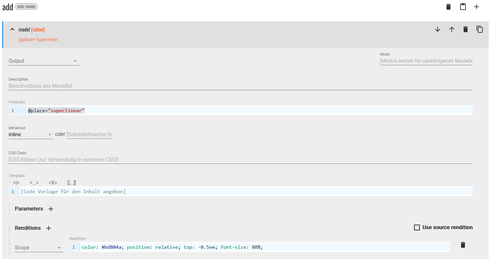
    Nach dem Aktualisieren in der Publikationsansicht, wird das `<add>`-Element entsprechend unserer Änderungen dargestellt.
    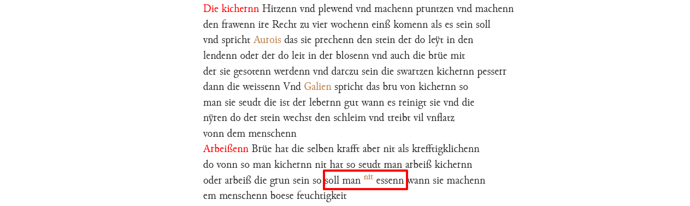
* Für `<choice>`-Elemente gibt es ebenfalls bereits Voreinstellungen, die vorsehen, dass die Langform ausgegeben und die Abkürzung in einem Popover angezeigt wird. Wir möchten dies für unser Projekt jedoch umkehren und wie im Originaltext nur die Abkürzung anzeigen und diese farblich markieren, um Nutzer:innen unserer Edition anzuzeigen, dass diese Textstelle besonders ist und somit eine Erkundung der Stelle mit der Maus anzuregen. Im Popover wird schließlich die Langform angezeigt.
    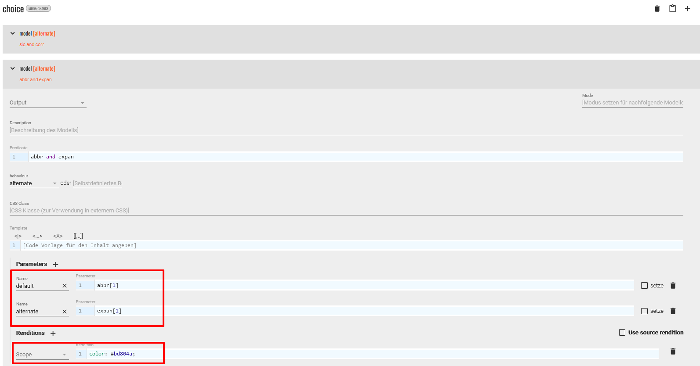
    Zurück in der Publikationsansicht können wir nun unsere Änderungen für das `<choice>`-Element (b) sehen. Außerdem ist in diesem Screenshot auch die unveränderte Darstellung für das `<supplied>`-Elemente (a) ersichtlich, bei der die editorische Hinzufügung mittels eckigen Klammern um den Zusatz gekennzeichnet wird. Da wir diese Darstellung passend finden, nehmen wir hier keine Änderungen vor.
    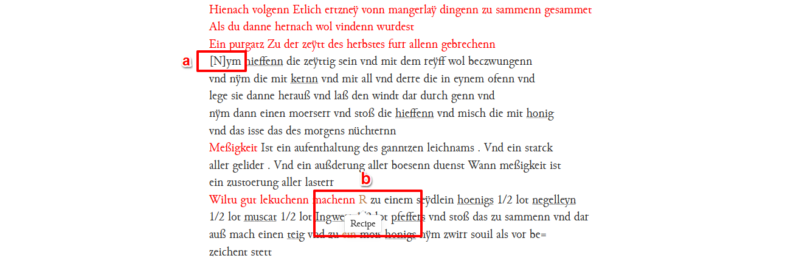
* Zuletzt haben wir noch die `<note>`-Elemente für Fußnoten, für die wir ebenfalls die bereits festgelegten Modellspezifikationen ohne Anpassungen übernehmen.
    
* Für die `<div>`-Elemente, die jeweils den ausgezeichneten Text der einzelnen Manuskriptseiten beinhalten, nutzen wir nun erneut eine Modellsequenz. Von diesen Elementen ausgehend möchten wir nämlich jeweils auf die `<pb>`-Elemente zugreifen, um einerseits die Webkomponente zu erstellen, die die Faksimiles verlinkt, sowie um die Seitenzahl anzuzeigen, und um andererseits auch den Inhalt des `<div>`-Elements anzuzeigen. Wir erstellen dementsprechend eine Sequenz für das `<div>`-Element und beschränken dieses mit dem Predicate `preceding-sibling::pb` auf jene  `<div>`-Elemente, denen ein `<pb>`-Elemente auf gleicher Ebene vorangeht. In der Modellsequenz erstellen wir anschließend 2 Modelle:
    * Zuerst benötigen wir ein Modell mit dem behaviour "block", das in der Ausgabe des `<div>`-Elements auf das vorhergehende `<pb>`-Element zugreift und anschließend nur die letzten 4 Zeichen ausgibt, da diese die Seitenzahl sowie die zusätzliche Information enthält, ob es sich bei der Manuskriptseite um eine Vorder- oder Rückseite handelt. Um die Seitenzahl legen wir außerdem eckige Klammern, um anzuzeigen, dass dies ein editorischer Zusatz ist und kein Teil der Transkription. Für den content-Parameter fügen wir dabei folgenden XPath-Ausdruck ein:
        ```xml
        concat("[", substring(preceding-sibling::pb[1]/@n, string-length(preceding-sibling::pb[1]/@n)-3), "]")
        ```
        Außerdem geben wir hinsichtlich der Rendition an, dass die Seitenangabe grau und zentriert ausgegeben werden soll.
        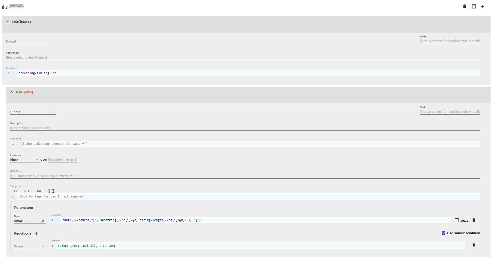
    * Das zweite Modell soll das Einbinden der Faksimiles regeln. Diese Modellspezifikation verschieben wir nach dem Anlegen nun an die letzte Stelle in der Sequenz, und nutzen einen XPath-Ausdruck im Predicate, um anzugeben, dass diese Spezifikation nur für jene `<div>`-Elemente gelten soll, denen ein `<pb>`-Element mit einem `@facs`-Attribut vorausgeht. Als behaviour wählen wir in diesem Fall "webcomponent" aus und setzen für diese Komponente die entsprechenden Parameter. Das Verbindungselement zwischen dem Faksimile und dem Text trägt den Namen "pb-facs-link" und enthält die Attribute `@emit` mit dem Wert "transcription", das für den Kanal steht, über den kommuniziert wird. Der Pfad zum Faksimile, auf das verwiesen wird, befindet sich letztlich im `@facs`-Attribut des `<pb->`-Elements, wobei wir über den Wert im `@facs` zur `@xml:id` in dem dazugehörigen `<graphic>`-Element gelangen und dort die `@url` wählen, die die URI zu unseren Faksimiles enthält.
        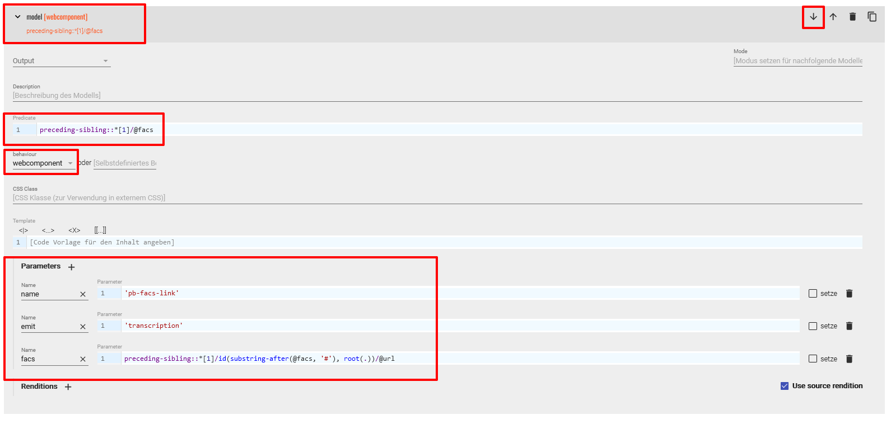
        → Damit die Faksimiles tatsächlich angezeigt werden, bedarf es noch weiterer Schritte, die im Abschnitt [c.) Bearbeitung des Page Templates](https://digedtnt.github.io/teipublisher/#c-bearbeitung-des-page-templates--weitere-odd-anpassungen) näher ausgeführt sind. </br>
    Mit all diesen Adaptionen haben wir aber jedenfalls in der Publikationsansicht eine zusätzliche Zeile vor Textbeginn erzeugt.
    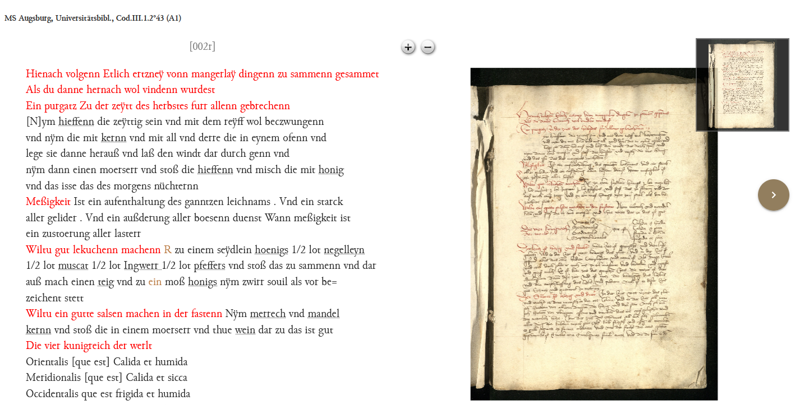
* In dem zweiten Manuskript unseres Beispielprojekts gibt es jetzt bis auf das `<fw>`-Element keine zusätzlichen Elemente mehr, die einer Bearbeitung bedürfen. Wie legen also eine neue Modellspezifikation für `<fw>`-Elemente mit dem Attribut `@type="header"` an, wählen als behaviour "block" und definieren anschließend die Rendition mit CSS-Code, der dafür sorgen soll, dass diese Textstelle etwas vergrößert, fettgedruckt und zentriert ausgegeben wird.
    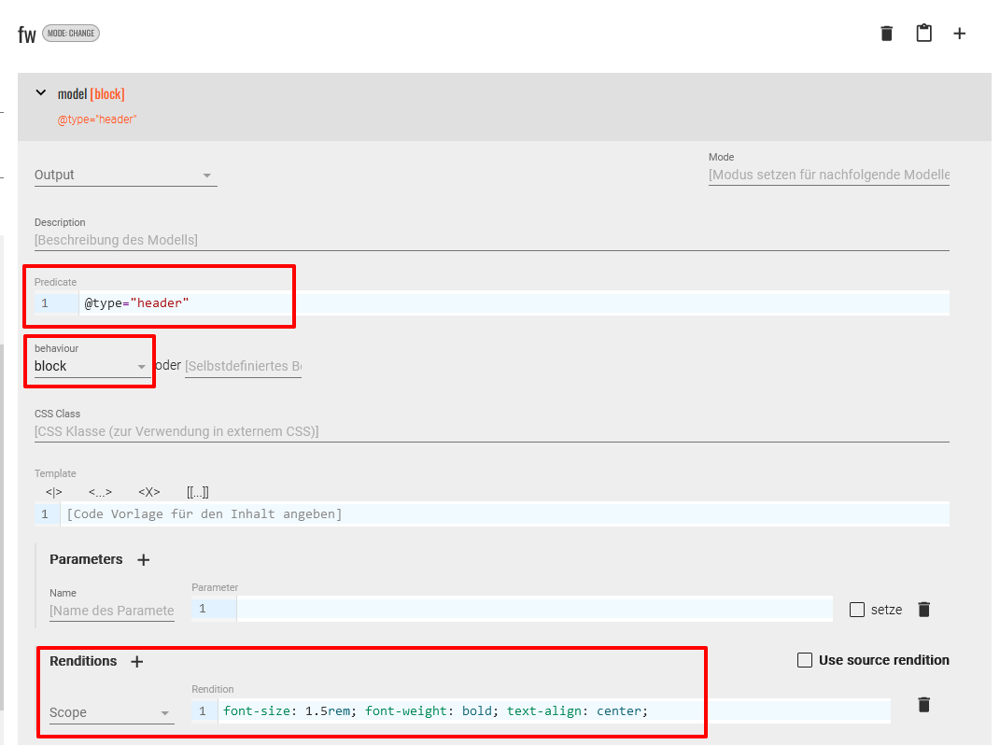
    In der Publikationsansicht sehen wir nach dem Aktualisieren schließlich das Ergebnis unserer Änderung.
    


### b. Bearbeitung des ODD des Zutatenregisters

In unserem Projekt gibt es aber nicht nur die XML-Dateien für das Manuskript, sondern noch eine weitere XML-Datei, die das Zutatenregister beinhaltet. Da wir für dieses Register eine andere Publikationsansicht haben möchten, müssen wir hierfür ein eigenes ODD erstellen.

* Zuerst laden wir das Register ([Sachbegriffe.xml](https://github.com/DigEdTnT/digedtnt.github.io/blob/master/data/pipelines/pipeline_1/teipublisher/data/import/Sachbegriffe.xml) in der Spielwiese hoch, wo wir auch unsere Manuskript-Dateien hochgeladen haben. Nach erfolgreichem Upload können wir sie in der Dokumentenliste der Spielwiese einsehen. Danach legen wir uns unter ODD Dateien (am Seitenende) eine ODD-Datei mit dem Dokumentnamen ma-zutaten und der Bezeichnung "MA Zutaten" an.
    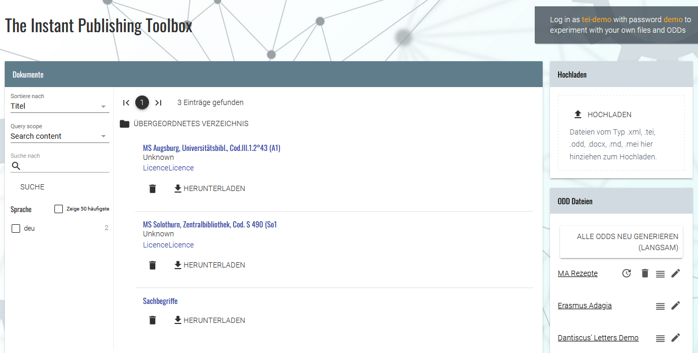
    → Möglicherweise muss die Seite aktualisiert werden, damit alle neu erstellten oder hochgeladenen Dokumente sichtbar sind.
* Wenn wir nun unser Register öffnen, sehen wir in der Publikationsansicht mit dem Standard-Template, dass unser Register als eine Liste mit allen Informationen zu den einzelnen Zutaten ausgegeben wird. Denn das Zutatenregister besteht aus einem `<list>`-Element mit vielen `<item>`-Elementen für die einzelnen Zutaten, und in dem Standard-Template sind nur für `<list>`- sowie `<item>`-Elemente Modellspezifikationen vordefiniert. Alle weiteren Elemente, für die es keine Regeln gibt, werden in Textform ausgegeben.
    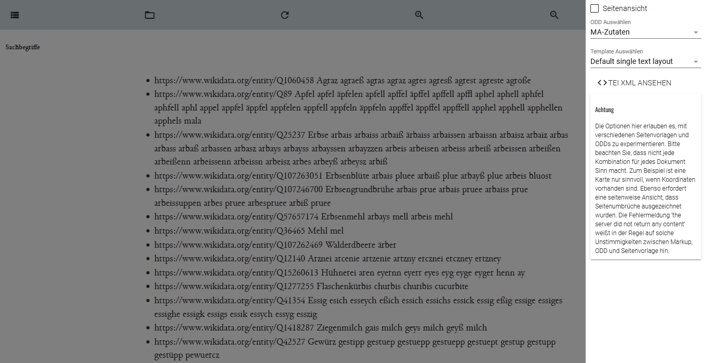
    Wir verbinden unser neu erstelltes ODD mit unserem Register und belassen bei der Auswahl der HTML-Templates die Verknüpfung mit dem Standard-Template (view.html).
* Danach wechseln wir in den ODD-Editor zur Anpassung des neuen ODD und beginnen damit, dem Register eine Überschrift zu geben. Dafür öffnen wir über das linke Seitenmenü das `<list>`-Element, wo es bereits ein vordefiniertes Modell mit dem behaviour "list" gibt. Da wir über diese Liste nun die Überschrift setzen wollen und zusätzlich die Listenelemente ausgeben wollen, benötigen wir wieder eine Modellsequenz. Diese Modellsequenz soll nun einerseits ein Modell für die Überschrift und eines für die Ausgabe der Listenelemente beinhalten, weshalb wir 2 Modelle erstellen.
    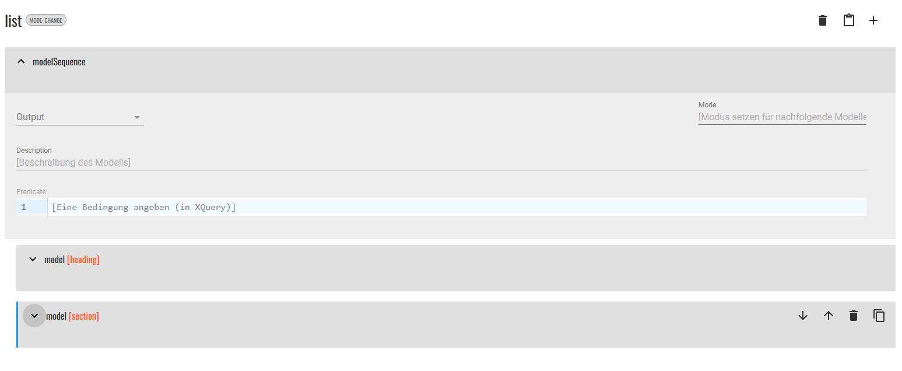
    * Das erste der beiden Modelle in der Sequenz bekommt das behaviour "heading" und der Inhalt der Überschrift soll "Zutatenregister" in Großbuchstaben sein, was wir dementsprechend im content-Parameter festhalten. Außerdem geben wir für die Rendition an, dass die Überschrift fettgedruckt und mittig ausgegeben werden soll.
        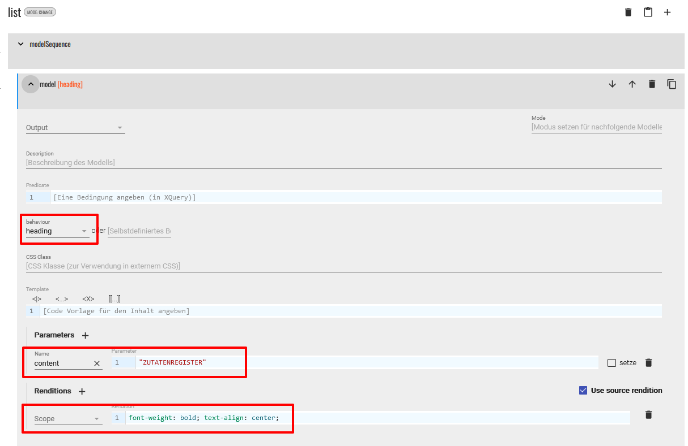
    * Damit nun auch der Inhalt der Liste und nicht nur die Überschrift angezeigt wird, setzen wir beim zweiten Modell der Sequenz das behaviour auf "list". Im content-Parameter nutzen wir diesmal einen XQuery-Ausdruck, der die `<item>`-Elemente anhand des ersten `<label>`-Elements mit dem Attribut `@type="reg"` alphabetisch sortieren soll. (Für diese Sortierung haben wir im Übrigen den [Slack-Channel](https://digedtnt.github.io/teipublisher/#kontakt) genutzt, wo uns sehr schnell mit dem Code weitergeholfen wurde!)
        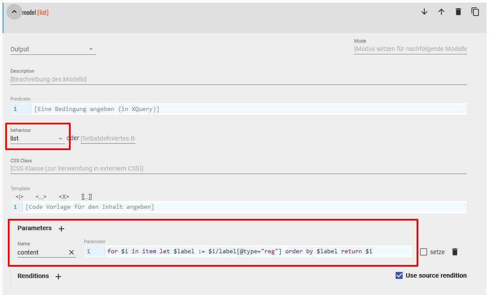
* Das Modell für die `<item>`-Elemente ändern wir auch nur sehr geringfügig. Diesem Element ist standardmäßig das behaviour "listItem" zugeordnet, das wir genau so belassen wollen. Wir möchten nur den Abstand zwischen den Listenelementen etwas vergrößern, weshalb wir die Rendition entsprechend anpassen.
    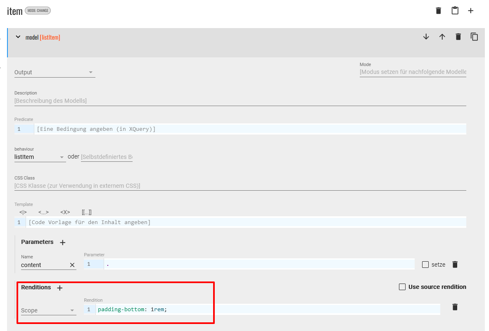
* Als nächstes widmen wir uns den Kindelementen des `<item>`-Elements und beginnen mit dem `<idno>`-Element. Dieses wollen wir gar nicht ausgeben bzw. die Information später nur anderweitig im Hintergrund für einen Link verwenden. Insofern müssen wir für das `<idno>`-Element nur eine Modellspezifikation anlegen, die mit dem behaviour "omit" attribuiert wird. Zusätzlich wird dieses Modell noch auf jene Elemente eingeschränkt, die das Attribut `@type="uri"` besitzen.
    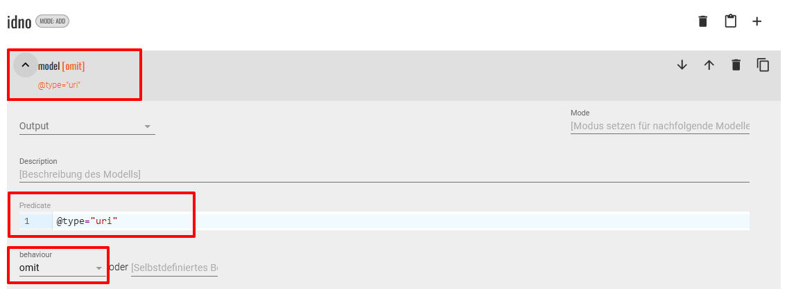
* Die nachfolgenden Kindelement im `<item>`-Element sind die `<label>`-Elemente mit einer regulären Schreibweise im modernen Standarddeutsch, die den Attributwert "reg" führen, und allen weiteren frühneuhochdeutschen Varianten, die mit dem Attributwert "alt" ausgezeichnet sind. Insgesamt haben wir 4 Vorhaben, die jeweils unterschiedliche behaviour verlangen. Daher benötigen wir wieder eine Modellsequenz mit 4 Modellen.
    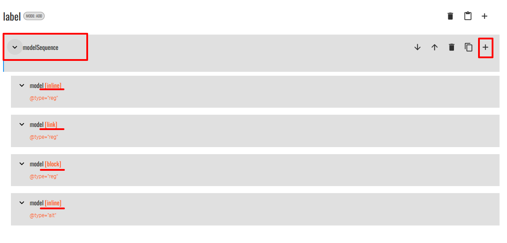
    Gehen wir diese Modelle und erwünschten Verhaltensweise einzeln durch:
    * Unser erstes Modell ist für `<label>`-Elemente mit dem Attributwert "reg" bestimmt und soll vor den tatsächlichen Inhalt des Elements das fettgedruckte Wort "Zutat" stellen. Dementsprechend sieht diese Modellspezifikation aus:
        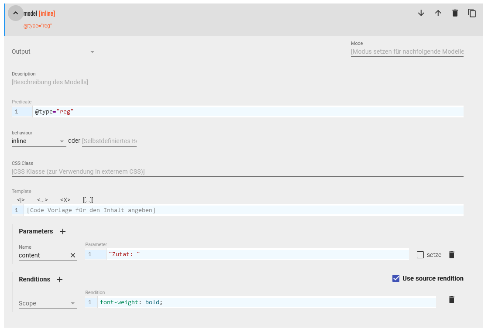
    * Das zweite Modell bezieht sich ebenfalls auf `<label type="reg">`-Elemente. Diesmal möchten wir jedoch den Inhalt sehr wohl ausgeben, diesen aber mit einem Link hinterlegen. Daher wählen wir nun als behaviour "link" und verweisen dann im uri-Parameter auf das vorhergehende `<idno>`-Element, welches den Link zur Wikidata-Entität enthält. Zudem verändern wir wieder typographische Merkmale mit entsprechendem CSS-Code.
        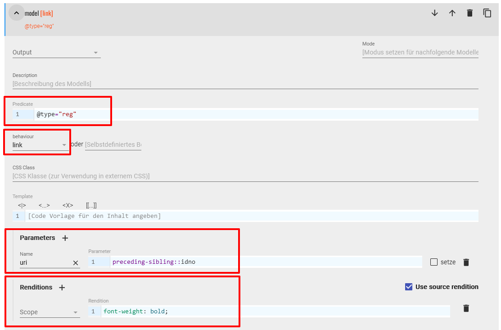
    * Als nächstes möchten wir eine informative Zeile einbauen, die angibt, dass es sich nachfolgend (bei den `<label type="alt">`-Elementen) um alternative Schreibweisen im Frühneuhochdeutschen handelt. Erneut erstellen wir ein Modell für das vorhergehende `<label type="reg">`-Element, da wir andernfalls diesen Informationstext vor jeder Schreibvariante stehen hätten. Die Modellspezifikation enthält als behaviour den Wert "block" und im content-Parameter die gewünschte Zusatzinformation. Mittels entsprechenden CSS-Ausführungen im Abschnitt Rendition legen wir fest, dass dieser Text unterstrichen werden soll.
        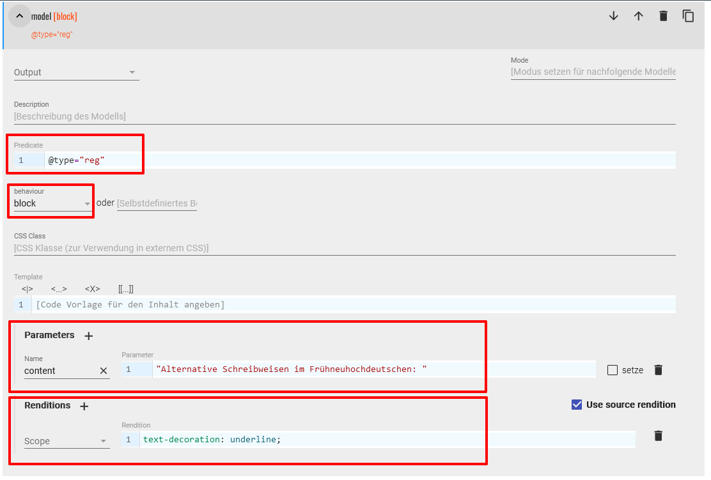
    * Zu guter Letzt passen wir nun noch die Modellspezifikation jener `<label>`-Elemente mit dem Attributwert "alt" an. In der standardmäßigen Ausgabe werden die Inhalte dieser Elemente nacheinander als inline-Elemente ausgegeben. Hier möchten wir noch Beistriche zwischen die einzelnen Varianten setzen, wobei dem letzten `<label>`-Element in dieser Sequenz kein Beistrich mehr nachgestellt werden soll. Dies machen wir mit folgendem XPath im content-Parameter:
        ```xml
        concat(.,
            if (following-sibling::label[1][@type='alt'])
            then ','
            else '')
        ```
        Die 4. Modellspezifikation in dieser Sequenz sieht dementsprechend folgendermaßen aus:
        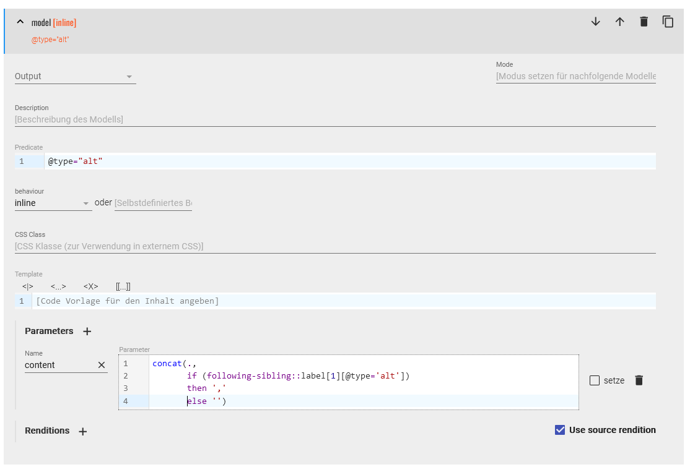
    Nachdem wir all diese Anpassungen vorgenommen haben, wechseln wir in die Publikationsansicht, aktualisieren diese und haben nun eine unseren Vorstellungen angepasste Webansicht des Zutatenregisters.
    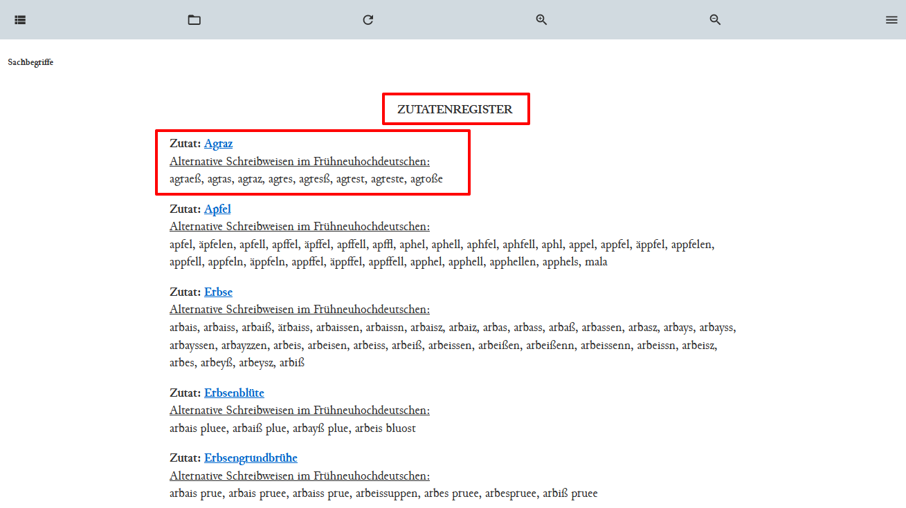


### c. Bearbeitung des Page Templates (+ weitere ODD-Anpassungen)
* Da wir in unserem Projekt über die Faksimiles unserer Manuskripte verfügen, möchten wir für die Publikation eine Bild-Text-Synopse erstellen. Dies lässt sich im _TEI Publisher_ über die Webkomponente `<pb-facsimile>` realisieren. Der einfachste Weg, um dies umzusetzen, besteht darin, dass wir uns zuerst ein Template kopieren, das diese synoptische Ansicht bereits integriert hat. Da in der Demo-Sammlung des _TEI Publisher_ die XML-Struktur des Projekts Immanuel Kant unseren importierten XML-Dokumenten sehr ähnlich ist und uns auch die Darstellung ganz gut gefällt, wollen wir dieses Template für uns nutzen. Dafür navigieren wir in eXide unter "Open" in der Ordnerstruktur zu dem Template des Deutschen Textarchivs (dta.html), indem wir folgenden Pfad nutzen: '/db/apps/tei-publisher/templates/pages/'
    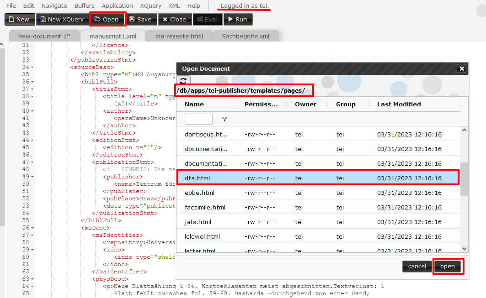
    Wir ändern in diesem Template nur im `<meta>`-Element mit dem Attribut `@name="description"` den Wert des Attributs `@content` auf "MA Rezepte Template" und entfernen weiter unten im Dokument im `<pb-facsimile>`-Element den Wert aus dem Attribut `@base-uri`, da wir in den `<graphic>`-Elementen in unserem XML, bereits den gesamten Pfad zum Faksimile angegeben haben.
    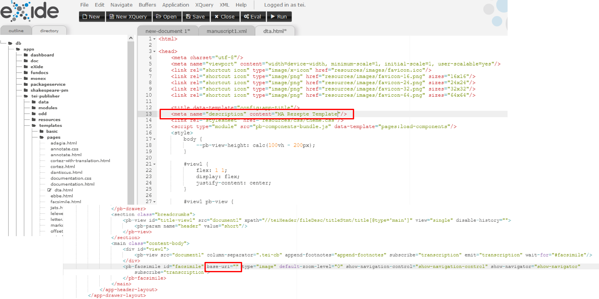
    Wir speichern das HTML-Dokument anschließend unter "ma-rezepte.html" in der gleichen Ordnerstruktur ab. \
    → Für Änderungen in eXide ist die Eingabe eines Passworts erforderlich, wobei hier ebenfalls die User "tei" oder "tei-demo" mit dem jeweiligen Passwort genutzt werden kann. In manchen Ordnern kann es auch erforderlich sein, sich als "admin" einzuloggen, da dieser User die umfangreichsten Schreibrechte hat.
    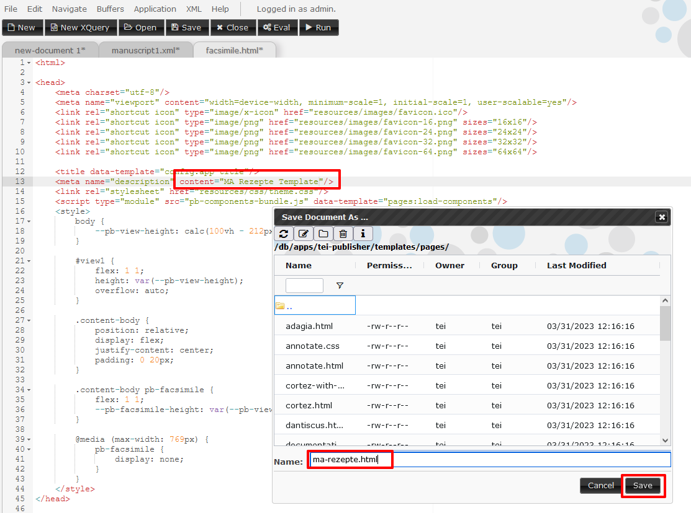
    Zurück in der Manuskript-Ansicht wählen wir im Menü in der zweiten Navigationsleiste, wo wir bereits unser projekteigenes ODD verknüpft haben, nun zusätzlich auch unser eigenes Template aus.
    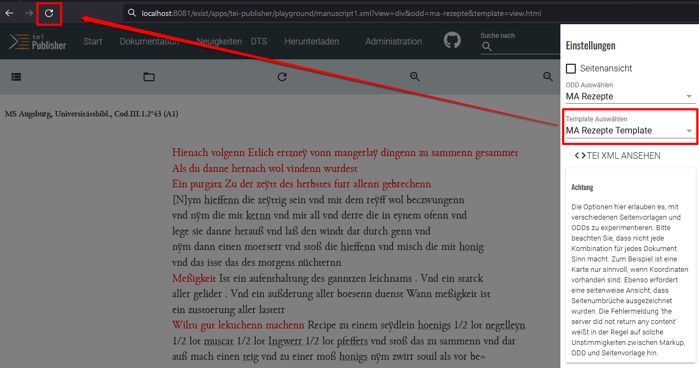
    Nachdem wir den Browser aktualisiert haben, gelangen wir schließlich zur Text-Bild-Synopse.
    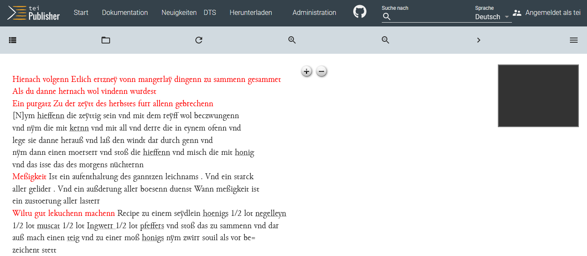
    Die Seite ist in zwei Bereiche aufgeteilt, wobei die rechte Hälfte bereits für unsere Faksimiles vorbereitet ist, die wir jedoch noch einbinden müssen.
* Zum Einbinden der Faksimiles unserer Manuskripte müssen wir im ODD eine Kommunikation zwischen den Webkomponenten herstellen. Wir gehen also zurück in den ODD-Editor, wo wir Ausgaberegeln für das `<div>`-Element spezifizieren wollen. Dafür werfen wir zuerst noch einen Blick auf das XML des Manuskripts. Dort befinden sich die Links zu den Faksimiles in den `<graphic>`-Elementen, und jedes `<pb>`-Element enthält eine Referenz.
    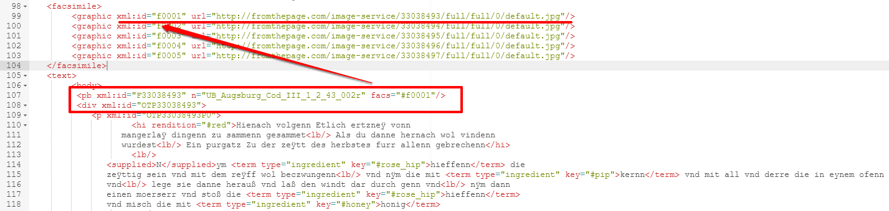
    Die Modellspezifikation für die Webkomponente haben wir bereits im vorherigen Abschnitt während der Bearbeitung der Seitenangabe aus den `<pb>`-Elementen, die über das `<div>`-Element angesteuert werden, beschrieben. Zum besseren Verständnis möchten wir aber noch mal einen kurzen Überblick über die einzelnen Schritte geben: Im ODD-Editor haben wir für jene `<div>`-Elemente, denen ein `<pb>`-Element mit einem `@facs`-Attribut vorausgeht, eine Modellspezifikation angelegt. Als behaviour haben wir in diesem Fall "webcomponent" ausgewählt und für diese Komponente die entsprechenden Parameter gesetzt. Das Verbindungselement zwischen dem Faksimile und dem Text trägt den Namen "pb-facs-link" und enthält die Attribute `@emit` mit dem Wert "transcription", das für den Kanal steht, über den kommuniziert wird. Der Pfad zum Faksimile, auf das verwiesen wird, befindet sich letztlich im `@facs`-Attribut des `<pb->`-Elements vor dem `<div>` - wobei wir über den Wert im `@facs` zur `@xml:id` in der `<graphic>` gelangen und dort die `@url` wählen, die die URI zu unseren Faksmilies enthält.
    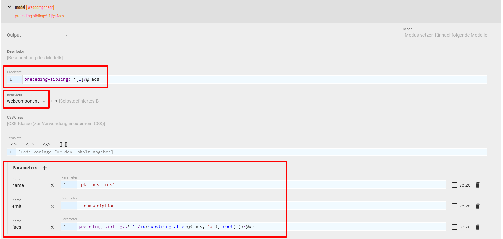
    Nach erneutem Aktualisieren in der Dokumentansicht werden die entsprechenden Faksimiles nun zu jeder Manuskriptseite in den [OpenSeadragon](http://openseadragon.github.io/)-Viewer geladen.
    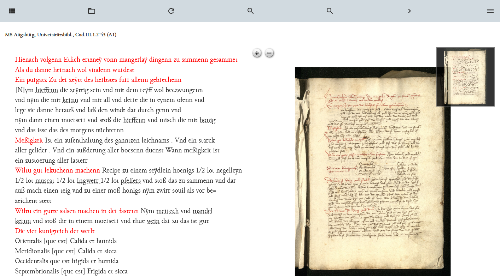

* Eine weitere Webkomponente, die uns die Seitennavigation im Manuskript erleichtert, ist [`<pb-navigation>`](https://cdn.tei-publisher.com/@2.12.6/dist/api.html#pb-navigation.0). Auch hier nutzen wir wieder die Beispielprojekte der Demo-Sammlung, in der wir gleich im ersten Beispiel (Adagia in Latine and English) die entsprechenden Navigationsbuttons finden. Wenn wir in der Seitenleiste nun überprüfen, welches Template eingebunden wurde, können wir sehen, dass dieses Beispielprojekt das **Default single text layout** nutzt.
    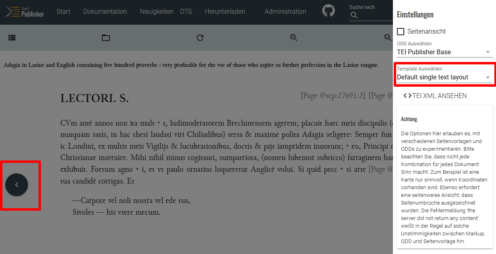
    Wir öffnen daher in eXide das entsprechende Template (view.html) und können erneut per "Copy-Paste" die gewünschte Webkomponenten - in diesem Fall die jeweiligen `<pb-navigation>`-Komponenten des `<main>`-Abschnitts vor und nach der `<pb-view>`-Webkomponente - auswählen und in unser projektspezifisches Template an entsprechender Stelle vor und nach den anderen Webkomponenten des `<main>`-Abschnitts einbauen. Dadurch ersparen wir uns die Suche in der [Dokumentation](https://teipublisher.com/exist/apps/tei-publisher/documentation/webcomponents) nach entsprechenden Komponenten bzw. müssen die Webkomponenten nicht selbst anlegen.
    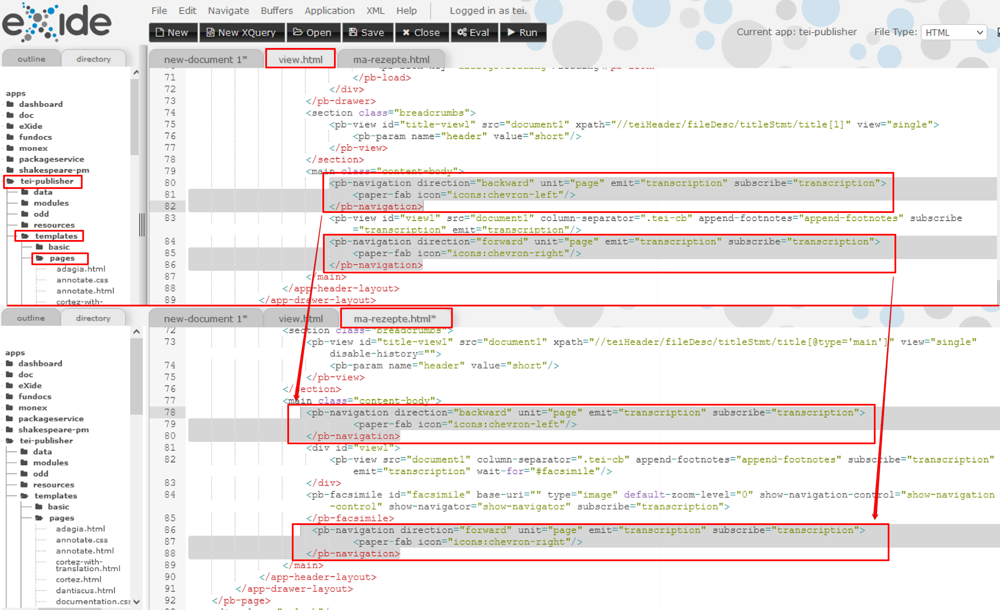
    In der Publikationsansicht sehen wir nun, dass die Navigationsbuttons noch nicht an gewünschter Stelle sind.
    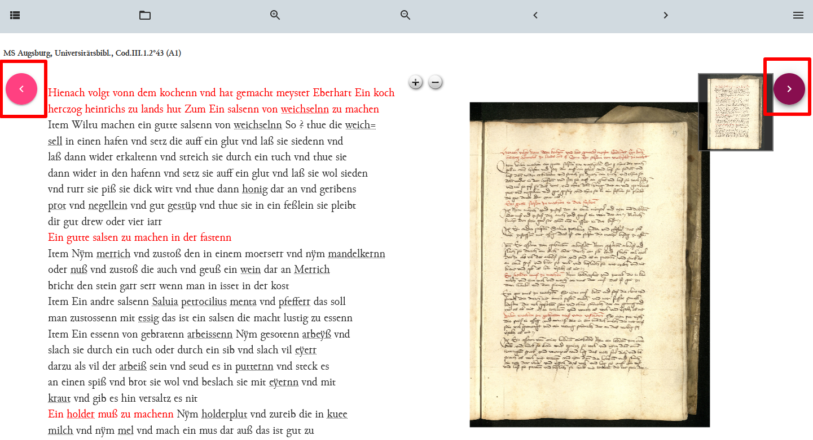
    Um diese Elemente entsprechend anzupassen, müssen wir die CSS-Informationen ändern. Hier können wir ebenfalls aus dem Template des Demo-Projekts die für das Styling der Navigationsbutton verantwortlichen Regeln übernehmen und in unser projektspezifisches Template übernehmen.
    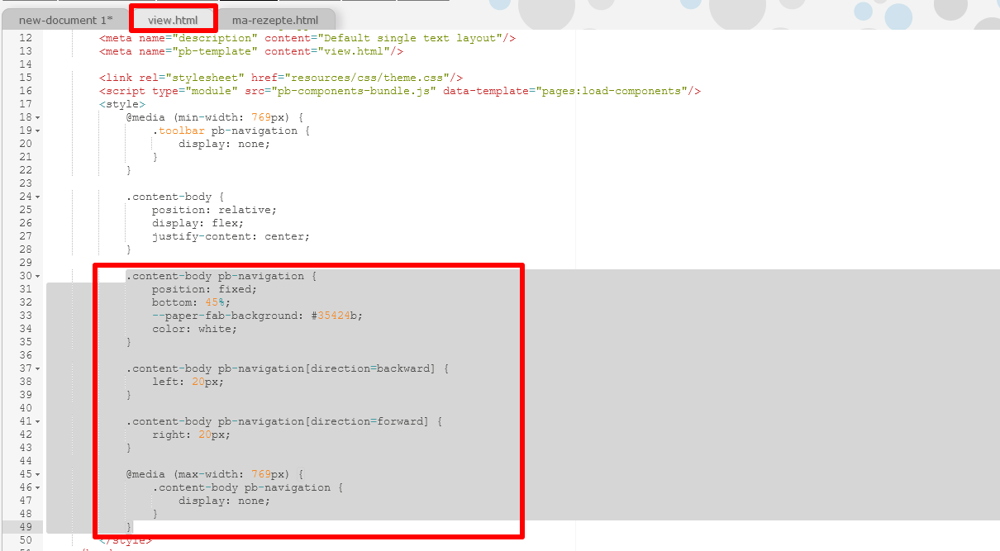
    Wir kopieren die Informationen unter die Styling-Informationen für die Faksimile-Webkomponente und ändern dabei noch die Farbe der Navigationsbutton.
    
    Nach dem Aktualisieren der Publikationsansicht unseres Manuskripts, haben die Buttons nun eine andere Farbe und sind vertikal mittig ausgerichtet.
    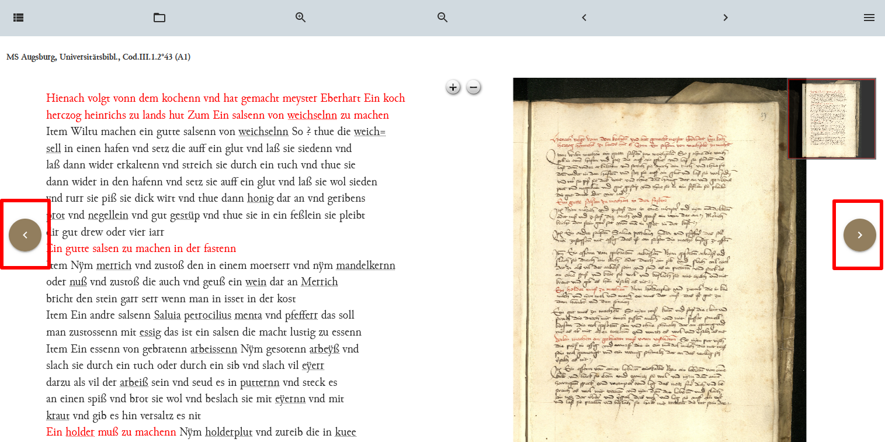
* In der Publikationsansicht möchten wir nun außerdem für die einzelnen Manuskripte auch die Metadaten darstellen. In der Demo-Sammlung haben wir dabei in dem Projekt "Mauritius Ferber" eine ein- und ausklappbare Metadaten-Darstellung gefunden, die wir für unser Projekt nachnutzen wollen. Wir navigieren dafür in eXide zu dem entsprechenden Page-Template (danticus.html). Dort finden wir innerhalb des `<app-header>`-Abschnitts sogar einen Hinweis darauf, dass in der entsprechenden Darstellung die Toolbar, die eigentlich nur das Inhaltsverzeichnis anzeigt, um ein Toggle-Element für die Metadaten ergänzt wurde.
    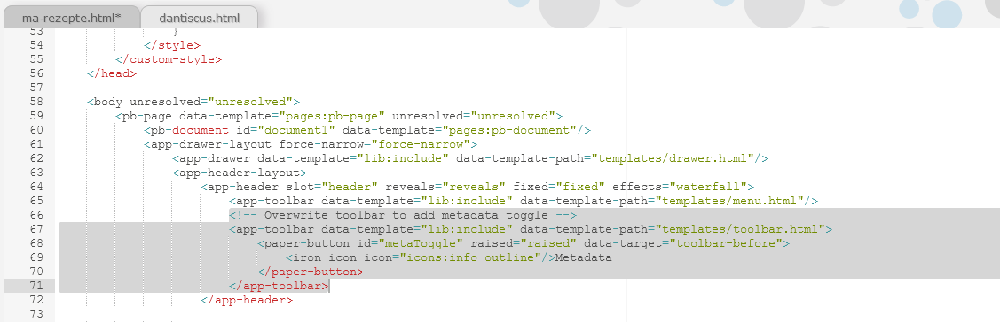
    Um diesen Button in unserem Page-Template zu übernehmen, kopieren wir also die zweite `<app-toolbar>` im `<app-header>` und fügen diese an gleicher Stelle in unser projektspezifisches HTML-Template ein. Wie bei den Copy-Paste-Aktionen für andere Webkomponenten dürfen wir hier ebenfalls nicht vergessen, zusätzlich auch den CSS-Code für die ausklappbare Metadaten-Anzeige zu übernehmen.
    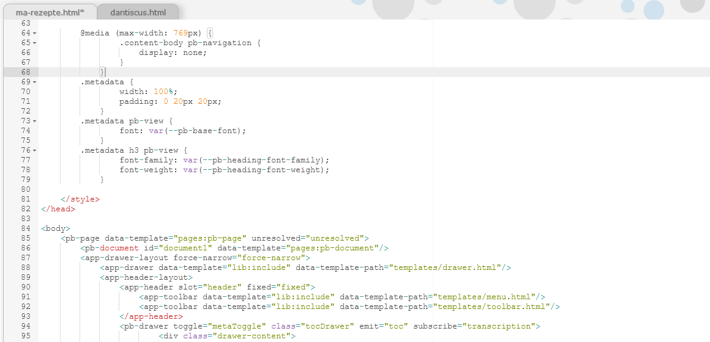
    Wenn wir in der Publikationsansicht unser Browser-Fenster aktualisieren, erscheint nun oben links in der Navigationsleiste ein Metadaten-Button.
    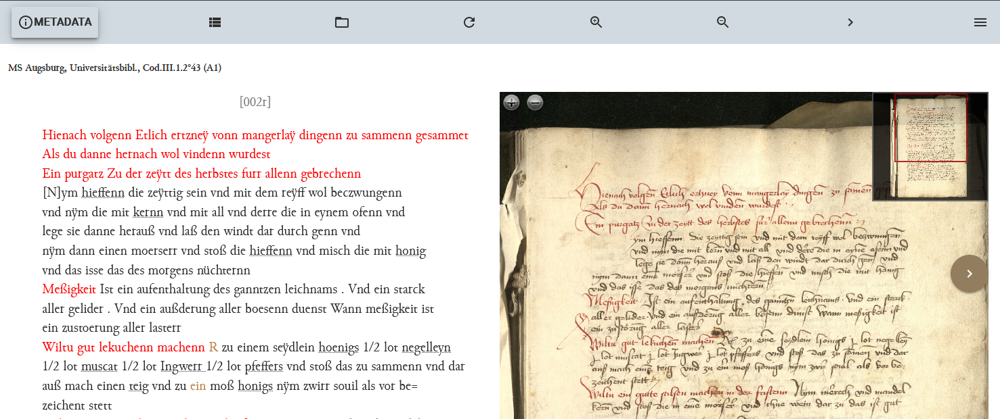
    Um diesen ausklappbaren Seitenbereich mit Metadaten zu füllen, müssen wir jedoch noch ein paar Anpassungen in unserem ODD vornehmen.
* Wir wechseln also erneut in den ODD-Editor und suchen dort nach den Modellspezifikationen für den `<teiHeader>`. Wir legen hier ein neues inline-Modell an und weisen im Predicate mit der XQuery-Angabe `$parameters?mode=’commentary’` darauf hin, dass dieses Modell nur für die zuvor im HTML-Template angelegte Metadaten-Toggle-Komponente gilt. Im Metadatenbereich möchten wir einerseits Informationen zum Repository, zur Signatur sowie zur physischen Beschreibung des Manuskripts anzeigen. Dementsprechend basteln wir ein Template in HTML mit Überschriften und geben in doppelten eckigen Klammern Platzhalter-Elemente an, denen wir darunter die entsprechenden Parameter zuordnen: Unter [[repository]] im Template sollen schließlich jene Daten angegeben werden, die wir im teiHeader im Element `<repository>` finden. Daher geben wir bei diesem Parameter vom `<teiHeader>`-Element ausgehend den entsprechenden Pfad '//repository' an. Genauso gehen wir auch für die weiteren Parameter vor. Beim `<idno>`-Element bedarf es genauerer Spezifikation, da es einerseits die `<idno>`-Elemente in unserem Register, und andererseits aber auch das `<idno>`-Element im `<teiHeader>` gibt. Daher fügen wir hier als XPath-Bedingung noch das Attribut `@type="shelfmark"` hinzu. Zuletzt stellen wir noch sicher, dass es für all die in den Parametern angegebenen Elemente auch tatsächlich Modellspezifikationen gibt. Dabei reicht es, dass es für jedes Element, das wir in den Metadaten ausgeben wollen, ein inline-Modell existiert.
    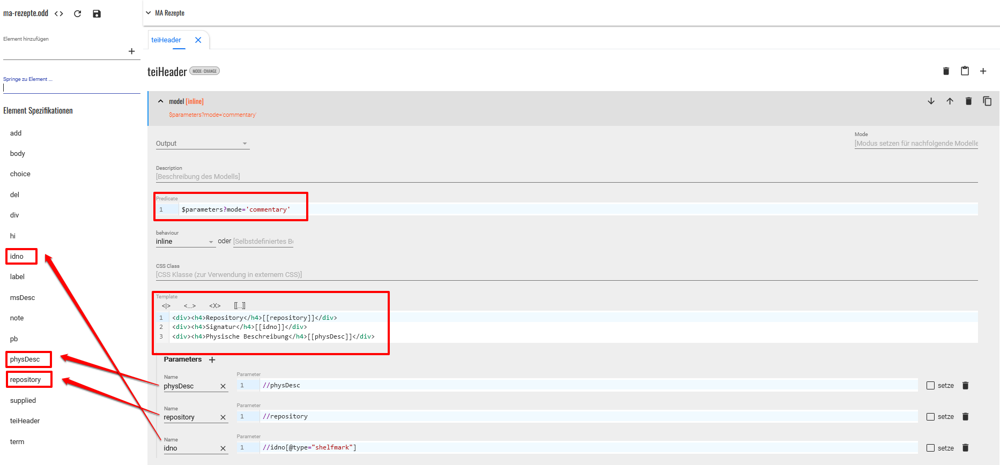
    Wenn wir schließlich alle Modelle erstellt haben und die Publikationsansicht aktualisieren, erscheint nach einem Klick auf den Metadaten-Button nun auch ein entsprechender Inhalt.
    


## 4. Erstellung einer eigenen App

Damit wir nun zu einer eigenständigen Edition bzw. Applikation gelangen, die wir auf unserer eigenen Website präsentieren können, müssen wir die erstellten ODDs, die HTML Templates und Webkomponenten zusammenführen.

* Wir klicken dafür zunächst in der Navigationsleiste auf **Administration** und wählen im Drop-Down "Anwendung generieren".
    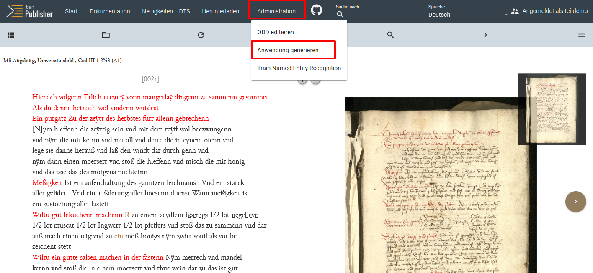
* In dem Tab, das sich daraufhin öffnet, wählen wir als Erstes jene ODDs aus, die für unsere App verwendet werden sollen. Dies ist in unserem Fall das ODD "MA Rezepte" sowie "MA Zutaten". Außerdem geben wir hier die URL zur App sowie das gewünschte Kürzel an.
    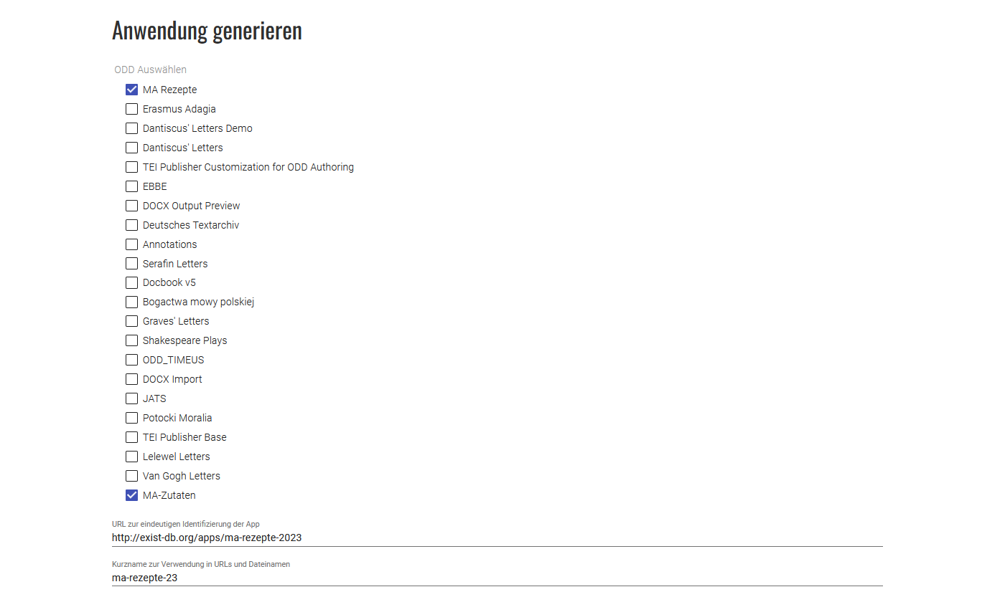
    Bei den weiteren Feldern lassen wir die Eingabezeile zum Namen der Subcollection frei, da wir hier die vordefinierte Struktur nutzen wollen. Wir geben den Titel unserer App an, und wählen unsere zuvor erstellte HTML-Vorlage. Die Strukturierung in der Standardansicht soll sich nach den `<div>`-Elementen richten und auch beim Standard-Volltextindex wählen wir wieder eine Organisation nach `<div>`-Elementen. Hinsichtlich des Benutzerkontos hat sich bei uns herausgestellt, dass wir nur mit dem Benutzer **tei-demo** und dem entsprechenden Passwort **demo** später auch ohne weitere Konfigurierungen Dokumente hochladen können, weshalb wir diesen Standardnutzer nun auch für unsere App anlegen.
    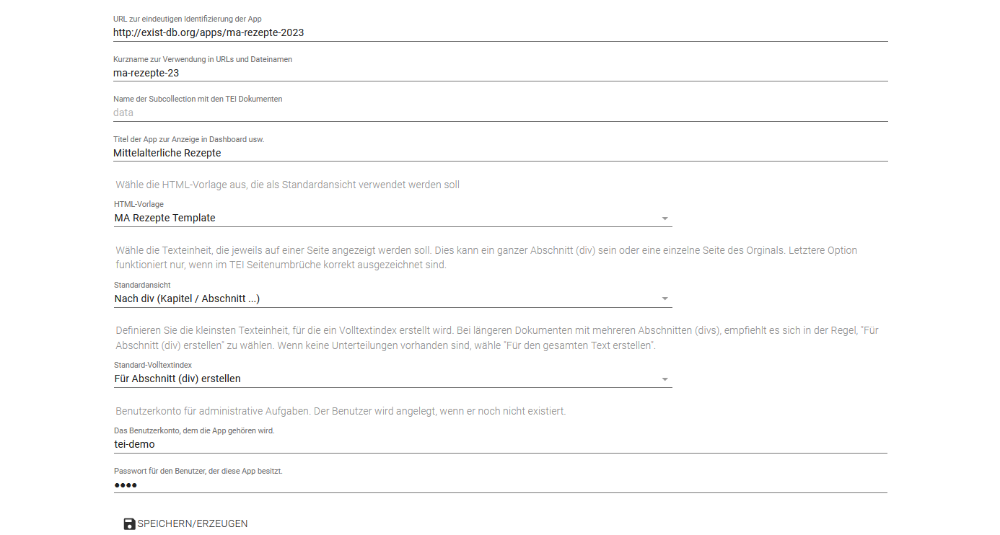
    Nachdem das Formular vollständig bearbeitet wurde und wir auf "SPEICHERN/ERZEUGEN" geklickt haben, erscheint ein kleines Dialogfenster, das uns bestätigt, dass unsere App erfolgreich erstellt wurde.
    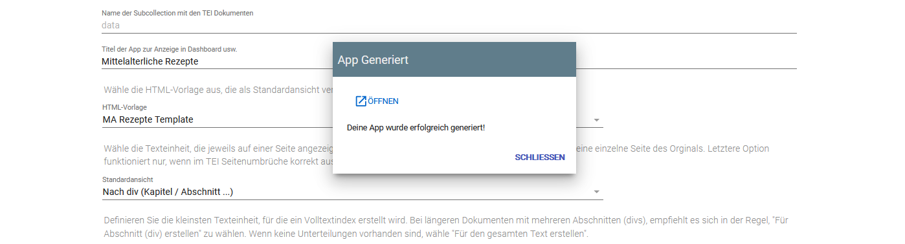
* Wenn wir unsere App nun über den Link (oder andernfalls über die eXist-db, wo unsere App nun so wie der _TEI Publisher_ in einer eigenen Kachel erscheint) geöffnet haben, sehen wir, dass unsere App im Grunde wie der _TEI Publisher_ aufgebaut ist, wobei sie bereits unseren Projekttitel trägt. Zunächst müssen wir sichergehen, dass wir auch dort mit den zuvor eingetragenen Benutzerdaten angemeldet sind. Daraufhin sind die Projektdateien erneut hochzuladen, da diese nicht automatisch übernommen wurden.
    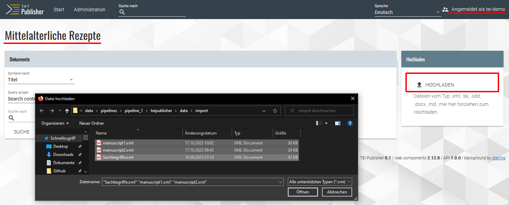
    Mit einem Klick auf unser erstes Manuskript sehen wir auch gleich, dass das ODD direkt mit unserem XML verknüpft wurde. Unter dem Button **Administration** in der Navigationsleiste können wir uns außerdem einen Überblick darüber verschaffen, welche Optionen es für die Bearbeitung jetzt noch gibt.
    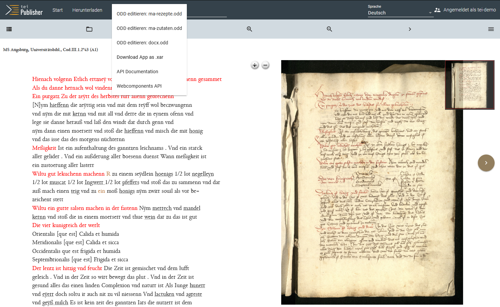
    → Es ist also auch jetzt noch möglich, Änderungen an den beiden ODDs vorzunehmen, sowie das HTML-Template oder die XMLs in eXide anzupassen.
* Einzig das XML mit dem Zutatenregister wird noch nicht richtig dargestellt, da es ebenfalls standardmäßig mit dem MA-Rezepte-ODD für die Manuskripte verknüpft wird und nicht mit dem eigens für die Zutaten erstellten MA-Zutaten-ODD.
    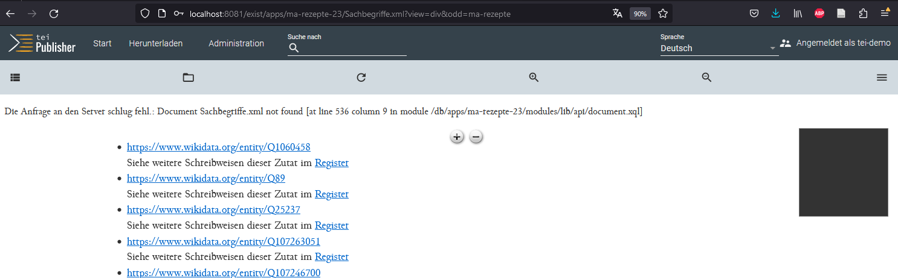
    Wie in der [Dokumentation des _TEI Publisher_ ](https://teipublisher.com/exist/apps/tei-publisher/documentation/multiple-odds) beschrieben, kann man die ODD- und HTML-Verknüpfung für einzelne Dokumente aber über die Datei "config.xqm" im Ordner **modules** unserer App konfigurieren. Dementsprechend verknüpfen wir für unser Projekt das Register-XML mit dem ODD für die Zutaten und dem "view.html" anstelle des eigens angepassten HTML-Templates.
    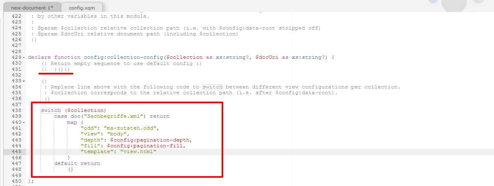
    Nach dem Aktualisieren des Zutatenregisters in der Publikationsansicht, wird auch dieses XML wieder richtig dargestellt.
    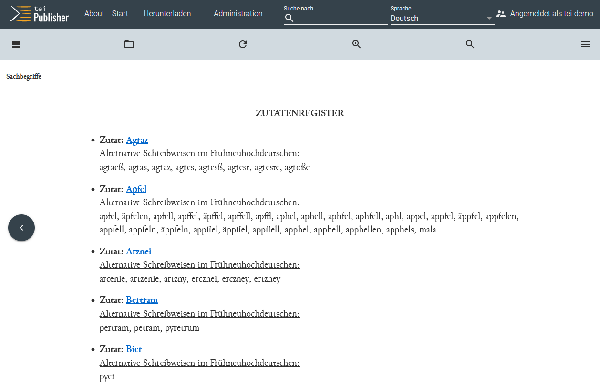
* Da die App aber weiterhin im TEI-Publisher-Design erscheint, widmen wir uns zunächst der Anpassung des Layouts. Wir möchten jedenfalls das Logo sowie die Farben unserer App für unser Projekt adaptieren. Dafür wechseln wir wieder in einen Tab, in dem eXide geöffnet ist. Wir navigieren als erstes innerhalb unserer App zum Ordner **templates/pages**, wo wir die Datei "ma-rezepte.html" finden, in der alle weiteren Bausteine unserer Website vorzufinden sind. Im Element `<app-header>` sehen wir schließlich, dass die Toolbar über ein anderes Template geladen wird, und zwar "menu.html", das sich im übergeordneten Ordner **templates** befindet.
    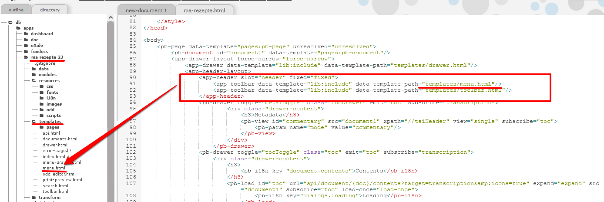
    In diesem HTML finden wir leider keine eingebundene Ressource, sondern nur das Attribut `@class="logo"`, in dem sich möglicherweise der Link zum Logo befindet. Um herauszufinden, wo das CSS abgelegt wurde, scrollen wir in unserer Datei also noch mal an den Anfang.
    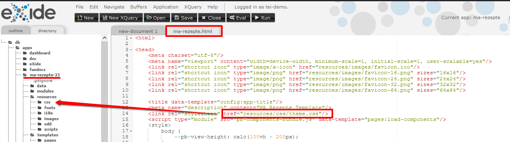
    Dort finden wir den Path zum standardmäßig eingebundene CSS ("theme.css"), wo wir anschließend nach der entsprechenden Klasse.
    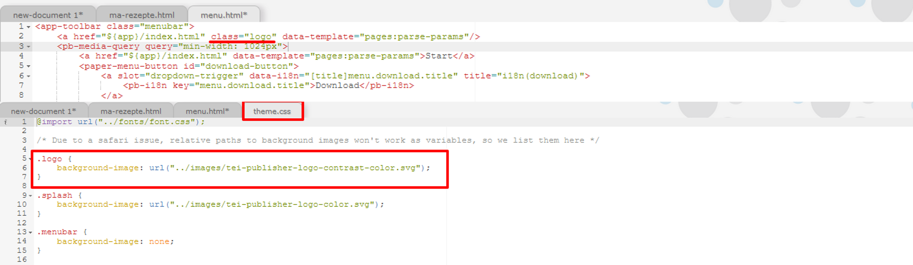
    Hier wird ersichtlich, dass das Logo tatsächlich über das CSS eingebunden wurde und dass die Logos über den Pfad ‘db/apps/ma-rezepte-23/resources/images’ zu finden sind. Dort laden wir nun unser eigenes Logo Ordner hoch.
    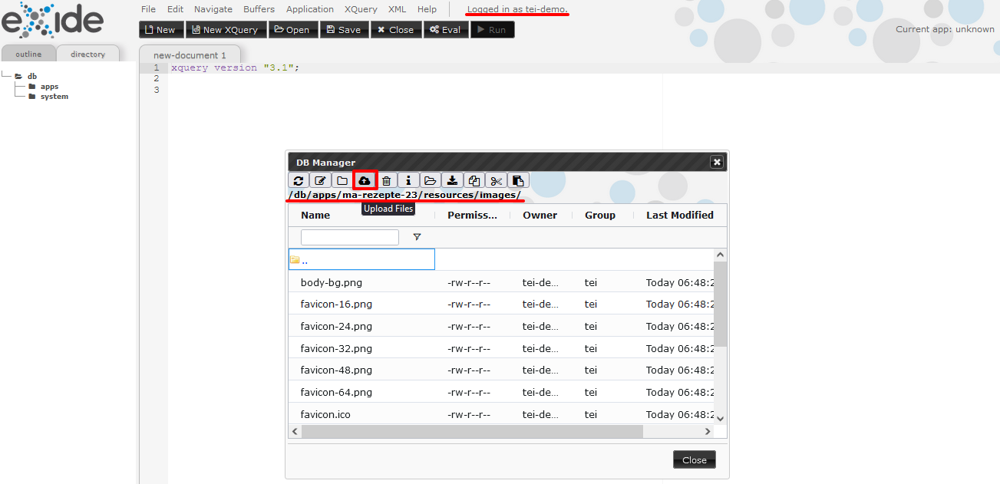
    Als nächstes müssen wir im CSS auf unsere Bilddatei verweisen. Bevor wir dies tun, suchen wir in dem "theme.css" aber auch jene Stelle, an der die Farbeigenschaften für die Menüleiste hinterlegt sind und sehen dort, dass die Farbschemata größtenteils in Variablen abgelegt wurden.
    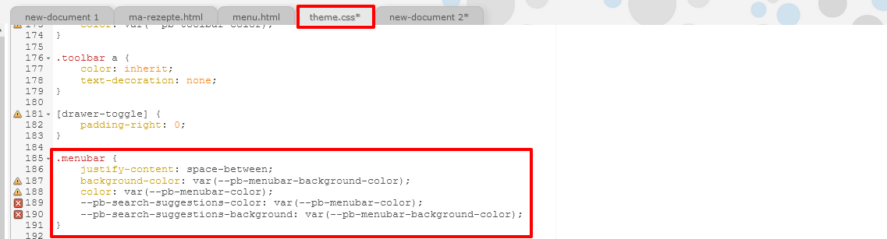
    Um unsere projektspezifischen Anpassungen separat zu bearbeiten, erstellen wir eine weitere CSS-Datei und überschreiben dort jene Klassen, die wir abändern möchten. Wir ändern einerseits die Bilddateien in der `.logo`-Klasse und zusätzlich auch in einer weiteren Klasse (`.splash`), die für die Übergangsbilder beim Laden verantwortlich ist. Außerdem passen wir die Text- und Hintergrundfarben in der Menüleiste und der darunterliegenden Navigationsleiste an, indem wir entsprechende Variablen einführen und die alten Variablen mit unseren Farbcodes überschreiben.
    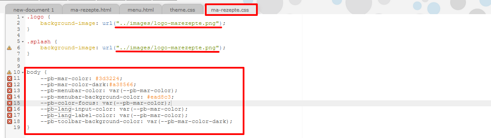
    Wenn wir nun erneut in die Publikationsansicht gehen und die Seite aktualisieren, erscheint unsere App nun mit unserem eigenen Logo und in anderen Farben.
    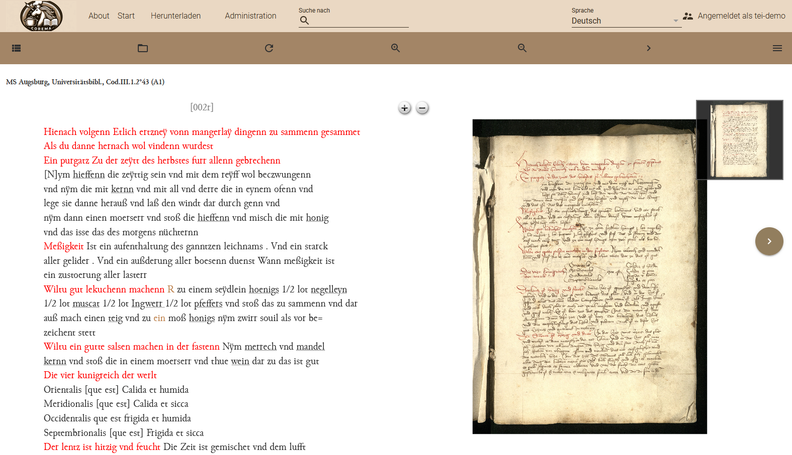
* Zuletzt möchten wir in unsere App noch eine weitere Seite einbinden, auf der das Projekt vorgestellt werden soll. Wir haben dafür bereits eine [About-Seite als XML](https://github.com/DigEdTnT/digedtnt.github.io/blob/master/data/pipelines/pipeline_1/teipublisher/data/import/about.xml) vorbereitet. Diese externe Seite laden wir nun über die App im Dokumentebrowser hoch.
    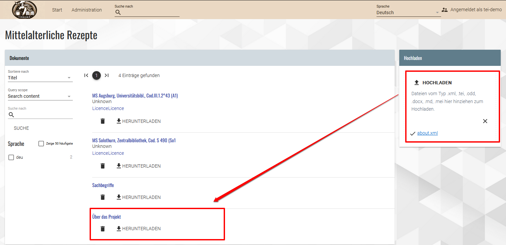
    → Hier können wir auch sehen, dass noch nicht alle Bereiche farblich angepasst sind, und es dafür noch weiterer Nachbearbeitungsschritte im CSS bedarf. <br/>
    Wenn wir das About-XML anwählen, verfügen wir aber jedenfalls über diese Ansicht:
    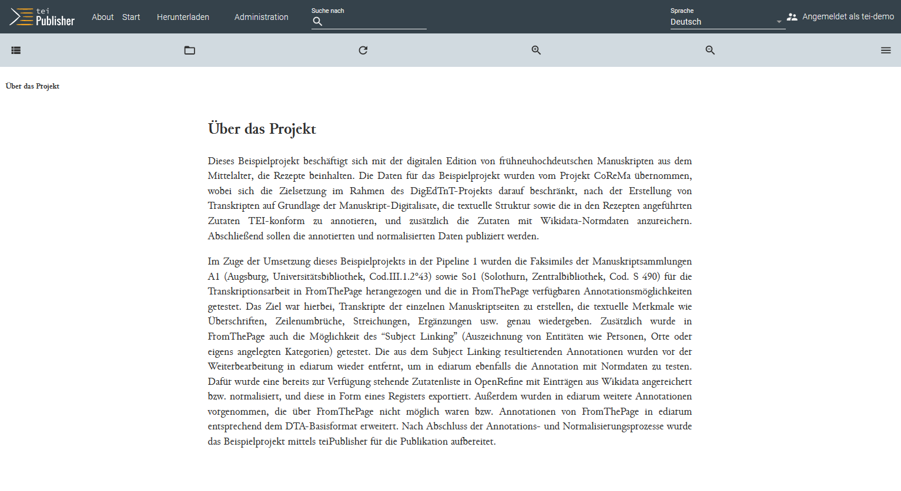
    → Auch diese Ansicht bedarf noch weiterer Anpassungen an das projekteigene Schema, die aber hier nicht weiter beschrieben werden.
    Da wir auf diese Projektseite von der Navigationsleiste aus zugreifen möchten, und nicht vom Dokumentenverzeichnis der App, erstellen wir im HTML einen entsprechenden Link. Und zwar müssen wir dafür wieder in das "menu.HTML", in dem sich die Navigationsleiste befindet, und fügen dort nach dem Logo einen Link zur About-Seite hinzu.
    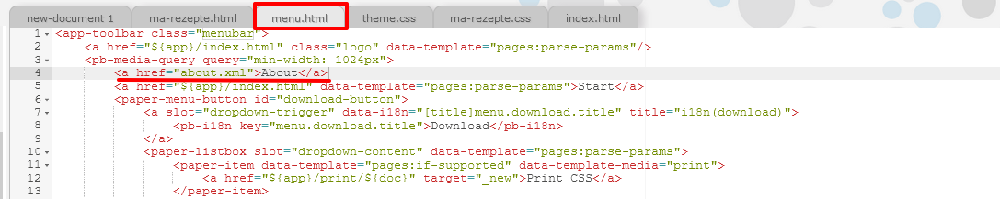
    Zurück in unserer App sehen wir nun, dass gleich rechts neben dem Logo ein Link zur About-Seite zur Verfügung steht.
    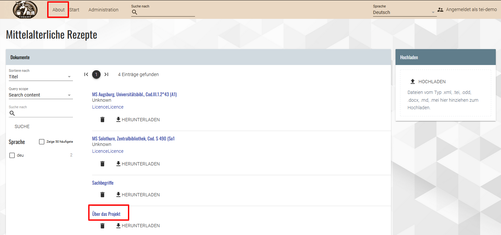
    Um die XML-Datei zur About-Seite aus der Manuskriptliste zu entfernen, müssen wir nun noch entsprechende Änderungen der Konfigurationsdatei "config.xqm" vornehmen, die wir im Ordner **modules** finden.
    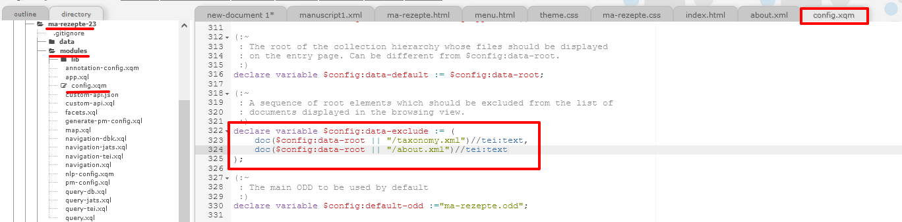
    Dort ergänzen wir bei der Variablen-Deklaration `$config:data-exclude` eine weitere Zeile, die bewirkt, dass unsere XML-Datei mit der About-Seite nicht in der Liste nicht angezeigt wird. Zurück in der App überprüfen wir, ob unsere Änderungen übernommen wurden:
    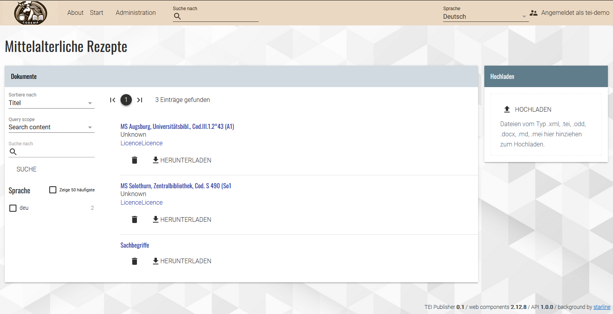
* Vor dem Export der App, ändern wir noch das Icon, das für unsere App in eXist aufscheinen soll. Dafür navigieren wir in eXide zum Ordner **packageservice** und überschreiben dort das bestehende Icon, indem wir unser Icon mit demselben Dateinamen (icon.png) hochladen. Im Dashboard erscheint nun anstelle des TEI-Publisher-Icons unser eigenes Projekt-Icon.
    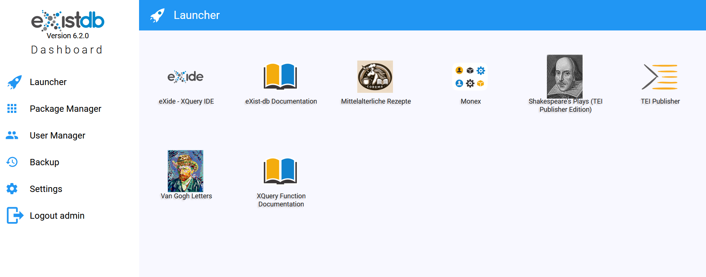


## 5. Export

Um die App nun endgültig zu exportieren und dann auf einem Webserver, auf dem eXist-db installiert ist, für die Öffentlichkeit zugänglich zu machen, laden wir die App als XAR-Datei herunter.
* Wir öffnen dafür das Dropdown-Menü unter **Administration** in der Navigationsleiste und wählen "Download App as .xar".
    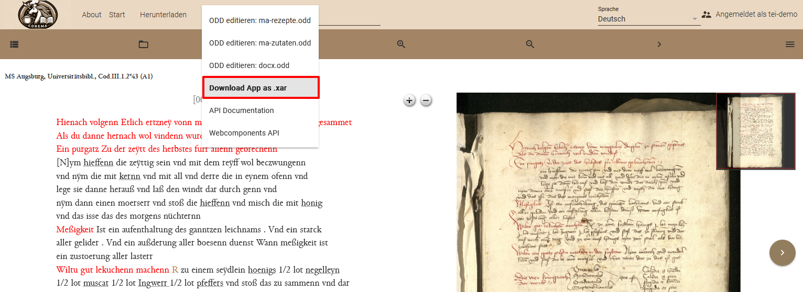
* In einer anderen eXist-db-Installation können wir die XAR-Datei anschließend über den PackageManager hochladen.
    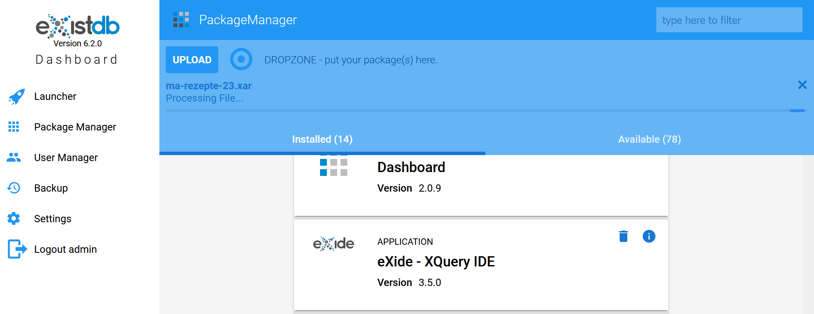
* Wenn wir daraufhin zum eXist-Dashboard wechseln, steht die App zu unserer Edition dort zur Verfügung.
    
    → Hier der Link zur [XAR-Datei unseres Beispielprojekts auf Github](https://github.com/DigEdTnT/digedtnt.github.io/blob/master/data/pipelines/pipeline_1/teipublisher/data/export/ma-rezepte-23.xar).


# Kontakt

**Unternehmensgröße:** (nicht eruierbar)

**Weblink:** [https://teipublisher.com](https://teipublisher.com)

<div class="table-responsive">
<table>
  <tr>
   <td><a href="https://github.com/eeditiones/tei-publisher-app/issues">Github Issues</a>
   </td>
  </tr>
  <tr>
   <td><a href="https://join.slack.com/t/e-editiones/shared_invite/zt-1fz52a9ra-tMWjgoKEWNF_rrRpMZQzRQ">Slack-Community</a> (inkl. Channel für Workshops)
   </td>
  </tr>
</table>
</div>


# Ressourcen


## Dokumentation

* [Offizielle TEI-Publisher-Dokumentation](https://teipublisher.com/exist/apps/tei-publisher/doc/documentation.xml?odd=docbook&view=div)
* [Webkomponenten-API](https://unpkg.com/@teipublisher/pb-components@1.38.5/dist/api.html)
* [XPath](https://www.data2type.de/xml-xslt-xslfo/xpath#c150)
* [Getting started with P5 ODDs](https://tei-c.org/guidelines/customization/getting-started-with-p5-odds/)


## Tutorials

* [Customising TEI, ODD, Roma](https://www.teibyexample.org/exist/tutorials/TBED08v00.htm)
* [Youtube - Learn TEI Publisher - Session 1 of 3](https://www.youtube.com/watch?v=QuWrfAS2SWM&t=1s)
* [Youtube - Learn TEI Publisher - Session 2 of 3](https://www.youtube.com/watch?v=5qu94bhftpk)
* [Youtube - Learn TEI Publisher - Session 3 of 3](https://www.youtube.com/watch?v=FS36nYFlTbE)
* [Learn TEI Publisher From Scratch (Workshop Material)](https://github.com/eeditiones/workshop#slides)


## Projekte, die dieses Tool genutzt haben

* [Escher Briefedition](briefedition.alfred-escher.ch)
* [Sammlung Schweizerischer Rechtsquellen online](editio.ssrq-online.ch)


## Literatur

* Bastianello, E. (2022). Digital Editions at the Bibliotheca Hertziana. _Journal of Art Historiography_, _27s_. [https://arthistoriography.wordpress.com/27s-dec22/](https://arthistoriography.wordpress.com/27s-dec22/)
* Chagué, A., Scheithauer, H., Terriel, L., Chiffoleau, F., & Tadjo-Takianpi, Y. (2022, July 25). _Take a sip of TEI and relax: a proposition for an end-to-end workflow to enrich and publish data created with automatic text recognition_. Digital Humanities 2022 : Responding to Asian Diversity. [https://inria.hal.science/hal-03739767](https://inria.hal.science/hal-03739767)
* Chiffoleau, F., Baillot, A., & Ovide, M. (2021, October). A TEI-based publication pipeline for historical egodocuments - the DAHN project. _Next Gen TEI, 2021 - TEI Conference and Members’ Meeting_. [https://hal.science/hal-03451421](https://hal.science/hal-03451421)
* Chiffoleau, F., & Scheithauer, H. (2022, September). From a collection of documents to a published edition : how to use an end-to-end publication pipeline. _TEI 2022 - Text Encoding Initiative 2022 Conference_. [https://hal.science/hal-03780316](https://hal.science/hal-03780316)
* Kränzle, A., Ritter, G., & Sieber, C. (2023). Sources Online: Eine nachhaltige Infrastruktur für digitale wissenschaftliche Texteditionen auf der Grundlage von _TEI Publisher_ und IIIF: Sources Online: A Sustainable Infrastructure for Digital Scholarly Text Editions Based on _TEI Publisher_ and IIIF. _ABI Technik_, _43_(3), 158–167. [https://doi.org/10.1515/abitech-2023-0030](https://doi.org/10.1515/abitech-2023-0030)
* Kumar, A., Bia, A., Holmes, M., Schreibman, S., Siemens, R., & Walsh, J. (2004). <teiPublisher> : Bridging the Gap Between a Simple Set of Structured Documents and a Functional Digital Library. In R. Heery & L. Lyon (Eds.), _Research and Advanced Technology for Digital Libraries_ (pp. 432–441). Springer. [https://doi.org/10.1007/978-3-540-30230-8_39](https://doi.org/10.1007/978-3-540-30230-8_39)
* Kumar, A., Schreibman, S., Stewart, Arneil, Holmes, M., Bia, A., & Walsh, J. (2005). <teiPublisher> : A Repository Management System for TEI Documents. _Literary and Linguistic Computing_, _20_(1), 117–132. [https://doi.org/10.1093/llc/fqh047](https://doi.org/10.1093/llc/fqh047)
* Morlock, E. (2017, October 6). _TeiPublisher for EpiDoc_. Visible Words: Digital Epigraphy in a Global Perspective, Providence, United States. [https://shs.hal.science/halshs-01773203](https://shs.hal.science/halshs-01773203)
* Scheithauer, H., Chagué, A., & Romary, L. (2021). _From eScriptorium to TEI Publisher_. Brace your digital scholarly edition! [https://inria.hal.science/hal-03538115/document](https://inria.hal.science/hal-03538115/document)


# Factsheet

<table>
  <tr>
   <td colspan="2" style="text-align: center;font-size: 1.2em"><strong>System</strong>
   </td>
  </tr>
  <tr>
   <td><strong>Scope des Tools</strong>
   </td>
   <td>Publikation
   </td>
  </tr>
  <tr>
   <td><strong>Softwareumgebung/Softwaretyp</strong><br/>(Remotesystem im Browser / Lokaler Client)
   </td>
   <td>lokale Browser-Anwendung
   </td>
  </tr>
  <tr>
   <td><strong>Unterstützte Plattformen</strong>
   </td>
   <td>Unix, Windows & Mac
   </td>
  </tr>
  <tr>
   <td><strong>Geräte</strong>
   </td>
   <td>Desktop
   </td>
  </tr>
  <tr>
   <td><strong>Einbindung anderer Systeme (Interoperabilität)</strong>
   </td>
   <td>✅
   </td>
  </tr>
  <tr>
   <td><strong>Accountsystem</strong>
   </td>
   <td>✅Hinzufügen von mehreren Usern über eXist möglich
   </td>
  </tr>
  <tr>
   <td><strong>Kostenmodell</strong><br/>(Kostenübersicht/Open Source)
   </td>
   <td><span style="text-decoration:underline;">TEI Publisher & eXist-db:</span> kostenlos
   </td>
  </tr>
  <tr>
   <td colspan="2" style="text-align: center;font-size: 1.2em"><strong>Anforderungen & Methoden</strong>
   </td>
  </tr>
  <tr>
   <td><strong>Erforderte Code Literacy</strong>
   </td>
   <td>fortgeschritten
   </td>
  </tr>
  <tr>
   <td><strong>Interface-Sprachen (ISO 639-1)</strong>
   </td>
   <td>de, en + 18 weitere Sprachen
   </td>
  </tr>
  <tr>
   <td><strong>Unterstützte Zeichenkodierung</strong>
   </td>
   <td>[keine Angaben]
   </td>
  </tr>
  <tr>
   <td><strong>Inkludierte Datenkonvertierung</strong>
<br/>
(Im Preprocessing mögliche Anpassung der Daten an für die Software erforderliches Format)
   </td>
   <td>❌
   </td>
  </tr>
  <tr>
   <td><strong>Abhängigkeit von anderer Software</strong><br/>(Falls ja, wird diese Software automatisch mitinstalliert?)
   </td>
   <td>✅eXist-db ist eigenständig zu installieren
   </td>
  </tr>
  <tr>
   <td><strong>Erforderliche Plug-Ins </strong>
   <br/>(bei web-basierten Anwendungen)
   </td>
   <td>[nicht anwendbar]
   </td>
  </tr>
  <tr>
   <td colspan="2" style="text-align: center;font-size: 1.2em"><strong>Dokumentation & Support</strong>
   </td>
  </tr>
  <tr>
   <td><strong>Wartung und ständige Erweiterung</strong>
   </td>
   <td>✅
   </td>
  </tr>
  <tr>
   <td><strong>Einbindung der Community</strong>
   </td>
   <td>✅via GitHub
   </td>
  </tr>
  <tr>
   <td><strong>Dokumentation</strong>
   </td>
   <td>✅
   </td>
  </tr>
  <tr>
   <td><strong>Dokumentationssprache</strong>
   </td>
   <td>Englisch
   </td>
  </tr>
  <tr>
   <td><strong>Dokumentationsformat</strong>
   </td>
   <td>HTML
   </td>
  </tr>
  <tr>
   <td><strong>Dokumentationsabschnitte</strong>
   </td>
   <td>Quickstart, Supported XML Vocabularies, Processing Model Transformations, CSS Styling, Page Templates and pb-componens, API, Best Practice Recommendations, Creating & Updating Apps, Facet Search Configuration, Creating Custom Web Components, Adding custom vocabulary, Embedding TEI Publisher in other systems, Annotating Documents, Configuring the Annotation Editor, TEI Publisher in Production
   </td>
  </tr>
  <tr>
   <td><strong>Verfügbarkeit von Tutorials</strong>
   </td>
   <td>✅ Youtube-Videos für Nutzer:innen inkl. GitHub Workshop-Materiall
   </td>
  </tr>
  <tr>
   <td><strong>Aktiver Support/Community</strong><br/>(Forum, Slack, Issue Tracker etc.)
   </td>
   <td>✅Slack Channel, Mailingliste, Github-Issue-Mechanismus
   </td>
  </tr>
  <tr>
   <td colspan="2"><strong>Nutzbarkeit & Nachhaltigkeit</strong>
   </td>
  </tr>
  <tr>
   <td><strong>Installationsablauf </strong>
   </td>
   <td>fortgeschrittene Kenntnisse nötig
   </td>
  </tr>
  <tr>
   <td><strong>Test</strong>
<br/>
(Gibt es ein Test Suite, um zu überprüfen, ob die Installation erfolgreich war?)
   </td>
   <td>✅
   </td>
  </tr>
  <tr>
   <td><strong>Lizenz, unter der das Tool veröffentlicht wurde</strong>
   </td>
   <td><a href="https://www.gnu.org/licenses/gpl-3.0.en.html">GNU GPL 3.0</a>
   </td>
  </tr>
  <tr>
   <td><strong>Registrierung in einem Repository</strong>
   </td>
   <td>✅ Github
   </td>
  </tr>
  <tr>
   <td><strong>Möglichkeit zur Software-Entwicklung beizutragen</strong>
   </td>
   <td>✅
   </td>
  </tr>
  <tr>
   <td colspan="2" style="text-align: center;font-size: 1.2em"><strong>Benutzerinteraktion & Benutzeroberfläche</strong>
   </td>
  </tr>
  <tr>
   <td><strong>Benutzerprofil</strong><br/>(erwartete Nutzer:innen)
   </td>
   <td>GeWi-Institutionen, Forschende und Editor:innen als Tool-Nutzende
   </td>
  </tr>
  <tr>
   <td><strong>Benutzerinteraktion</strong><br/>(erwartete Nutzung)
   </td>
   <td>Hochladen von XML-Dateien, Dateimanagement (über eXide), Publikationsaufbereitung von XML-Dokumenten, Erstellung einer App
   </td>
  </tr>
  <tr>
   <td><strong>Benutzeroberfläche</strong>
   </td>
   <td>browserbasiertes GUI
   </td>
  </tr>
  <tr>
   <td><strong>Visualisierungen</strong><br/>
(Analyse-, Input-, Outputkonfigurationen)
   </td>
   <td>❌
   </td>
  </tr>
  <tr>
   <td colspan="2" style="text-align: center;font-size: 1.2em"><strong>Benutzerverwaltung</strong>
   </td>
  </tr>
  <tr>
   <td><strong>Personenverwaltung</strong>
   </td>
   <td>✅ inklusive Rollenzuweisung (über eXist)
   </td>
  </tr>
  <tr>
   <td><strong>Interne Kommunikationsmöglichkeiten</strong><br/>(z. B. Annotationsrichtlinien, Kommentarfunktionen, …)
   </td>
   <td>❌
   </td>
  </tr>
  <tr>
   <td colspan="2" style="text-align: center;font-size: 1.2em"><strong>Daten- und Toolverwaltung</strong>
   </td>
  </tr>
  <tr>
   <td><strong>Zentrale/dezentrale Verwaltungsmöglichkeit</strong>
   </td>
   <td>✅
   </td>
  </tr>
  <tr>
   <td><strong>Versionskontrolle</strong>
   </td>
   <td>❌
   </td>
  </tr>
  <tr>
   <td><strong>Projektspezifische Einstellungen</strong>
   </td>
   <td>✅
   </td>
  </tr>
  <tr>
   <td><strong>API</strong>
   </td>
   <td>✅
   </td>
  </tr>
  <tr>
   <td><strong>Möglichkeit auf simultanes Arbeiten </strong>
   </td>
   <td>✅
   </td>
  </tr>
  <tr>
   <td colspan="2" style="text-align: center;font-size: 1.2em"><strong>Datenupload</strong>
   </td>
  </tr>
  <tr>
   <td><strong>Unterstützte Dateiformate</strong>
   </td>
   <td>Diverse XML-Formate: TEI, DocBook, MSWord (DOCX), JATS
   </td>
  </tr>
  <tr>
   <td><strong>Informationen zur Datensicherheit</strong>
   </td>
   <td>[nicht anwendbar, da Datenbank und Daten auf einem von der Projektleitung selbst gewählten Server gespeichert sind]
   </td>
  </tr>
  <tr>
   <td><strong>Zugänglichkeit von verschiedenen Standorten/Geräten</strong>
   </td>
   <td>✅
   </td>
  </tr>
  <tr>
   <td><strong>Einschränkungen hinsichtlich der Datenmenge</strong>
   </td>
   <td>[keine Angaben]
   </td>
  </tr>
  <tr>
   <td><strong>Verlustfreier Upload von bereits bearbeiteten Dokumenten </strong>
   </td>
   <td>✅
   </td>
  </tr>
  <tr>
   <td><strong>Unterstützung von IIIF-Import</strong>
   </td>
   <td>❌ ABER: eigene Webkomponente für die Anzeige von Faksimiles über den IIIF-Server
   </td>
  </tr>
  <tr>
   <td colspan="2" style="text-align: center;font-size: 1.2em"><strong>Datenbearbeitung (Publikationstool)</strong>
   </td>
  </tr>
  <tr>
   <td><strong>Komplexitätsgrad bei der Publikationsvorbereitung
</strong><br/>(z. B. Verfügbarkeit von Buttons, Drag&Drop-Funktion, …)
   </td>
   <td>ODD-Editor und App-Erzeugung auf Formularbasis
   </td>
  </tr>
  <tr>
   <td><strong>Standardeinstellungen entsprechend bestimmten Standards für Digitale Editionen   </strong>
   </td>
   <td>✅ TEI, XML, HTML
   </td>
  </tr>
  <tr>
   <td><strong>Anpassungsmöglichkeit und Validierung entsprechend projektspezifischen Konventionen/Schemata</strong>
   </td>
   <td>✅
   </td>
  </tr>
  <tr>
   <td><strong>Metadaten-Anreicherung</strong>
   </td>
   <td>✅ über eXide möglich
   </td>
  </tr>
  <tr>
   <td><strong>Ansichtsmöglichkeiten</strong><br/>(z. B. Bearbeitungsansicht, Synopsen-Ansicht, Vorschauansicht …)
   </td>
   <td>✅ Publikationsvorschau
   </td>
  </tr>
  <tr>
   <td colspan="2" style="text-align: center;font-size: 1.2em"><strong>Datenexport</strong>
   </td>
  </tr>
  <tr>
   <td><strong>Unterstützte Dateiformate</strong>
   </td>
   <td>Für Publikation: HTML, EPUB, PDF, LaTex<br/>
    Allgemein: XML, ODD, CSS, XAR
   </td>
  </tr>
  <tr>
   <td><strong>Datenverlust</strong><br/>(nicht vollständiger Erhalt von Annotationen, die bereits vor Verwendung des Tools gemacht wurden)
   </td>
   <td>❌
   </td>
  </tr>
  <tr>
   <td><strong>Validierungsmöglichkeit für TEI-XML vor Export</strong>
   </td>
   <td>✅über eXide möglich
   </td>
  </tr>
  <tr>
   <td><strong>Datenaufbewahrung nach Export</strong>
   </td>
   <td>[nicht anwendbar, da Datenbank und Daten auf einem von der Projektleitung selbst gewählten Server gespeichert sind]
   </td>
  </tr>
</table>


