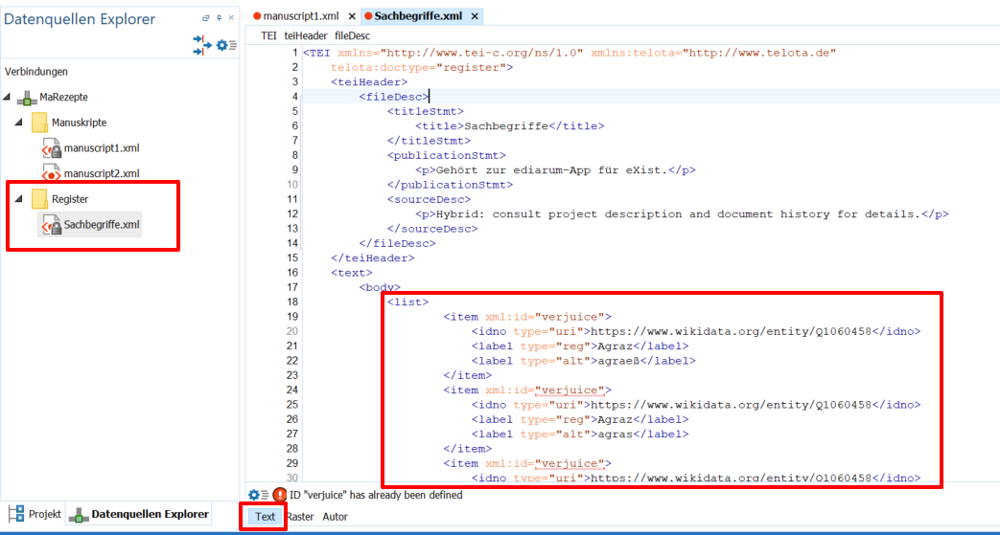
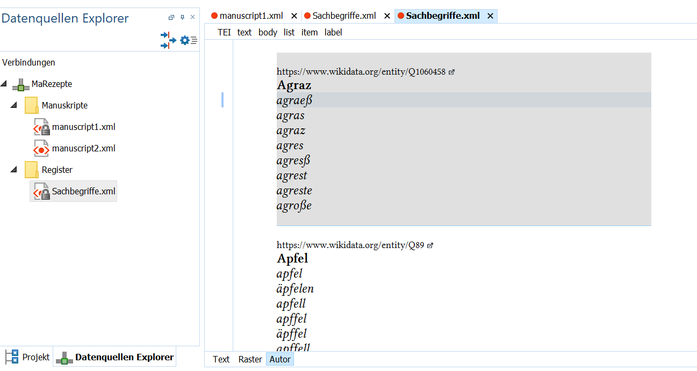

# Allgemeine Beschreibung

Die von _OpenRefine_ exportierten TXT-Dokumente bedürfen noch einer kleinen Anpassung für die Benutzung als Register in _ediarum_. Die vorliegende Transition zielt daher darauf ab, redundante Informationen im _OpenRefine_-Output zu reduzieren, um mit sinnvoll komprimierten Daten in _ediarum_ weiterarbeiten zu können.

<div class="essence">
In _OpenRefine_ lässt sich der Export über die Templating-Option bereits sehr gut an die Registerstruktur von _ediarum_ anpassen. Bei Dopplungen im Datensatz bedarf es aber mitunter noch kleineren Anpassungen, die über ein kurzes XSLT vorgenommen werden können.
</div>


## Voraussetzungen
Die im DigEdTnT-Projekt vorgestellten Transitions setzen nicht nur bestimmte Kompetenzen der Benutzer:innen voraus, sondern stellen auch hinsichtlich der Software-Umgebung gewisse Anforderungen.

### Erforderliche Kenntnisse

* [EDV-Grundkenntnisse](https://digedtnt.github.io/about/#grundvoraussetzungen)
* Einrichten einer [Oxygen-Transformation](https://digedtnt.github.io/xsl-transformation)
* Grundlegende XSLT-Kenntnisse (für erweiterte Anpassungen)

### Benötigte Software

* Oxygen Editor


# Möglichkeiten & Grenzen

Der Übergang von einem Tool zu einem anderen lässt sich verschieden gestalten. Nachfolgend soll ein Überblick über die Vor- und Nachteile unserer Transition von _OpenRefine_ zu _ediarum_ gegeben werden.

## Stärken

* Eliminierung von Redundanzen des _OpenRefine_-Outputs

## Herausforderungen & Probleme

* Keine


# XSL Transformation

In unserem Beispielprojekt sind wir mit folgender Situation konfrontiert: Der Export von _OpenRefine_ enthält aufgrund der zeilenbasierten Struktur mehrere Listenelemente (`<item>`) mit der gleichen `@xml:id` und zudem redundante Informationen in Bezug auf die Q-Nummern der Wikidata-Einträge sowie hinsichtlich der deutschen Übersetzungen:

```xml
<list>
<item xml:id="verjuice">
   <idno type="uri">https://www.wikidata.org/entity/Q1060458</idno>
   <label type="reg">Agraz</label>
   <label type="alt">agraeß</label>
</item>
<item xml:id="verjuice">
   <idno type="uri">https://www.wikidata.org/entity/Q1060458</idno>
   <label type="reg">Agraz</label>
   <label type="alt">agras</label>
</item>
<item xml:id="verjuice">
   <idno type="uri">https://www.wikidata.org/entity/Q1060458</idno>
   <label type="reg">Agraz</label>
   <label type="alt">agraz</label>
</item>
…
<item xml:id="apple">
   <idno type="uri">https://www.wikidata.org/entity/Q89</idno>
   <label type="reg">Apfel</label>
   <label type="alt">apfel</label>
</item>
<item xml:id="apple">
   <idno type="uri">https://www.wikidata.org/entity/Q89</idno>
   <label type="reg">Apfel</label>
   <label type="alt">äpfelen</label>
</item>
…
```
Um die `<item>`-Elemente mit der gleichen `@xml:id`, die außerdem auch die gleiche QID und die gleiche deutsche Übersetzung im `<label type="reg">`-Element enthalten, in einem `<item>`-Element mit den verschiedenen frühneuhochdeutschen Varianten mit mehreren  `<label type="alt">`-Elementen zusammenzuführen, transformieren wir die Daten mittels XSLT.

Die Transformation ist in unserem Workflow folgend eingebettet:

* Der in _OpenRefine_ mittels Template in eine XML-Struktur überführte Datensatz wird beim Export als [Plaintext-Datei](https://github.com/DigEdTnT/digedtnt.github.io/blob/master/data/pipelines/pipeline_1/transition_2/data/output_openrefine.txt) zum Download bereitgestellt. Daher kopieren wir zunächst die Liste und fügen diese in das vorerst leere [Register](https://github.com/DigEdTnT/digedtnt.github.io/blob/master/data/pipelines/pipeline_1/ediarum/data/register_pre-transition/Sachbegriffe.xml) ein, das wir in _ediarum_ für unser Projekt erstellt haben. Dafür wechseln wir in die Text-Ansicht und kopieren den Inhalt der TXT-Datei in den vorerst noch leeren `<body>`.
   
→ Wie wir sehen können, ist das Dokument nicht valide, da die englische Übersetzung, die wir als `@xml:id` nutzen, mehrfach vorhanden ist, diese aber eindeutig sein muss.
* Im nächsten Schritt wenden wir ein Transformationsszenario [(siehe Kurzanleitung)](https://digedtnt.github.io/xsl-transformation) mit dem für die Listenadaptierung erstellten[ XSL-Dokument](https://github.com/DigEdTnT/digedtnt.github.io/blob/master/data/pipelines/pipeline_1/transition_2/data/openrefine-output_to_ediarum.xsl)  auf unser Register (Sachbegriffe.xml) an.
* Unser transformiertes Register enthält nun zu jedem standarddeutschen Begriff alle frühneuhochdeutschen Varianten. In der Autor-Ansicht sieht dies folgendermaßen aus:
   
* Nun müssen wir in _ediarum_ nur mehr das Register-XML austauschen oder den Inhalt der transformierten Datei in das alte Register übernehmen, und können dann mit der [Annotation der Zutaten](https://digedtnt.github.io/ediarum/#d-annotation-mit-registereintr%C3%A4gen) anhand unseres Datensatzes fortfahren.


# XSLT Dokumentation

Die Transformation zur Bereinigung des _OpenRefine_-Outputs umfasst folgende Schritte:


* **Gruppierung der `<item>`-Elemente:**  Da alle frühneuhochdeutschen Varianten die gleiche englische Übersetzung haben und diese daher als `@xml:id` gewählt wurde, gruppieren wir alle Listeneinträge mit der gleichen `@xml:id`.
* **Inhalte der gruppierten** **`<item>`-Elemente:**
    * **`<idno>`-Element:** Jeder Listen- bzw. Registereintrag, der im _OpenRefine_ die gleiche englische Übersetzung hat, besitzt auch die gleiche Q-Nummer. Daher kopieren wir bei unserer Transformation nur das `<idno>`-Element des ersten Elements aus unserer Gruppierung.
    * **`<label>`-Elemente:** Bei den `<label>`-Elementen haben wir einerseits jene, die ein "reg" als Wert im `@type`-Attribut haben und die standarddeutsche Übersetzung beinhalten, sowie andererseits jene mit "alt", welche die frühneuhochdeutsche Schreibung beinhalten. Da ersteres ebenfalls bei allen Listeneinträgen gleich ist, nehmen wir auch hier nur das erste Element aus dem gruppierten Set. Von den alternativen `<label>`-Elementen übernehmen wir nun aber das gesamte Gruppenset, da wir innerhalb von einem Listeneintrag alle vorhandenen frühneuhochdeutschen Schreibweisen zusammensammeln möchten.
* **Übernahme der Metadaten:** Die Metadaten des Sachregisters möchten wir nicht verändern, weshalb wir hier kein eigenes Template für die Elemente im `<teiHeader>` anlegen.